# Resumen General — PLN UBA

Guía de estudio integrando clases 1-6. Pensada para tener solidez teórica y poder narrar **la evolución del NLP**: cada técnica nueva existe porque resuelve una limitación concreta de la anterior. Esa cadena causal es el hilo que conecta todo el curso y es, probablemente, la pregunta de examen más probable ("explique por qué pasamos de X a Y").

---

# 0. El hilo conductor: evolución de NLP en una página

```
1. Reglas/conteo puro (n-gramas)
   ↓ (esparsidad: la mayoría de frases nunca se vieron)
2. Representaciones vectoriales sparse (BoW, TF-IDF, BM25) + clasificadores clásicos (Naive Bayes, SVM)
   ↓ (alta dimensión, sin noción de significado/semántica, features a mano)
3. Embeddings estáticos densos (Word2Vec, GloVe, FastText)
   ↓ (un vector por palabra, sin importar el contexto: "banco" siempre es el mismo vector)
4. Redes recurrentes (RNN, LSTM, GRU) — procesan secuencias, mantienen estado/memoria
   ↓ (vanishing/exploding gradients, procesamiento secuencial = lento, cuello de botella en seq2seq)
5. Atención — el decoder mira todos los estados del encoder, no solo el último
   ↓ (¿por qué no sacar la RNN del medio?)
6. Transformers — self-attention pura, paralelizable, sin recurrencia
   ↓ (¿cómo aprovechar datos no etiquetados a gran escala?)
7. Pretraining + Transfer Learning (BERT, GPT, T5...) — preentrenar en texto masivo, después adaptar
   ↓ (escalar parámetros y datos)
8. LLMs modernos — in-context learning, capacidades emergentes, y sus riesgos (alucinación, costo, sesgo)
```

Cada flecha "↓" es una pregunta de examen en potencia: **¿qué limitación tenía la técnica anterior, y cómo la resuelve la siguiente?** Esa es la estructura de todo este resumen.

---

# 1. Preprocesamiento y Modelos Probabilísticos (Clase 1 — 18-03)

### Por qué empieza aquí el curso
Antes de poder modelar significado, hay que decidir **qué es una unidad de texto** (tokenización) y cómo reducir su variabilidad (normalización). Y antes de tener redes neuronales, el primer modelo de "lenguaje" fue puramente estadístico: contar.

### Tokenización

- **Word types** ($|V|$): vocabulario, palabras distintas. **Word instances** ($N$): total de palabras corridas.
- **Ley de Herdan/Heaps**: $|V| = kN^\beta$, $0<\beta<1$. El vocabulario sigue creciendo con más datos — nunca se "completa". Esto es la raíz del problema OOV (out-of-vocabulary): ningún vocabulario finito cubre todo el lenguaje.
- **BPE (Byte-Pair Encoding)**: solución práctica al problema OOV. En vez de tokenizar por palabra, se tokeniza por **subwords** que se recombinan.
  - **Trainer**: parte de caracteres individuales, fusiona iterativamente el par adyacente más frecuente, k veces.
  - **Encoder**: aplica los merges aprendidos, en el mismo orden, sobre texto nuevo.
  - Se ejecuta sobre bytes UTF-8 → vocabularios de 50K-200K tokens.
  - **Problema multilingüe**: tokenizadores entrenados mayormente en inglés sobre-segmentan otros idiomas (el español usa más tokens que el inglés para la misma oración) → esto afecta directamente el costo de inferencia de LLMs en español.

### Normalización: Stemming vs. Lemmatization

- **Stemming** (Porter Stemmer): reglas heurísticas, remueve sufijos. Rápido, impreciso, puede producir no-palabras, no distingue POS.
- **Lemmatization**: usa diccionario/análisis morfológico para hallar la forma base (lema). Más preciso, más lento, considera POS.
- **Morfología**: morfema (unidad mínima con significado) → raíz + afijos (inflexionales: rol sintáctico, ej. plural; derivacionales: cambian la clase gramatical). Clíticos: actúan como palabras pero se adjuntan ("I've").
- **Case folding**: minúsculas. Gana generalización, pierde información ("US" vs "us").

### Stopwords
Palabras de alta frecuencia y bajo contenido semántico (function words: artículos, preposiciones) vs. content words (sustantivos, verbos — crecen indefinidamente). **No filtrar** cuando el orden importa (modelado de lenguaje) o en búsqueda de frases exactas.

### N-gramas y Cadenas de Markov

- Un n-grama es una secuencia contigua de $n$ tokens. Es la base de los LM estadísticos clásicos.
- **Asunción de Markov**: la probabilidad de la próxima palabra depende solo de las $n-1$ palabras anteriores, no de toda la historia:
$$P(w_i \mid w_1 \ldots w_{i-1}) \approx P(w_i \mid w_{i-n+1} \ldots w_{i-1})$$
- Estimación **MLE** para bigramas: $P(w_i \mid w_{i-1}) = \frac{C(w_{i-1}, w_i)}{C(w_{i-1})}$ (conteo simple).
- **Generación de texto**: muestrear la siguiente palabra de la distribución condicional — la misma idea conceptual que usará después una RNN o GPT, solo que aquí la distribución viene de conteos en vez de una red neuronal.

### El problema central: esparsidad
A medida que $n$ crece, la mayoría de combinaciones nunca aparecen en el corpus de entrenamiento → probabilidad 0 → toda la cadena colapsa a 0. **Este es el problema que persigue a todo el curso**: cómo generalizar a secuencias no vistas. La solución de esta clase es smoothing; la solución de las clases 3-6 es, en el fondo, la misma pregunta resuelta con representaciones distribuidas (embeddings) en vez de conteos exactos.

### Smoothing (soluciones al problema de esparsidad)

- **Laplace (add-one)**: $P = \frac{C(w_{i-1},w_i)+1}{C(w_{i-1})+V}$. Simple pero redistribuye demasiada masa.
- **Add-k**: generaliza con $k<1$.
- **Backoff**: si no hay evidencia del n-grama de orden $n$, usar el de orden $n-1$.
- **Interpolación**: combina todos los órdenes simultáneamente con pesos $\lambda$ que suman 1.
- **Absolute Discounting**: resta un descuento fijo $d\approx 0.75$ (observación empírica de Church & Gale) a cada conteo, y redistribuye esa masa via backoff a unigramas.
- **Kneser-Ney**: mejora el discounting reemplazando el backoff a $P(w)$ por la **probabilidad de continuación** $P_{\text{CONTINUATION}}(w)$ — cuántos contextos *distintos* preceden a $w$. Intuición: "Kong" es frecuente pero solo aparece tras "Hong"; "glasses" aparece en muchos contextos → debería tener mayor probabilidad de continuación aunque sea menos frecuente en total.
- **Modified Kneser-Ney** (Chen & Goodman): usa 3 descuentos distintos según si el conteo es 1, 2 o ≥3. Es el método con mejor rendimiento para n-gramas puros.

### Perplexity
Métrica estándar para evaluar LMs:
$$\text{PP}(W) = P(w_1,\ldots,w_N)^{-1/N} = 2^{-\frac{1}{N}\sum \log_2 P(w_i\mid w_{<i})}$$
Es el "factor de ramificación efectivo": PP=100 ≈ tan confundido como elegir entre 100 opciones equiprobables. Menor es mejor. Equivale a $2^H$ (H = entropía cruzada). **Solo comparable entre modelos con el mismo vocabulario** — un detalle que suele preguntarse.

---

# 2. Vectorización y Clasificación Clásica (Clase 2 — 25-03)

### Por qué surge esta clase
Una vez tokenizado el texto, hace falta convertirlo en **números** para que un clasificador lo procese, y elegir un clasificador. Esta etapa es anterior a "el significado de las palabras importa" — primero se resuelve "¿cómo represento un documento entero como vector?".

### Vector Space Model y Bag of Words
- Cada documento = vector en $\mathbb{R}^{|V|}$, cada dimensión = un término.
- **BoW**: el valor es el conteo de la palabra. Ignora el orden completamente. Sparse, palabras frecuentes dominan.
- **Similitud coseno**: $\cos(a,b) = \frac{a\cdot b}{\|a\|\|b\|}$ — mide ángulo, ignora magnitud (longitud del documento).

### TF-IDF
$$\text{TF-IDF}(t,d) = \text{TF}(t,d)\cdot \text{IDF}(t), \qquad \text{IDF}(t)=\log\frac{N}{\text{df}(t)}$$
Combina frecuencia local (TF) con rareza global (IDF): términos que aparecen en pocos documentos son más distintivos.

### BM25 — la mejora probabilística sobre TF-IDF
$$\text{BM25}(d,q)=\sum_{q_i\in q} \text{IDF}(q_i)\cdot \frac{\text{TF}(q_i,d)(k_1+1)}{\text{TF}(q_i,d)+k_1\left(1-b+b\frac{|d|}{\text{avgdl}}\right)}$$
- $k_1$: controla **saturación** de TF (rendimientos decrecientes por repetición de un término).
- $b$: controla **normalización por longitud** del documento (evita que documentos largos "ganen" solo por ser largos).
- Sigue siendo, hoy, el algoritmo de ranking lexical más usado en IR (y se combina con embeddings en sistemas RAG modernos — conecta directo con clase 6).

### Naive Bayes — clasificador generativo
Modela $P(X,Y)$ vía Bayes: $\hat{Y}=\arg\max_y P(X\mid Y=y)P(Y=y)$.
**Asunción "naive"**: independencia condicional entre features dada la clase: $P(X\mid Y)=\prod_i P(x_i\mid Y)$. Viola la realidad del lenguaje (las palabras no son independientes) pero funciona bien con pocos datos. Requiere Laplace smoothing para palabras no vistas en una clase (si no, probabilidad 0 anula todo el producto).

### SVM — clasificador discriminativo
Busca el hiperplano que **maximiza el margen** entre clases; solo los **vectores de soporte** (puntos más cercanos al hiperplano) determinan su posición. **Kernel trick** (lineal, polinomial, RBF) permite separar datos no linealmente separables sin calcular la transformación explícita. Fue el método más exitoso para texto antes del deep learning (datos sparse de alta dimensión → SVM lineal funciona muy bien).

### Generativo vs. Discriminativo (distinción clave de examen)
- **Naive Bayes** (generativo): modela $P(X\mid Y)$, asume independencia, mejor con pocos datos.
- **Logistic Regression / SVM** (discriminativos): modelan/separan $P(Y\mid X)$ directamente, sin asumir independencia, mejores con muchos datos.
- Regresión logística: $\hat y = \sigma(w\cdot x+b)$, pérdida cross-entropy, optimización por SGD. Versión multiclase: softmax. **Este es el mismo softmax que reaparece en RNNs, atención y Transformers** — vale la pena notar la continuidad.

### Feature Engineering
Diseñar a mano las representaciones (BoW, n-gramas de caracteres, features manuales como presencia de negación). Contrasta con el **representation learning** que vendrá después (embeddings aprendidos automáticamente) — este es uno de los puntos de inflexión más importantes de la evolución del NLP: pasar de *diseñar* features a *aprenderlas*.

### LSA (Latent Semantic Analysis) — el puente hacia los embeddings
1. Matriz término-documento (ponderada por TF-IDF o PPMI).
2. **SVD**: $A=U\Sigma V^T$, truncar a $k$ dimensiones: $A_k=U_k\Sigma_k V_k^T$.
3. Resultado: vectores **densos** de baja dimensión.

**PPMI** como alternativa de ponderación a TF-IDF para matrices término-término:
$$\text{PMI}(w,c)=\log_2\frac{P(w,c)}{P(w)P(c)}, \qquad \text{PPMI}=\max(\text{PMI},0)$$
LSA captura sinonimia parcialmente (palabras en contextos similares quedan cerca) — **es el precursor conceptual directo de Word2Vec/GloVe** (clase 3): la diferencia es que LSA factoriza una matriz global de una sola vez, mientras Word2Vec aprende iterativamente con ventanas de contexto locales.

---

# 3. Word Embeddings Estáticos (Clase 3 — 01-04)

### Por qué surge esta clase
LSA ya mostró que se pueden obtener vectores densos con significado semántico. La pregunta siguiente es: ¿se puede entrenar esto de forma más escalable y con mejor calidad semántica, usando una red neuronal simple en vez de SVD sobre toda la matriz?

### Hipótesis distribucional (Firth, 1957)
"A word is characterized by the company it keeps" — el significado de una palabra está determinado por los contextos en que aparece. Esta es la base teórica de **todos** los embeddings, estáticos y contextuales.

### Word2Vec (Mikolov et al., 2013)
- **Skip-gram**: dada $w_t$, predecir las palabras de contexto en ventana $\pm c$. Maximiza $\frac{1}{T}\sum_t\sum_{j} \log P(w_{t+j}\mid w_t)$.
- **CBOW**: inverso — dado el contexto, predecir la palabra central. Más rápido, mejor con vocabularios grandes.
- **Negative Sampling**: el softmax completo sobre $|V|$ es costoso. Se reemplaza por distinguir la palabra de contexto real de $k$ negativos muestreados de $P_n(w)\propto f(w)^{3/4}$ (suaviza para no sobre-representar palabras frecuentes).
- **Analogías vectoriales**: $v_{\text{king}}-v_{\text{man}}+v_{\text{woman}}\approx v_{\text{queen}}$. Emerge del entrenamiento, no está programado — es la evidencia más citada de que estos vectores capturan estructura semántica real.

### GloVe (Pennington et al., 2014)
Combina lo mejor de LSA (estadísticas globales de co-ocurrencia) con lo mejor de Word2Vec (objetivo de entrenamiento eficiente):
$$J=\sum_{i,j} f(X_{ij})\left(v_i^\top v_j + b_i+b_j-\log X_{ij}\right)^2$$
$f$ pondera menos las co-ocurrencias muy frecuentes. Suele superar a Word2Vec en benchmarks de analogía/similitud porque usa la matriz de co-ocurrencia completa en vez de solo ventanas locales.

### FastText (Bojanowski et al., 2017)
Cada palabra = suma de embeddings de sus **n-gramas de caracteres**. Resuelve dos problemas: **OOV** (una palabra nueva puede construirse de subwords conocidos) y **morfología rica** (español, alemán). Esta misma idea de subwords reaparece después en BPE (clase 1) y en cómo los Transformers tokenizan.

### La limitación fundamental — y el gancho hacia la clase 4
**Un único vector por palabra, sin importar el contexto.** "Banco" en "me senté en el banco" y "saqué dinero del banco" tienen el mismo vector. Esto **motiva directamente los embeddings contextuales** (ELMo en clase 4, BERT en clase 5) — la pregunta que abre el resto del curso es: ¿cómo hacer que la representación de una palabra dependa de la oración en la que aparece?

### Sesgo en embeddings
$v_{\text{doctor}}-v_{\text{man}}+v_{\text{woman}}\approx v_{\text{nurse}}$: los embeddings aprenden los sesgos sociales del corpus de entrenamiento. Tema que reaparece en clase 6 (toxicidad y sesgo en LLMs) — **mismo problema, escala mucho mayor**.

---

# 4. Language Models I: RNN, LSTM, GRU (Clase 4 — 27-05)

### Por qué surge esta clase
Los n-gramas (clase 1) generalizan mal; los embeddings estáticos (clase 3) no capturan contexto ni orden secuencial completo. Hace falta una arquitectura que **procese secuencias manteniendo memoria de lo anterior**, y que combine eso con redes neuronales para generalizar.

### RNN — arquitectura base
$$h_t=\tanh(Wh_{t-1}+Ux_t+b_h), \qquad o_t=Vh_t+b_o, \qquad \hat y_t=\text{softmax}(o_t)$$
$W,U,V$ son matrices **compartidas** en todos los pasos de tiempo — esto es clave: el tamaño del modelo no crece con el largo de la secuencia.

- **Generación de texto**: samplear $\hat y_t$ y realimentarlo como $x_{t+1}$ — la misma idea que la generación por cadena de Markov de la clase 1, pero ahora la distribución viene de una red neuronal entrenada, no de conteos, lo que resuelve la generalización a secuencias nunca vistas.
- **Clasificación**: usar el último hidden state o un mean/max de todos los $h_t$.
- **Multi-layer RNN**: apilar capas; cada capa procesa la salida de la anterior.

### Seq2seq (Encoder-Decoder)
Encoder RNN procesa la fuente → último hidden state = vector de contexto de tamaño fijo → Decoder RNN (modelo de lenguaje condicionado por ese vector) genera la secuencia destino token a token con argmax.

**Problema (cuello de botella)**: comprimir toda una secuencia larga en **un solo vector de tamaño fijo** pierde información. **Este es el problema concreto que la atención (clase 5) viene a resolver** — es la transición más importante de todo el curso entre clase 4 y clase 5.

### Backpropagation Through Time (BPTT)
Se desenrolla la RNN en el tiempo; como $W$ es compartida, el gradiente $\partial L/\partial W$ suma contribuciones de **todos** los pasos. Esto produce, al propagar $T$ pasos hacia atrás, un producto de $T$ matrices $W$:
$$\frac{\partial h_T}{\partial h_1}=\prod_{t=2}^T W\cdot\text{diag}(\sigma'(h_{t-1}))$$

### Exploding / Vanishing Gradients
- $W$ grande → el producto explota → gradiente gigante → **Gradient Clipping**: si $\|\nabla\|>$ umbral, reescalar $\nabla \leftarrow \frac{\text{umbral}}{\|\nabla\|}\nabla$.
- $W$ chica → el producto se desvanece → no se aprenden dependencias largas. **No se soluciona con clipping**, requiere una arquitectura distinta: LSTM/GRU.

### LSTM (Hochreiter & Schmidhuber, 1997)
Introduce el **cell state** $c_t$ (memoria de largo plazo), separado del hidden state, con caminos para el gradiente que evitan el desvanecimiento:
- **Forget gate**: $f_t=\sigma(W_f[h_{t-1},x_t]+b_f)$ — qué olvidar.
- **Input gate**: $i_t=\sigma(W_i[h_{t-1},x_t]+b_i)$ — qué agregar.
- **New cell content**: $\tilde c_t=\tanh(W_c[h_{t-1},x_t]+b_c)$.
- **Actualización**: $c_t=f_t\odot c_{t-1}+i_t\odot\tilde c_t$ — nótese que es **aditiva**, no solo multiplicativa, lo que permite que el gradiente fluya sin desaparecer.
- **Output gate**: $o_t=\sigma(W_o[h_{t-1},x_t]+b_o)$, $h_t=o_t\odot\tanh(c_t)$.

### GRU (Cho et al., 2014)
Más simple, menos parámetros: **reset gate** $r_t$, **update gate** $z_t$, $\tilde h_t=\tanh(W_h[r_t\odot h_{t-1},x_t])$, $h_t=(1-z_t)\odot h_{t-1}+z_t\odot \tilde h_t$. No hay evidencia fuerte de que GRU o LSTM sea consistentemente mejor; convención: LSTM por defecto, GRU si se necesita eficiencia.

### RNR Bidireccionales
Dos RNNs en paralelo (izq→der y der→izq), outputs concatenados. **No sirve para modelado de lenguaje** (el futuro "filtraría" hacia el pasado, haciendo trivial la predicción), pero es ideal para clasificación, NER, etiquetado — cualquier tarea donde ya se tiene la secuencia completa. **Bi-LSTM** fue la arquitectura dominante en NLP justo antes de los Transformers.

### ELMo — primer paso hacia embeddings contextuales
Genera representaciones **dinámicas** según el contexto (resuelve la limitación de clase 3). Arquitectura: embeddings de caracteres (CNN) + 2 capas Bi-LSTM (4096 hd, 512 od) + conexiones residuales. Capas inferiores → sintaxis; capas superiores → semántica. Preentrenado prediciendo la palabra siguiente/anterior sobre corpus grandes, y se puede fine-tunear. **ELMo es la bisagra exacta entre "embeddings estáticos" y "preentrenamiento + fine-tuning"** (que explota en clase 6).

### Tareas de referencia (vocabulario de benchmarks)
SQuAD (QA extractivo), SNLI (entailment/contradiction/neutral), SRL (roles semánticos), NER, WSD, POS tagging — estos benchmarks reaparecen constantemente como ejemplos de "para qué sirve" cada arquitectura nueva.

---

# 5. Language Models II: Atención y Transformers (Clase 5 — 03-06)

### Por qué surge esta clase
Quedaron dos problemas abiertos en clase 4: (1) el cuello de botella del vector de contexto fijo en seq2seq, y (2) que las RNN son inherentemente secuenciales → lentas, no paralelizables, y siguen sufriendo vanishing gradients en secuencias largas a pesar de LSTM/GRU.

### Mecanismo de Atención — resuelve el cuello de botella
En vez de pasar solo el último hidden state del encoder al decoder, el decoder **mira todos** los hidden states $h_1,\ldots,h_T$ y pondera cuáles son relevantes en cada paso:
1. **Scores**: $s_{ij}=a_i\cdot h_j$ (similitud entre estado del decoder y cada estado del encoder).
2. **Pesos**: $w_i=\text{softmax}([s_{i1},\ldots,s_{iT}])$.
3. **Contexto**: $Y_i=\sum_j w_{ij}h_j$.

**Ventajas**: resuelve el cuello de botella, ayuda con vanishing gradient (conexiones directas a cada paso del encoder), da interpretabilidad (los pesos muestran qué palabras fuente influyen en cada palabra generada), captura dependencias largas.

### Transformers (Vaswani et al., 2017) — sacar la RNN del medio
**Idea central**: si la atención ya deja que cada posición "vea" cualquier otra posición directamente, ¿por qué seguir procesando secuencialmente con una RNN? Reemplazarla por completo con atención. Cada token calcula su representación ponderando **todos** los demás tokens directamente (un solo paso, no $T$ pasos secuenciales).

| Propiedad | RNN | Transformer |
|---|---|---|
| Interacción entre tokens distantes | Indirecta, se degrada con la distancia | Directa, un solo paso |
| Procesamiento | Secuencial | Paralelo |
| Dependencias largas | Difícil (vanishing gradient) | Natural |
| Escalabilidad | Limitada | Alta — esto es lo que habilita los LLMs de clase 6 |

### Positional Embeddings
Al procesar todo en paralelo, el Transformer **pierde la noción de orden** (que las RNN tenían gratis, por construcción secuencial). Solución: sumar una codificación posicional al embedding de entrada:
$$PE(pos,2i)=\sin\left(\frac{pos}{10000^{2i/d}}\right), \qquad PE(pos,2i+1)=\cos\left(\frac{pos}{10000^{2i/d}}\right)$$
Sinusoidal → generaliza a cualquier longitud de secuencia (a diferencia de embeddings posicionales aprendidos con longitud fija).

### Self-Attention — el mecanismo central
Cada token genera tres proyecciones lineales: $Q=XM_q$, $K=XM_k$, $V=XM_v$ (Query = "qué busco", Key = "qué ofrezco", Value = "qué contenido tengo").
$$\text{Attention}(Q,K,V)=\text{softmax}\left(\frac{QK^T}{\sqrt{d_k}}\right)V$$
El escalado $\sqrt{d_k}$ evita que el softmax se sature (gradientes ínfimos) cuando $d_k$ es grande.

**Feed-Forward** después de la atención: $\text{FFN}(x)=\max(0,xW_1+b_1)W_2+b_2$. Necesaria porque la self-attention es lineal en los values — la FFN introduce no-linealidad real.

### Multiheaded Self-Attention
Varias proyecciones $Q,K,V$ en paralelo, cada "cabeza" puede especializarse en un tipo de relación distinto (sintáctica, correferencia, etc.): $\text{MultiHead}=\text{Concat}(\text{head}_1,\ldots,\text{head}_h)W^O$.

### Residual Connections y Layer Normalization
- **Residual**: $\text{output}=\text{LayerNorm}(x+\text{Sublayer}(x))$ — provee un camino directo para el gradiente en redes muy profundas, evitando que se desvanezca antes de llegar a las capas iniciales (mismo problema de fondo que en clase 4, solución análoga al cell state de LSTM).
- **LayerNorm**: $\gamma\cdot\frac{x-\mu}{\sigma+\epsilon}+\beta$, normaliza dentro de cada capa → entrenamiento más rápido y estable.

### Encoder
Cada bloque: Multiheaded Self-Attention (+residual+LN) → FFN (+residual+LN), repetido $N$ veces. BERT base: 12 capas, 768 dims, 12 heads. BERT large: 24 capas, 1024 dims, 16 heads. Max seq length 512.

### BERT — Masked Language Modeling
Usa **solo el encoder**. Enmascara ~15% de tokens y los predice usando contexto **bidireccional** completo:
"El [MASK] está buenísimo" → "hotel". `[CLS]` para clasificación de secuencia completa, `[SEP]` para separar oraciones. Ideal para clasificación de secuencias/tokens (NER, POS, Q&A extractivo) — **no genera texto** porque depende de ver ambos lados.

### Encoder-Decoder Transformer
Para tareas generativas (traducción, resumen): el decoder tiene **tres** subcapas: (1) Masked Multiheaded Self-Attention (causal, cada token solo ve los anteriores), (2) Encoder-Decoder Cross-Attention ($Q$ del decoder, $K,V$ del encoder), (3) FFN.

### Decoder-Only
Solo el componente decoder, con masked self-attention, sin encoder. Entrenamiento autorregresivo: predecir el próximo token dado todo lo anterior. **GPT, LLaMA y la mayoría de los LLMs actuales son decoder-only** — esta arquitectura es la que domina hoy y la puerta de entrada a la clase 6.

### Landscape (mapa mental para el examen)
```
Encoder-only   (BERT, RoBERTa, DeBERTa)  → clasificación, NER, extracción
Encoder-Decoder (T5, BART)               → traducción, resumen, Q&A generativo
Decoder-only   (GPT, LLaMA)              → generación libre, chat, código
```

---

# 6. Pretraining y Modelos Generativos (Clase 6 — 10-06)

### Por qué surge esta clase
Ya existe la arquitectura (Transformer) y el paradigma (preentrenar en texto general, adaptar después — visto embrionariamente en ELMo). Esta clase pregunta: ¿qué formas de preentrenamiento existen, cómo se adapta eficientemente un modelo gigante a una tarea nueva, y qué pasa cuando se escala esto al extremo (GPT-3+)?

### Pretraining y Transfer Learning
Entrenar en una tarea general sobre corpus masivo (sin etiquetar) antes de afinar a una tarea específica. Acelera el entrenamiento downstream y reduce drásticamente los datos necesarios (hasta casi 0 en modelos grandes vía few/zero-shot). Evolución: primero solo se preentrenaban embeddings (Word2Vec) → luego todo el modelo (ELMo, BERT, GPT).

**Por qué funciona (intuición de optimización)**: el preentrenamiento ubica los parámetros en un punto del espacio de búsqueda ya "cerca" de un buen óptimo, en vez de partir de inicialización aleatoria — el fine-tuning explora un valle ya explorado, no el espacio completo.

### Tipos de preentrenamiento (tabla de examen)

| Tipo | Qué predice | Ejemplo |
|---|---|---|
| MLM | Tokens enmascarados | BERT |
| NWP (next word) | Siguiente palabra | GPT |
| NSP | Si una oración sigue a otra | BERT |
| Discriminativo | Real vs. reemplazado | ELECTRA |

**Qué aprenden los modelos**: a fuerza de predecir tokens faltantes sobre corpus masivos, emergen sin supervisión explícita: relaciones semánticas, conocimiento de mundo, aritmética básica, analogías, sintaxis — esto conecta directo con "capacidades emergentes" más abajo.

### BERT en detalle + ELECTRA
- BERT: de los tokens seleccionados (~15%), 80% se reemplazan por `[MASK]`, 10% por token aleatorio, 10% se dejan igual (y se predicen). Pérdida solo sobre esos tokens. Entrenado en BooksCorpus + Wikipedia.
- **ELECTRA**: en vez de predecir tokens enmascarados, entrena un **discriminador** que decide, para *cada* token, si es original o fue reemplazado por un generador pequeño. Usa señal de toda la secuencia, no solo el 15% → mucho más eficiente en cómputo.

### Adapters y LoRA — fine-tuning eficiente
**Problema**: fine-tunear un modelo entero es costoso, propenso a overfitting en datasets chicos, y requiere un modelo completo por tarea.
- **Adapters**: módulos pequeños insertados en las capas, solo ellos se entrenan; el resto queda congelado.
- **LoRA**: congela $W$ y aprende una actualización de bajo rango $W'=W+BA$ con $A\in\mathbb{R}^{r\times d}$, $B\in\mathbb{R}^{d\times r}$, $r\ll d$. Solo $A,B$ son entrenables → drásticamente menos parámetros, menos overfitting, cambio de tarea rápido (solo se cambian las matrices LoRA).

### Por qué los encoders no generan texto (recordatorio + razón formal)
Procesan bidireccionalmente y en simultáneo — incompatible con la generación secuencial autorregresiva que requiere ver solo el contexto previo. Esto motiva las arquitecturas siguientes.

### BART y T5 — denoising en vez de LM puro
- **BART**: corrompe el input (masking, permutación de oraciones, rotación de documento, borrado de tokens) en el encoder; el decoder reconstruye el original.
- **T5**: "span corruption" — corrompe tramos del texto, el objetivo es reconstruirlos; preentrenado en C4. Framework de "texto a texto" para cualquier tarea.

### GPT-1 → GPT-2 → GPT-3 (la línea de escalado)
- **GPT-1**: decoder-only, unidireccional, predice la siguiente palabra. Trata el input como prefijo condicional, sin tratamiento especial del prompt. Fine-tuning con capa de salida sobre la representación del modelo.
- **GPT-2**: 1.5B parámetros (vs 117M de GPT-1), secuencias más largas (1024 vs 512), más datos mejor curados, foco en **zero-shot**.
- **GPT-3**: 175B parámetros. Introduce **In-Context Learning**: en vez de adaptar el modelo a la tarea (fine-tuning), se adapta la tarea al modelo — instrucciones/ejemplos directamente en el prompt, interacción en lenguaje natural. Marca conceptualmente "el fin del fine-tuning" para muchas tareas. Más ejemplos en el prompt (few-shot) → mejor resultado; modelos más grandes aprenden más rápido con menos ejemplos; el rendimiento aún no satura al escalar.

### Capacidades Emergentes
Habilidades no programadas explícitamente, que aparecen de forma **impredecible** y no extrapolable linealmente desde modelos chicos (ej. GPT-3 con WiC en few-shot vs. PaLM 540B con salto cualitativo, sin cambio arquitectónico). Hipótesis: mayor escala → mejor memorización/manejo de tareas complejas; razonamiento multi-paso requeriría cierta profundidad mínima de capas. Sigue siendo, en gran parte, un fenómeno **no explicado teóricamente** — punto importante para discutir críticamente en el examen.

### Alucinaciones
Texto plausible pero factualmente incorrecto.
- **Intrínseca**: contradice directamente la fuente. **Extrínseca**: no verificable ni contradicha por la fuente.
- **Fidelidad** (adherencia a la fuente) vs. **Facticidad** (alineación con hechos del mundo real) — pueden diferir.
- Causas: errores en datos de entrenamiento, tareas que fomentan divergencia (creatividad), representación imperfecta, exposure bias, conocimiento fijo del modelo (no se actualiza post-entrenamiento).
- Mitigación: mejores datos, mejores modelos, RLHF, atención condicionada a la fuente, y **RAG**.

### RAG (Retrieval-Augmented Generation)
Búsqueda de documentos relevantes → generación condicionada a esos documentos. Mejora factualidad sin reentrenar el modelo; permite personalizar con documentos internos/privados. Conecta directamente con BM25/TF-IDF (clase 2) como motor de búsqueda, combinado con un LLM generativo — **es la síntesis práctica de todo el curso**: recuperación clásica + generación neuronal moderna.

### Costo, Destilación, Early Exit
- LLMs: costos altos de entrenamiento/hosting/inferencia, impacto ambiental.
- **Destilación**: modelo grande (maestro) → modelo chico (estudiante) que imita sus predicciones; el estudiante se afina sobre datos generados por el maestro.
- **Early Exit**: los hidden states se saturan en capas intermedias; salir antes para tokens "fáciles" ahorra cómputo, pero complica batching y KV-caching. **Skipping**: política estática (todas las posiciones salen en la misma capa) — sacrifica flexibilidad pero da costo predecible.

### Toxicidad y Sesgo
Toxicidad: lenguaje dañino/ofensivo. Sesgo: preferencias distribucionales sutiles que afectan equidad, no solo discriminación explícita. Causas: datos de entrenamiento (corpus web), arquitectura (amplifica sesgos), input del usuario. Mitigación: mejor limpieza de datos, mejores métodos de evaluación, entrenamiento adaptativo (RLHF), educación del usuario. **Mismo problema que el sesgo en Word2Vec (clase 3), a escala mucho mayor y con consecuencias prácticas más serias.**

---

# 7. Diagramas de Arquitecturas

Diagramas Mermaid de cada arquitectura relevante, con la explicación de qué hace cada bloque. Útiles para poder dibujarlos de memoria en el examen (GitHub y la mayoría de los visores Markdown renderizan Mermaid automáticamente).

## 7.1 Skip-gram (Word2Vec)

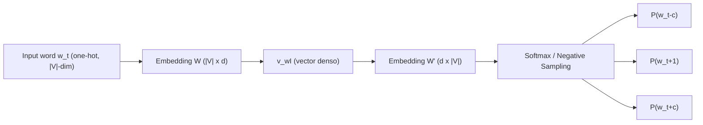
**Explicación:** la palabra objetivo $w_t$ se proyecta a un vector denso vía $W$ (esa es la matriz que terminamos usando como "los embeddings"); luego $W'$ proyecta de nuevo al espacio del vocabulario para predecir cada palabra de la ventana de contexto. El entrenamiento ajusta $W$ y $W'$ para que esa predicción sea correcta; el embedding final es lo que la red "necesitó aprender" en $W$ para lograrlo. CBOW es la misma red con el flujo invertido (contexto → centro).

## 7.2 RNN (desenrollada en el tiempo)

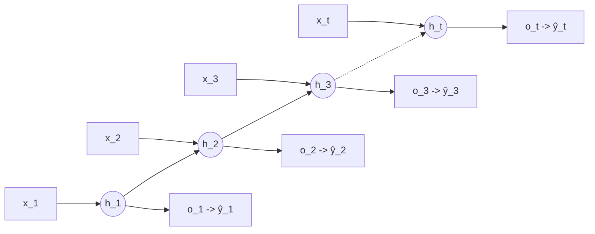
**Explicación:** $h_t=\tanh(Wh_{t-1}+Ux_t+b)$. La misma matriz $W$ se reusa en cada paso de tiempo (de ahí que el tamaño del modelo no dependa del largo de la secuencia) — pero esto también es la causa de vanishing/exploding gradients: multiplicar por $W$ una y otra vez, $T$ veces, durante BPTT. Cada $h_t$ es la "memoria" acumulada hasta el paso $t$; $o_t=Vh_t$ y $\hat y_t=\text{softmax}(o_t)$ es la predicción en ese paso (p.ej. la próxima palabra).

## 7.3 Celda LSTM (un solo paso de tiempo)

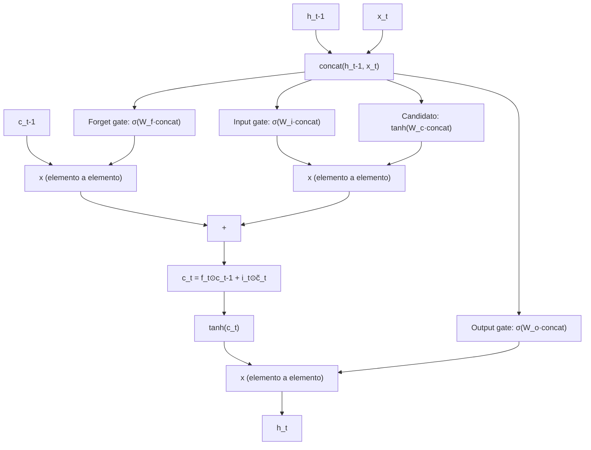
**Explicación:** el `[h_{t-1}, x_t]` concatenado alimenta **cuatro** transformaciones lineales+activación: forget gate $f_t$ (qué borrar de la memoria), input gate $i_t$ (cuánto deja pasar la nueva info), contenido candidato $\tilde c_t=\tanh(\cdot)$ (qué información nueva hay), y output gate $o_t$ (qué parte de la memoria exponer como $h_t$). La clave es que $c_t = f_t\odot c_{t-1} + i_t\odot\tilde c_t$ es una actualización con un componente **aditivo**: el gradiente puede fluir hacia atrás por la "autopista" de $c_t$ sin pasar por $T$ multiplicaciones consecutivas de una matriz de pesos, evitando el vanishing gradient.

## 7.4 Celda GRU (un solo paso de tiempo)

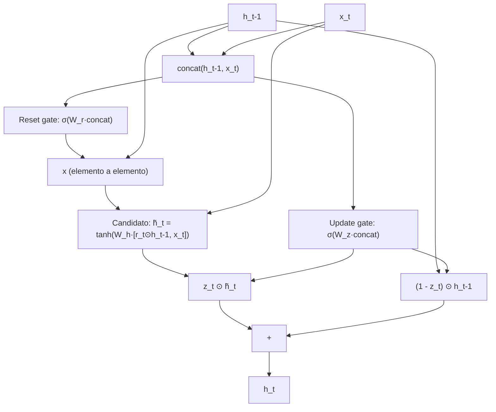
**Explicación:** GRU fusiona el forget+input gate de LSTM en un solo **update gate** $z_t$, y no tiene cell state separado — solo $h_t$. El **reset gate** $r_t$ controla cuánto del estado anterior se usa para calcular el contenido candidato $\tilde h_t$. $h_t=(1-z_t)\odot h_{t-1}+z_t\odot\tilde h_t$ es un promedio ponderado entre "quedarse con lo viejo" y "adoptar lo nuevo" — menos parámetros que LSTM (3 matrices de peso en vez de 4) pero la misma idea de fondo: permitir que el gradiente fluya sin atravesar puras multiplicaciones.

## 7.5 Seq2seq con Atención (Encoder-Decoder + RNN)

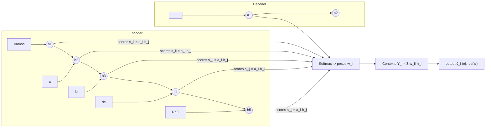
**Explicación:** el encoder corre normalmente y guarda **todos** sus hidden states $h_1,\ldots,h_T$ (no solo el último, como en seq2seq vanilla). En cada paso $i$ del decoder, su estado actual $a_i$ hace de "query": se compara contra cada $h_j$ (scores), se normaliza con softmax (pesos $w_{ij}$), y se construye un vector de contexto $Y_i$ como combinación ponderada de los $h_j$. Ese $Y_i$ —junto con $a_i$— se usa para generar la salida del paso $i$. Esto es exactamente el germen de Q/K/V de los Transformers, solo que aquí $Q=a_i$ y $K=V=h_j$ vienen de dos RNNs distintas (encoder y decoder).

## 7.6 Self-Attention (un bloque, Transformer)

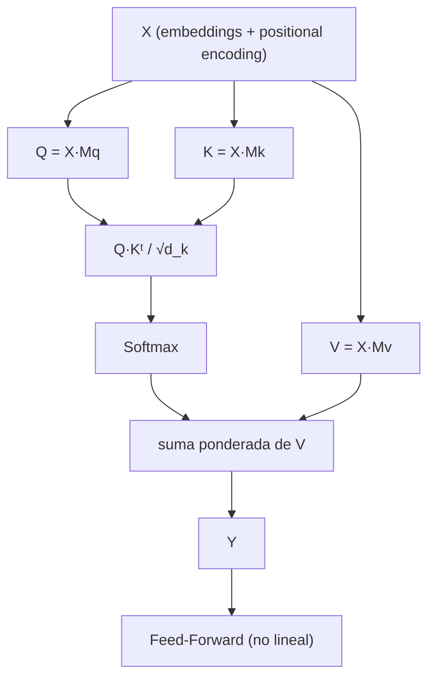
**Explicación:** cada token de la secuencia se proyecta a $Q$, $K$, $V$ mediante matrices aprendidas. El producto $QK^T$ mide cuánto "encaja" cada query con cada key (similitud); se escala por $\sqrt{d_k}$ y se normaliza con softmax → pesos de atención. La salida $Y$ es una combinación ponderada de los $V$ de **todos** los tokens, calculada en **un solo paso matricial** (paralelizable), no secuencialmente como en una RNN. La Feed-Forward posterior agrega no-linealidad token por token.

## 7.7 Bloque Encoder del Transformer (×N)

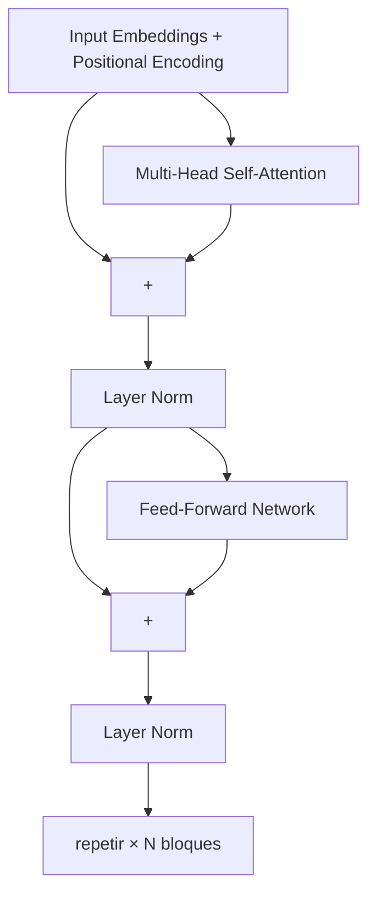
**Explicación:** cada subcapa (atención y FFN) está envuelta en `residual + LayerNorm`: la salida de la subcapa se suma a su propia entrada (camino directo para el gradiente) y luego se normaliza. Apilando $N$ de estos bloques se logra refinar progresivamente la representación de cada token usando el contexto completo de la secuencia. **BERT = solo esta pila de encoders.**

## 7.8 Bloque Decoder y Transformer Encoder-Decoder completo

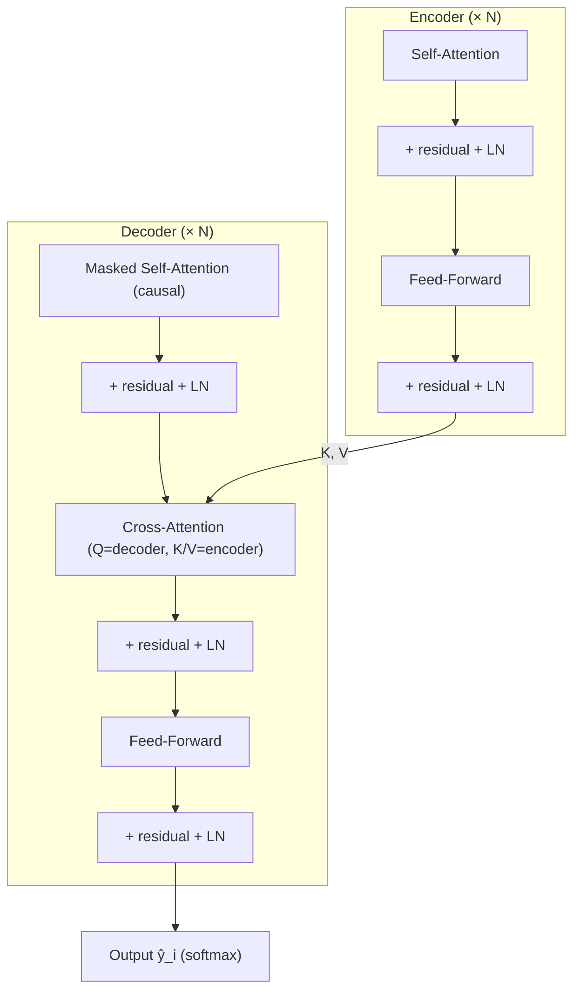
**Explicación:** el encoder produce representaciones $K,V$ de la secuencia fuente. El decoder tiene **tres** subcapas: (1) self-attention enmascarada (causal — cada posición solo ve las anteriores, necesario para generación autorregresiva), (2) cross-attention donde el **query** viene del decoder pero **keys/values** vienen del encoder (así el decoder "consulta" la fuente en cada paso de generación), y (3) feed-forward. Usado en traducción, resumen, Q&A generativo (T5, BART).

## 7.9 BERT (Encoder-only) — input/output

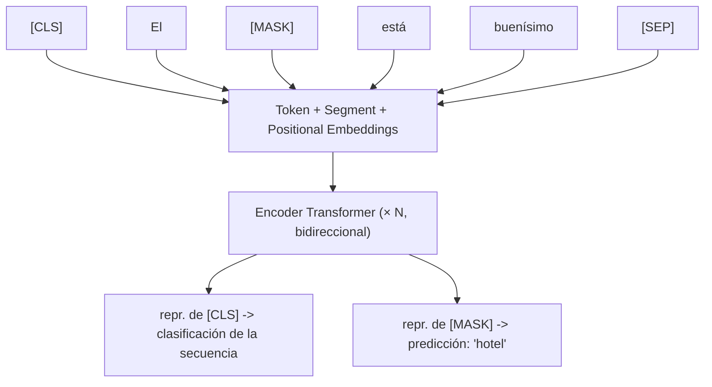
**Explicación:** todos los tokens pueden atender a todos los demás (bidireccional, sin máscara causal) — por eso BERT puede usar contexto izquierdo *y* derecho para predecir `[MASK]`, pero precisamente por esto no puede generar texto de forma autorregresiva (tendría que "ver" tokens futuros que aún no generó). `[CLS]` agrega información de toda la secuencia para tareas de clasificación; `[SEP]` separa pares de oraciones.

## 7.10 GPT (Decoder-only) — generación autorregresiva

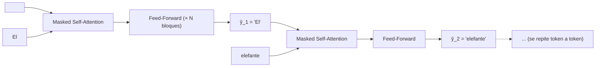
**Explicación:** no hay encoder. Cada posición predice el siguiente token usando **solo** los tokens que ya generó (máscara causal en la self-attention). Durante el entrenamiento esto se hace en paralelo sobre toda la secuencia de una vez (con la máscara forzando la causalidad); durante la generación real, es estrictamente secuencial: se genera un token, se lo agrega a la entrada, y se vuelve a pasar todo por el modelo para el siguiente token.

## 7.11 ELMo (Bi-LSTM apilado)

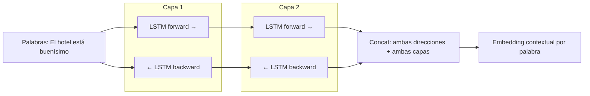
**Explicación:** dos LSTMs bidireccionales apiladas (2 capas). Para cada palabra, el embedding contextual final combina las representaciones de **ambas** direcciones y **ambas** capas (capas bajas → sintaxis, capas altas → semántica). A diferencia de Word2Vec, la representación de "hotel" cambia según el resto de la oración — esto es lo que la hace "contextual" en vez de estática.

## 7.12 LoRA (fine-tuning eficiente)

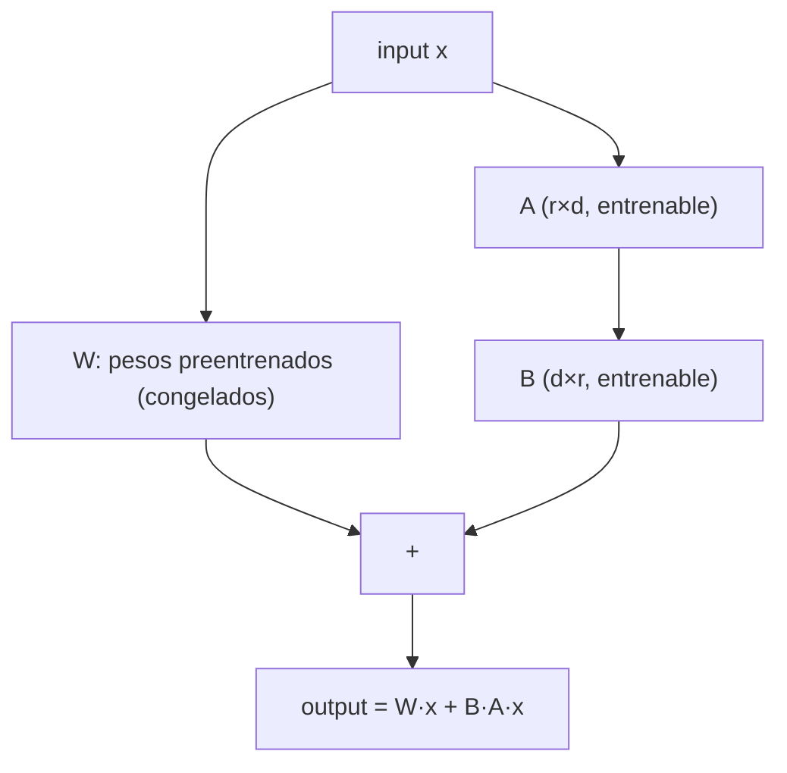
**Explicación:** en vez de actualizar la matriz completa $W$ (millones/billones de parámetros), se congela $W$ y se aprende solo una corrección de **bajo rango** $BA$ ($r \ll d$, por ejemplo $r=8$ vs $d=4096$). Esto reduce drásticamente los parámetros entrenables. En inferencia, se puede sumar $W+BA$ en una sola matriz, o mantenerlas separadas para intercambiar rápidamente entre distintos LoRAs (tareas) sobre el mismo modelo base.

---

# 8. Preguntas guía para repasar (auto-examen)

Usar estas preguntas para verificar que la solidez teórica es real y no solo reconocimiento de términos:

1. ¿Por qué un modelo de n-gramas con probabilidad 0 es catastrófico, y cómo lo resuelven distintas técnicas de smoothing (Laplace vs. Kneser-Ney)?
2. ¿Por qué BM25 es "mejor" que TF-IDF? ¿Qué dos cosas corrige explícitamente?
3. ¿Por qué Naive Bayes funciona razonablemente bien en la práctica a pesar de que su asunción de independencia es falsa?
4. ¿Qué relación hay entre LSA y Word2Vec? ¿Por qué Word2Vec normalmente generaliza mejor a pesar de no usar la matriz completa de co-ocurrencias?
5. ¿Cuál es la limitación de los embeddings estáticos que motiva a ELMo, y qué arquitectura usa ELMo para resolverla?
6. Explicar paso a paso por qué una RNN sufre vanishing/exploding gradients y por qué el cell state de LSTM lo mitiga (pensar en la diferencia entre actualización multiplicativa vs. aditiva).
7. ¿Cuál es el "cuello de botella" del seq2seq clásico, y cómo lo resuelve la atención? Dibujar el flujo de scores → softmax → contexto.
8. ¿Por qué un Transformer necesita positional embeddings y una RNN no?
9. ¿Por qué BERT (encoder-only) no puede usarse para generar texto libremente, pero GPT (decoder-only) sí?
10. ¿Qué significa "in-context learning" y por qué representa un cambio de paradigma respecto al fine-tuning clásico?
11. ¿Cómo se relacionan adapters/LoRA con el problema de costo de fine-tunear modelos grandes?
12. ¿Qué es una capacidad emergente, y por qué es un fenómeno difícil de predecir o explicar?
13. Diferencia entre fidelidad y facticidad en el contexto de alucinaciones — dar un ejemplo donde un texto sea fiel pero no factual (o viceversa).
14. ¿Cómo conecta RAG las técnicas de IR clásico (clase 2) con los LLMs generativos (clase 6)?
15. Trazar la cadena completa: ¿por qué pasamos de contar n-gramas → vectores sparse → embeddings densos estáticos → embeddings contextuales → atención → Transformers → preentrenamiento masivo? ¿Qué problema concreto resolvió cada paso?

---

# 9. Glosario rápido de fórmulas clave (cheat-sheet)

| Concepto | Fórmula |
|---|---|
| Bigrama MLE | $P(w_i\mid w_{i-1})=\frac{C(w_{i-1},w_i)}{C(w_{i-1})}$ |
| Laplace smoothing | $\frac{C+1}{C(w_{i-1})+V}$ |
| Perplexity | $2^{-\frac{1}{N}\sum\log_2 P(w_i\mid w_{<i})}$ |
| TF-IDF | $\text{TF}\cdot\log\frac{N}{\text{df}(t)}$ |
| BM25 | ver fórmula completa en clase 2 — recordar $k_1$ (saturación) y $b$ (largo) |
| Naive Bayes | $\arg\max_y P(X\mid Y)P(Y)$, con $P(X\mid Y)=\prod_i P(x_i\mid Y)$ |
| Softmax | $\frac{e^{z_i}}{\sum_j e^{z_j}}$ |
| Skip-gram | $P(w_O\mid w_I)=\frac{\exp(v'_{w_O}{}^\top v_{w_I})}{\sum_w \exp(v'_w{}^\top v_{w_I})}$ |
| RNN | $h_t=\tanh(Wh_{t-1}+Ux_t+b)$ |
| LSTM cell update | $c_t=f_t\odot c_{t-1}+i_t\odot \tilde c_t$ |
| Atención (scores) | $s_{ij}=a_i\cdot h_j \to \text{softmax} \to Y_i=\sum_j w_{ij}h_j$ |
| Self-Attention | $\text{softmax}\left(\frac{QK^T}{\sqrt{d_k}}\right)V$ |
| Positional Encoding | $\sin(pos/10000^{2i/d})$, $\cos(pos/10000^{2i/d})$ |
| LayerNorm | $\gamma\cdot\frac{x-\mu}{\sigma+\epsilon}+\beta$ |
| LoRA | $W'=W+BA$, $r\ll d$ |

---

# 10. Respuestas al autoexamen (Sección 8)

**1. ¿Por qué una probabilidad 0 en n-gramas es catastrófica, y cómo lo resuelven Laplace vs. Kneser-Ney?**
Porque la probabilidad de una oración completa es un **producto** de probabilidades condicionales: $P(w_1,\ldots,w_n)=\prod_i P(w_i\mid w_{<i})$. Si un solo n-grama nunca apareció en entrenamiento, su probabilidad MLE es 0, y como está multiplicando, **toda la cadena colapsa a 0** sin importar qué tan buena sea el resto de la oración — el modelo no puede generalizar a nada no visto literalmente. Laplace soluciona esto sumando 1 a todos los conteos (nunca hay un 0 verdadero), pero es burdo: redistribuye demasiada masa de probabilidad hacia eventos no vistos, perjudicando a los n-gramas que sí tienen buena evidencia. Kneser-Ney es más fino: en vez de "regalar" masa pareja a todo lo no visto, hace backoff a la **probabilidad de continuación** (cuántos contextos distintos preceden a la palabra), que es una mejor estimación de cuán "natural" es esa palabra en general — por eso es el método con mejor performance empírica para n-gramas.

**2. ¿Por qué BM25 es mejor que TF-IDF? ¿Qué dos cosas corrige?**
Corrige (a) la **saturación de TF**: en TF-IDF puro, una palabra que aparece 20 veces pesa el doble que si aparece 10 veces (lineal); en la práctica, después de cierto punto repetir una palabra no aporta información proporcional. El término $\frac{\text{TF}(k_1+1)}{\text{TF}+k_1(\ldots)}$ hace que el aporte de TF se sature (rendimientos decrecientes), controlado por $k_1$. (b) La **normalización por longitud del documento**: sin corrección, documentos largos acumulan más conteos de términos solo por ser largos, y "ganan" artificialmente en ranking. El factor $\left(1-b+b\frac{|d|}{\text{avgdl}}\right)$ penaliza documentos más largos que el promedio, controlado por $b$. Estas dos correcciones tienen fundamento probabilístico (derivan de un modelo de relevancia), no son ad-hoc como en TF-IDF.

**3. ¿Por qué Naive Bayes funciona bien pese a su asunción falsa de independencia?**
Porque para clasificación lo que importa no es estimar $P(X\mid Y)$ con precisión absoluta, sino que el **ranking** entre clases ($\arg\max_y$) sea correcto. Aunque la independencia condicional es violada (las palabras de un texto están correlacionadas entre sí), los errores de esa violación suelen afectar de forma similar a todas las clases, por lo que el orden relativo de los scores se mantiene razonablemente bien. Además, al ser un modelo muy simple con pocos parámetros (solo conteos), tiene **baja varianza**: con pocos datos de entrenamiento generaliza mejor que modelos discriminativos más flexibles (como logistic regression) que necesitan más datos para ajustar bien sus pesos sin sobreajustar.

**4. ¿Qué relación hay entre LSA y Word2Vec? ¿Por qué Word2Vec suele generalizar mejor?**
Ambos parten de la misma hipótesis distribucional: el significado de una palabra está determinado por sus contextos. LSA construye explícitamente una matriz término-documento (o término-término) global y la factoriza de una sola vez con SVD para obtener vectores densos — es un método de **álgebra lineal sobre estadísticas globales**. Word2Vec, en cambio, entrena iterativamente una red neuronal muy simple (skip-gram/CBOW) prediciendo palabras de contexto en ventanas locales, ajustando los vectores con gradiente descendente paso a paso sobre millones de ejemplos. Word2Vec suele generalizar mejor en la práctica porque el objetivo de entrenamiento está directamente optimizado para que la geometría del espacio capture relaciones semánticas finas (de ahí que emerjan analogías vectoriales tipo king-man+woman≈queen), algo que la factorización SVD de LSA no garantiza explícitamente — LSA prioriza reducir dimensionalidad reteniendo varianza, no necesariamente estructura semántica lineal.

**5. ¿Cuál es la limitación de los embeddings estáticos que motiva a ELMo, y cómo la resuelve?**
La limitación es que Word2Vec/GloVe/FastText asignan **un único vector fijo por palabra**, sin importar la oración en la que aparece — "banco" tiene el mismo vector en "me senté en el banco" y "saqué dinero del banco". ELMo resuelve esto generando el embedding de una palabra a partir de **todo el contexto de la oración**: usa dos capas de LSTM bidireccional (forward + backward) preentrenadas como modelo de lenguaje; el embedding final de cada palabra es la concatenación de las representaciones de ambas direcciones y ambas capas, evaluadas en esa oración específica. Por construcción, ese embedding cambia según las palabras vecinas — es **contextual**, no estático.

**6. ¿Por qué una RNN sufre vanishing/exploding gradients, y por qué el cell state de LSTM lo mitiga?**
Durante BPTT, el gradiente de la pérdida respecto a un estado lejano en el pasado se calcula propagando hacia atrás a través de $T$ pasos de tiempo, lo cual produce un **producto de $T$ matrices** $W$ (más derivadas de la no-linealidad): $\frac{\partial h_T}{\partial h_1}=\prod_t W\cdot\text{diag}(\sigma')$. Si los autovalores de $W$ son mayores a 1, el producto crece exponencialmente con $T$ (exploding); si son menores a 1, decae exponencialmente a 0 (vanishing) — en ambos casos, las dependencias de largo alcance se vuelven imposibles de aprender (el gradiente que debería "enseñarle" al modelo a usar información lejana, o explota o desaparece antes de llegar). El cell state de LSTM ataca esto introduciendo una actualización con un término **aditivo**: $c_t = f_t\odot c_{t-1} + i_t\odot\tilde c_t$. A diferencia de una RNN vanilla, donde el estado se recalcula multiplicando por $W$ en cada paso, aquí $c_{t-1}$ puede pasar (casi) sin modificar a $c_t$ si $f_t\approx 1$ — el gradiente puede fluir hacia atrás por esa "autopista" aditiva sin tener que atravesar $T$ multiplicaciones sucesivas de una matriz de pesos, evitando que se desvanezca.

**7. ¿Cuál es el cuello de botella del seq2seq clásico y cómo lo resuelve la atención?**
En seq2seq vanilla, el encoder debe comprimir **toda** la secuencia fuente (sin importar cuán larga sea) en un único vector de tamaño fijo: el último hidden state. Para secuencias largas, esto es estructuralmente imposible de hacer sin perder información — es un cuello de botella de información, no un problema de entrenamiento. La atención lo resuelve dejando que el decoder, en cada paso $i$, en vez de depender solo de ese vector único, **mire todos** los hidden states del encoder $h_1,\ldots,h_T$: calcula scores de similitud $s_{ij}=a_i\cdot h_j$ entre su estado actual $a_i$ y cada $h_j$, los normaliza con softmax para obtener pesos $w_{ij}$, y construye un vector de contexto $Y_i=\sum_j w_{ij}h_j$ específico para ese paso de generación. Así la "memoria" de la fuente no se comprime una sola vez al final del encoder, sino que está disponible completa y se consulta de nuevo en cada paso de generación.

**8. ¿Por qué un Transformer necesita positional embeddings y una RNN no?**
Una RNN procesa la secuencia **token por token, en orden**, por construcción: el hecho de que $h_t$ se calcule a partir de $h_{t-1}$ ya codifica implícitamente la posición y el orden (no se puede calcular $h_3$ sin haber calculado $h_1$ y $h_2$ antes). Un Transformer, en cambio, procesa **todos los tokens en paralelo** mediante matrices — self-attention es, por diseño, invariante a permutaciones: si se permutan las filas de $X$, la salida de la atención se permuta igual pero no cambia su contenido relativo. Esto significa que, sin ayuda adicional, el modelo no tiene ninguna forma de saber que "Juan golpeó a Pedro" es distinto de "Pedro golpeó a Juan" — ambas tendrían la misma "bolsa" de tokens procesados en paralelo. Los positional embeddings inyectan esa información de orden directamente en la representación de entrada, sumándose a los embeddings de palabra antes de la primera capa.

**9. ¿Por qué BERT no puede generar texto libremente, pero GPT sí?**
BERT (encoder-only) usa self-attention **sin máscara**: cada token puede atender a todos los demás tokens de la secuencia, incluyendo los que están a su derecha (en el futuro, si pensamos en generación token a token). Eso es justamente lo que le permite tener contexto bidireccional verdadero para tareas de comprensión — pero para *generar* texto se necesitaría predecir el token en la posición $t$ sin haber "visto" todavía los tokens en posiciones $>t$, porque esos tokens son justamente los que el modelo debería estar generando. GPT (decoder-only) usa self-attention **enmascarada/causal**: cada posición solo puede atender a posiciones anteriores o iguales a la suya, lo cual es exactamente la restricción que necesita la generación autorregresiva (predecir el próximo token usando solo lo ya generado).

**10. ¿Qué es in-context learning y por qué es un cambio de paradigma?**
Es la capacidad de un LLM grande (GPT-3+) de resolver una tarea nueva usando solo **instrucciones y/o ejemplos colocados directamente en el prompt**, sin actualizar ni un solo peso del modelo. El cambio de paradigma es que invierte la relación clásica entre modelo y tarea: en el paradigma de fine-tuning (BERT, GPT-1), se **adapta el modelo a la tarea** (se reentrenan pesos con datos etiquetados de esa tarea específica). En in-context learning, se **adapta la tarea al modelo**: se formula la tarea como texto natural dentro del prompt, y el modelo —ya preentrenado y congelado— generaliza a partir de eso. Esto elimina (en muchos casos) la necesidad de datos etiquetados específicos de tarea y de cualquier paso de entrenamiento adicional, lo cual es lo que motiva la frase "el fin del fine-tuning" para una porción grande de tareas de NLP.

**11. ¿Cómo se relacionan adapters/LoRA con el costo de fine-tunear modelos grandes?**
Fine-tunear un LLM completo implica actualizar (y guardar) todos sus parámetros — para un modelo de miles de millones de parámetros esto es costoso en cómputo, memoria, y además requiere un modelo completo separado por cada tarea (no se puede compartir un único modelo base entre tareas sin reentrenar). Adapters y LoRA resuelven esto **congelando** los pesos preentrenados y entrenando solo un número pequeño de parámetros adicionales: adapters insertan módulos chicos entre capas; LoRA aprende una actualización de bajo rango $BA$ ($r\ll d$) que se suma a los pesos congelados. El resultado práctico es que se puede tener **un solo modelo base** y múltiples adaptadores/LoRAs livianos (uno por tarea), que se cargan/descargan rápidamente, reduciendo drásticamente cómputo, memoria de almacenamiento, y riesgo de overfitting en tareas con pocos datos.

**12. ¿Qué es una capacidad emergente y por qué es difícil de explicar?**
Es una habilidad que un LLM exhibe sin haber sido entrenado explícitamente para ella (no estaba en los datos de entrenamiento como tarea etiquetada), y que **aparece de forma abrupta** al superar cierta escala de parámetros/datos, sin poder predecirse extrapolando linealmente el desempeño de modelos más chicos — un modelo de 1B parámetros puede tener desempeño cercano a 0 en una tarea, y un modelo de 100B parámetros (sin cambios arquitectónicos) puede de repente desempeñarse bien. Es difícil de explicar porque no hay todavía una teoría sólida que prediga **en qué escala exacta** aparecerá una capacidad dada, ni un mecanismo causal claro y verificado — solo hipótesis (mayor capacidad de memorización, profundidad necesaria para razonamiento multi-paso, representaciones más comprimidas) que aún no son consenso.

**13. Diferencia entre fidelidad y facticidad — ejemplo.**
**Fidelidad** mide si el texto generado es consistente con la fuente/input dado (el contenido de entrada al modelo). **Facticidad** mide si el texto es consistente con los hechos reales del mundo, independientemente de qué decía la fuente. Pueden diverger: si le pido a un modelo que resuma un artículo que **contiene un error fáctico** (dice que "la Torre Eiffel mide 500 metros"), un resumen que reproduzca fielmente ese dato sería **fiel** (a la fuente) pero **no factual** (el dato real es ~330m). Al revés: si el modelo "corrige" el dato a 330m usando su conocimiento de mundo sin que la fuente lo diga, sería **factual** pero **infiel** a la fuente que se le pidió resumir.

**14. ¿Cómo conecta RAG el IR clásico (clase 2) con los LLMs generativos (clase 6)?**
RAG usa exactamente el mismo problema que resuelve BM25/TF-IDF en clase 2 — **encontrar los documentos más relevantes para una query** dentro de una colección — como primer paso de un pipeline más grande. En vez de quedarse ahí (mostrar una lista de resultados, como un motor de búsqueda clásico), RAG toma esos documentos recuperados y los **inyecta como contexto** en el prompt de un LLM generativo (decoder-only o encoder-decoder), que los usa para generar una respuesta en lenguaje natural fundamentada en esa información. Es literalmente la unión de las dos mitades del curso: la recuperación (information retrieval clásico, estadístico, basado en términos o embeddings) con la generación (modelos neuronales modernos preentrenados) — y resuelve un problema concreto de los LLMs puros: la alucinación y el conocimiento desactualizado/cerrado del modelo.

**15. Trazar la cadena completa de la evolución del NLP — qué problema resolvió cada paso.**
- **N-gramas (conteo)** → primer modelo de lenguaje, pero sufre esparsidad: la mayoría de combinaciones de palabras nunca aparecen en el corpus, dando probabilidad 0.
- **Vectores sparse + clasificadores clásicos (BoW/TF-IDF/BM25 + Naive Bayes/SVM)** → permiten clasificar texto sin depender de probabilidades de secuencias exactas, pero los vectores son de altísima dimensión, no capturan significado semántico, y requieren features diseñadas a mano.
- **Embeddings estáticos densos (Word2Vec/GloVe/FastText)** → aprenden representaciones semánticas de baja dimensión automáticamente (sin diseño manual de features) explotando la hipótesis distribucional, resolviendo "qué significa cada palabra" — pero asignan un único vector fijo por palabra sin importar el contexto.
- **RNN/LSTM/GRU + ELMo** → procesan la secuencia manteniendo un estado/memoria, permitiendo que la representación de una palabra dependa de su contexto (embeddings contextuales) — pero son secuenciales (lentas, no paralelizables) y, en seq2seq, sufren un cuello de botella al comprimir toda la fuente en un vector fijo.
- **Atención** → deja que el decoder consulte todos los estados del encoder en cada paso, resolviendo el cuello de botella — pero todavía corre sobre una RNN secuencial por debajo.
- **Transformers (self-attention)** → eliminan la RNN por completo, dejando que cada token atienda directamente a todos los demás en un solo paso paralelizable — esto habilita entrenar con muchísimos más datos y parámetros en tiempos razonables.
- **Preentrenamiento + Transfer Learning (BERT, GPT, T5...)** → aprovechan esa escalabilidad para preentrenar en corpus de texto masivo no etiquetado, aprendiendo conocimiento general que después se adapta (fine-tuning, adapters, LoRA, o directamente in-context learning) a tareas específicas con poquísimos datos.
- **LLMs modernos (GPT-3+)** → llevan esto al extremo de escala, produciendo capacidades emergentes y in-context learning, pero heredando (y amplificando) riesgos que ya existían en germen desde clases anteriores: sesgo (ya presente en Word2Vec), alucinación (ya presente conceptualmente en la imposibilidad de un n-grama de "saber" si algo es verdad), y costo computacional (que crece con cada salto de escala de esta cadena).
