# Resumen General — PLN UBA

Guía de estudio integrando clases 1-6. Pensada para tener solidez teórica y poder narrar **la evolución del NLP**: cada técnica nueva existe porque resuelve una limitación concreta de la anterior. Esa cadena causal es el hilo que conecta todo el curso y es, probablemente, la pregunta de examen más probable ("explique por qué pasamos de X a Y").

## Índice

**Cuerpo teórico (cronológico, clase por clase):**
- [0. El hilo conductor](#0-el-hilo-conductor-evolución-de-nlp-en-una-página) — [0.5 Definiciones fundamentales](#05-definiciones-fundamentales-y-distinciones-clave)
- [1. Clase 1: Preprocesamiento y Modelos Probabilísticos](#1-preprocesamiento-y-modelos-probabilísticos-clase-1--18-03) — *[1.1 Tokenización](#11-tokenización) · [1.1.1 Capa Embedding de Keras](#111-la-capa-embedding-de-keras--qué-hace-y-qué-pasos-vienen-antes) · [1.2 Normalización](#12-normalización-stemming-vs-lemmatization) · [1.3 POS/POS-Tagging](#13-pos-part-of-speech-y-pos-tagging) · [1.4 Stopwords](#14-stopwords) · [1.5 N-gramas y Markov](#15-n-gramas-y-cadenas-de-markov) · [1.6 Esparsidad](#16-el-problema-central-esparsidad) · [1.7 Smoothing](#17-smoothing-soluciones-al-problema-de-esparsidad) · [1.8 Perplexity](#18-perplexity)*
- [2. Clase 2: Vectorización y Clasificación Clásica](#2-vectorización-y-clasificación-clásica-clase-2--25-03) — *[2.1 Vector Space Model/BoW](#21-vector-space-model-y-bag-of-words) · [2.2 TF-IDF](#22-tf-idf) · [2.3 IR](#23-ir-information-retrieval) · [2.4 BM25](#24-bm25--la-mejora-probabilística-sobre-tf-idf) · [2.5 Naive Bayes](#25-naive-bayes--clasificador-generativo) · [2.6 SVM](#26-svm--clasificador-discriminativo) · [2.7 Generativo vs. Discriminativo](#27-generativo-vs-discriminativo-distinción-clave-de-examen) · [2.8 Feature Engineering](#28-feature-engineering) · [2.9 LSA/PPMI](#29-lsa-latent-semantic-analysis--el-puente-hacia-los-embeddings)*
- [3. Clase 3: Word Embeddings Estáticos](#3-word-embeddings-estáticos-clase-3--01-04) — *[3.1 Hipótesis distribucional](#31-hipótesis-distribucional-firth-1957) · [3.2 Word2Vec](#32-word2vec-mikolov-et-al-2013) · [3.3 GloVe](#33-glove-pennington-et-al-2014) · [3.4 FastText](#34-fasttext-bojanowski-et-al-2017) · [3.5 Limitación (gancho a clase 4)](#35-la-limitación-fundamental--y-el-gancho-hacia-la-clase-4) · [3.6 Sesgo](#36-sesgo-en-embeddings)*
- [4. Clase 4: RNN, LSTM, GRU](#4-language-models-i-rnn-lstm-gru-clase-4--27-05) — *[4.1 RNN](#41-rnn--arquitectura-base) · [4.2 Seq2seq](#42-seq2seq-encoder-decoder) · [4.3 BPTT](#43-backpropagation-through-time-bptt) · [4.4 Vanishing/Exploding Gradients](#44-exploding--vanishing-gradients) · [4.5 LSTM](#45-lstm-hochreiter--schmidhuber-1997) · [4.6 GRU](#46-gru-cho-et-al-2014) · [4.7 Bidireccionales](#47-rnn-bidireccionales) · [4.8 ELMo](#48-elmo--primer-paso-hacia-embeddings-contextuales) · [4.9 Benchmarks](#49-tareas-de-referencia-vocabulario-de-benchmarks)*
- [5. Clase 5: Atención y Transformers](#5-language-models-ii-atención-y-transformers-clase-5--03-06) — *[5.1 Atención](#51-mecanismo-de-atención--resuelve-el-cuello-de-botella) · [5.2 Transformers](#52-transformers-vaswani-et-al-2017--sacar-la-rnn-del-medio) · [5.3 Positional Embeddings](#53-positional-embeddings) · [5.4 Self-Attention](#54-self-attention--el-mecanismo-central) · [5.5 Multi-Head](#55-multiheaded-self-attention) · [5.6 Residual/LayerNorm](#56-residual-connections-y-layer-normalization) · [5.7 Encoder](#57-encoder) · [5.8 BERT](#58-bert--masked-language-modeling) · [5.9 Encoder-Decoder](#59-encoder-decoder-transformer) · [5.10 Decoder-Only](#510-decoder-only) · [5.11 Landscape](#511-landscape-mapa-mental-para-el-examen)*
- [6. Clase 6: Pretraining y Modelos Generativos](#6-pretraining-y-modelos-generativos-clase-6--10-06) — *[6.1 Pretraining/Transfer Learning](#61-pretraining-y-transfer-learning) · [6.2 Tipos de preentrenamiento](#62-tipos-de-preentrenamiento-tabla-de-examen) · [6.3 BERT/ELECTRA](#63-bert-en-detalle--electra) · [6.4 Adapters/LoRA](#64-adapters-y-lora--fine-tuning-eficiente) · [6.5 Por qué encoders no generan](#65-por-qué-los-encoders-no-generan-texto-recordatorio--razón-formal) · [6.6 BART/T5](#66-bart-y-t5--denoising-en-vez-de-lm-puro) · [6.7 GPT-1→3](#67-gpt-1--gpt-2--gpt-3-la-línea-de-escalado) · [6.8 Capacidades emergentes](#68-capacidades-emergentes) · [6.9 Alucinaciones](#69-alucinaciones) · [6.10 RAG](#610-rag-retrieval-augmented-generation) · [6.11 Costo/Destilación](#611-costo-destilación-early-exit) · [6.12 Toxicidad/Sesgo](#612-toxicidad-y-sesgo)*

**Anexos de repaso (no narrativos, para consulta rápida):**
- [7. Diagramas de Arquitecturas](#7-diagramas-de-arquitecturas) (Mermaid, uno por arquitectura clave) — *[7.1 Skip-gram](#71-skip-gram-word2vec) · [7.2 RNN](#72-rnn-desenrollada-en-el-tiempo) · [7.3 LSTM](#73-celda-lstm-un-solo-paso-de-tiempo) · [7.4 GRU](#74-celda-gru-un-solo-paso-de-tiempo) · [7.5 Seq2seq+Atención](#75-seq2seq-con-atención-encoder-decoder--rnn) · [7.6 Self-Attention](#76-self-attention-un-bloque-transformer) · [7.7 Encoder Transformer](#77-bloque-encoder-del-transformer-n) · [7.8 Encoder-Decoder](#78-bloque-decoder-y-transformer-encoder-decoder-completo) · [7.9 BERT](#79-bert-encoder-only--inputoutput) · [7.10 GPT](#710-gpt-decoder-only--generación-autorregresiva) · [7.11 ELMo](#711-elmo-bi-lstm-apilado) · [7.12 LoRA](#712-lora-fine-tuning-eficiente)*
- [8. Preguntas guía (autoexamen)](#8-preguntas-guía-para-repasar-auto-examen)
- [9. Glosario rápido de fórmulas (cheat-sheet)](#9-glosario-rápido-de-fórmulas-clave-cheat-sheet)
- [10. Respuestas al autoexamen](#10-respuestas-al-autoexamen-sección-8)

---

## 0. El hilo conductor: evolución de NLP en una página

```
1. Reglas/conteo puro (n-gramas)
   ↓ (esparsidad: la mayoría de frases nunca se vieron)
2. Representaciones vectoriales sparse (BoW, TF-IDF, BM25) + clasificadores clásicos (Naive Bayes, SVM)
   ↓ (alta dimensión, sin noción de significado/semántica, features a mano)
3. Embeddings estáticos densos (Word2Vec, GloVe, FastText)
   ↓ (un vector por palabra, sin importar el contexto: "banco" siempre es el mismo vector)
4. Redes recurrentes (RNN, LSTM, GRU) — procesan secuencias, mantienen estado/memoria
   ↓ (vanishing/exploding gradients, procesamiento secuencial = lento, cuello de botella en seq2seq)
5. Atención — el decoder mira todos los estados del encoder, no solo el último
   ↓ (¿por qué no sacar la RNN del medio?)
6. Transformers — self-attention pura, paralelizable, sin recurrencia
   ↓ (¿cómo aprovechar datos no etiquetados a gran escala?)
7. Pretraining + Transfer Learning (BERT, GPT, T5...) — preentrenar en texto masivo, después adaptar
   ↓ (escalar parámetros y datos)
8. LLMs modernos — in-context learning, capacidades emergentes, y sus riesgos (alucinación, costo, sesgo)
```

Cada flecha "↓" es una pregunta de examen en potencia: **¿qué limitación tenía la técnica anterior, y cómo la resuelve la siguiente?** Esa es la estructura de todo este resumen.

---

## 0.5 Definiciones fundamentales y distinciones clave

Antes de entrar clase por clase, conviene fijar bien estos términos — son la base de todo lo demás, y el examen suele castigar usarlos como sinónimos cuando no lo son.

### Token vs. Type vs. Word vs. Vocabulario
- **Token (word instance)**: cada **ocurrencia concreta** de una unidad de texto en una secuencia. En "el gato come y el perro come", hay 7 tokens.
- **Type (word type)**: cada unidad de texto **distinta** (sin repetición). En esa misma oración hay 5 types: {el, gato, come, y, perro}.
- **Word**: término informal que puede referirse a cualquiera de los dos según el contexto — por eso "token" y "type" son los términos precisos a usar cuando importa la distinción (p. ej., en la Ley de Herdan/Heaps, $|V|$ son types y $N$ son tokens).
- **Vocabulario ($V$)**: el conjunto de todos los types distintos que un modelo conoce/puede producir. Su tamaño $|V|$ es una dimensión que aparece en casi toda fórmula del curso (softmax sobre $|V|$, matriz de embeddings $|V|\times d$, etc.).
- Importante: un "token" no tiene por qué ser una palabra completa. Con BPE, un token puede ser una *subword* ("ing", "##ar") o incluso un carácter — la tokenización moderna desacopla "token" de "palabra".

### Embedding vs. Vector vs. One-hot
- **Vector**: cualquier arreglo de números. Es el término más genérico — un one-hot, un vector TF-IDF y un embedding son todos "vectores", pero no todos son "embeddings".
- **One-hot encoding**: vector de dimensión $|V|$ con un único 1 y el resto 0s — representa "qué palabra es" sin ninguna noción de significado ni similitud (la distancia entre cualquier par de one-hots es la misma). Es la representación de *entrada* antes de aplicar un embedding.
- **Embedding**: vector **denso** y de **baja dimensión** (comparado con $|V|$), aprendido (no diseñado a mano), tal que la geometría del espacio (distancias, ángulos) refleja relaciones de significado entre los elementos que representa. Técnicamente, un embedding es el resultado de multiplicar un one-hot por una matriz de embeddings $E\in\mathbb{R}^{|V|\times d}$ — "buscar la fila correspondiente a esa palabra en una tabla aprendida".
- **Diferencia con un vector TF-IDF/BoW**: estos también son vectores que representan texto, pero son **sparse**, de dimensión $|V|$ (no $d \ll |V|$), y sus componentes son cuentas/estadísticas interpretables (frecuencia de cada palabra) — no se "entrenan" como un embedding, se calculan directamente del corpus. Un embedding, en cambio, es denso, de baja dimensión, y sus componentes individuales no tienen un significado interpretable por separado (solo la geometría conjunta importa).
- **Embedding estático vs. contextual**: un embedding estático (Word2Vec, GloVe, FastText) asigna **un único vector fijo por type**, sin importar la oración — la palabra "banco" siempre tiene el mismo embedding. Un embedding **contextual** (ELMo, BERT, salida de cualquier capa de un Transformer) es el vector que resulta de procesar esa palabra **junto con su oración completa**: la misma palabra-type produce un vector distinto en cada ocurrencia (token) según el contexto. Es decir: un embedding estático vive a nivel de *type*; un embedding contextual vive a nivel de *token*.

### Hidden state vs. Embedding
Un **hidden state** ($h_t$ en una RNN, o la salida de una capa de un Transformer) es, en esencia, un embedding contextual de ese paso/posición — pero el término "hidden state" enfatiza que es un estado **interno e intermedio** del modelo (puede no tener una interpretación semántica limpia, y cambia capa a capa), mientras que "embedding" suele reservarse para la representación de **entrada** (embedding de palabra) o para una representación final que se usa como output reutilizable (p. ej., "el embedding de \[CLS\]"). En la práctica son el mismo tipo de objeto matemático (un vector denso); la diferencia es de rol dentro de la arquitectura, no de naturaleza.

### Modelo vs. Arquitectura vs. Parámetros/Pesos
- **Arquitectura**: el diseño estructural — qué capas hay, cómo se conectan, qué operaciones aplican (ej: "Transformer encoder de 12 capas, 12 heads"). Es independiente de los valores concretos de los números internos.
- **Parámetros (pesos)**: los números concretos ($W$, $U$, $V$, matrices $Q/K/V$, embeddings, etc.) que la arquitectura usa, y que se ajustan durante el entrenamiento. "175B parámetros" describe cuántos de estos números tiene el modelo, no su arquitectura.
- **Modelo**: una arquitectura **más** un conjunto específico de pesos entrenados. "BERT" como arquitectura es un diseño reutilizable; "bert-base-uncased entrenado en Wikipedia" es un modelo concreto (esa arquitectura + esos pesos).

### Pretraining vs. Fine-tuning vs. Transfer Learning vs. In-Context Learning
- **Transfer Learning**: la idea general de **reusar** conocimiento aprendido en una tarea/dominio para otra tarea/dominio distinta. Es el concepto "sombrilla" bajo el cual caen las otras tres.
- **Pretraining**: la fase de entrenamiento inicial sobre una tarea genérica y datos masivos (típicamente no etiquetados), antes de saber a qué tarea específica se va a aplicar el modelo después (ej: predicción de la palabra siguiente sobre todo Wikipedia).
- **Fine-tuning**: tomar un modelo ya preentrenado y **continuar entrenándolo** (actualizando sus pesos, total o parcialmente vía adapters/LoRA) sobre datos etiquetados de una tarea específica.
- **In-Context Learning**: **no** modifica ningún peso del modelo. Se le da la tarea al modelo en forma de instrucciones/ejemplos dentro del prompt, y el modelo (ya congelado) infiere qué hacer a partir de eso en el momento de inferencia. Es cualitativamente distinto de fine-tuning aunque ambos sean formas de "adaptar" un modelo preentrenado a una tarea — fine-tuning adapta el modelo a la tarea, in-context learning adapta la tarea (vía el prompt) al modelo.

### Logit vs. Probabilidad vs. Softmax
- **Logit**: la salida cruda (sin normalizar) de la última capa lineal de un clasificador — un número real, puede ser negativo, no suma 1 con los demás. $z = Wx+b$.
- **Softmax**: la función que convierte un vector de logits en una **distribución de probabilidad** válida (todos los valores entre 0 y 1, suman 1): $\text{softmax}(z)_i=\frac{e^{z_i}}{\sum_j e^{z_j}}$.
- **Probabilidad**: el resultado de aplicar softmax (o sigmoid, en el caso binario) a los logits — es lo que efectivamente se interpreta como "qué tan probable es cada clase/token según el modelo", y sobre lo que se calcula la pérdida (cross-entropy) y métricas como perplexity.

### Generación vs. Clasificación vs. Representación (las tres "salidas" posibles de un modelo de NLP)
- **Tarea de representación/embedding**: el objetivo es producir un vector útil (ej: embedding de una oración para buscar similitud) — no hay una "respuesta" en sí, solo una representación reutilizable.
- **Tarea de clasificación/etiquetado**: el modelo produce una **etiqueta discreta** de un conjunto fijo y finito de opciones, por documento (sentiment analysis) o por token (POS tagging, NER). Encoders (BERT) son naturales aquí.
- **Tarea de generación**: el modelo produce una **secuencia de tokens nueva**, de longitud no fija, token a token, de forma autorregresiva. Requiere decoder (GPT) o encoder-decoder (T5), nunca un encoder puro — esta es la razón formal detrás de "BERT no genera, GPT sí" (ver pregunta 9 del autoexamen).

### Bias — tres sentidos distintos que el curso usa con la misma palabra
1. **Bias como parámetro**: el término $b$ en $Wx+b$ — un simple parámetro entrenable, sin ninguna connotación ética.
2. **Bias estadístico/inductivo**: una asunción que el modelo hace por diseño (ej: la asunción de independencia de Naive Bayes es un "bias" del modelo, en el sentido de sesgo estadístico que cambia qué tan bien generaliza).
3. **Bias social/ético**: preferencias o asociaciones discriminatorias aprendidas de los datos de entrenamiento (ej: $v_{\text{doctor}}-v_{\text{man}}+v_{\text{woman}}\approx v_{\text{nurse}}$). Es el sentido que importa en las secciones de sesgo de clase 3 y clase 6.
Distinguir cuál de los tres sentidos está en juego es importante porque el examen puede preguntar por cualquiera de ellos usando la misma palabra "bias"/"sesgo".

---

## 1. Preprocesamiento y Modelos Probabilísticos (Clase 1 — 18-03)

### Por qué empieza aquí el curso
Antes de poder modelar significado, hay que decidir **qué es una unidad de texto** (tokenización) y cómo reducir su variabilidad (normalización). Y antes de tener redes neuronales, el primer modelo de "lenguaje" fue puramente estadístico: contar. La clase tiene entonces dos mitades: primero el **preprocesamiento** (1.1 a 1.4, cómo preparar el texto crudo) y después el primer **modelo de lenguaje** propiamente dicho (1.5 a 1.8, n-gramas y sus problemas).

### 1.1 Tokenización

- **Word types** ($|V|$): vocabulario, palabras distintas. **Word instances** ($N$): total de palabras corridas.
- **Ley de Herdan/Heaps**: $|V| = kN^\beta$, $0<\beta<1$. El vocabulario sigue creciendo con más datos — nunca se "completa". Esto es la raíz del problema OOV (out-of-vocabulary): ningún vocabulario finito cubre todo el lenguaje.
- **BPE (Byte-Pair Encoding)**: solución práctica al problema OOV. En vez de tokenizar por palabra, se tokeniza por **subwords** que se recombinan.
  - **Trainer**: parte de caracteres individuales, fusiona iterativamente el par adyacente más frecuente, k veces.
  - **Encoder**: aplica los merges aprendidos, en el mismo orden, sobre texto nuevo.
  - Se ejecuta sobre bytes UTF-8 → vocabularios de 50K-200K tokens.
  - **Problema multilingüe**: tokenizadores entrenados mayormente en inglés sobre-segmentan otros idiomas (el español usa más tokens que el inglés para la misma oración) → esto afecta directamente el costo de inferencia de LLMs en español.

**Código (BPE con la librería `tokenizers` de Hugging Face):**
```python
from tokenizers import Tokenizer, models, trainers, pre_tokenizers

tokenizer = Tokenizer(models.BPE())
tokenizer.pre_tokenizer = pre_tokenizers.Whitespace()
trainer = trainers.BpeTrainer(vocab_size=5000, min_frequency=2)

# Entrenamiento: aprende los merges más frecuentes a partir de texto crudo
tokenizer.train(files=["corpus.txt"], trainer=trainer)

# Uso: convierte una oración nueva en subword-tokens usando esos merges
output = tokenizer.encode("el preprocesamiento es fundamental")
print(output.tokens)  # ej: ['el', 'pre', '##proces', '##amiento', 'es', 'fund', '##amental']
print(output.ids)     # los ids enteros correspondientes en el vocabulario
```
Input: texto crudo (string). Output: lista de subword-tokens (strings) y sus ids enteros — esto es lo que luego se convierte en un tensor de enteros para alimentar cualquier red (embedding lookup).

### 1.1.1 La capa `Embedding` de Keras — qué hace, y qué pasos vienen *antes*
Punto de confusión frecuente: la capa `Embedding` **no tokeniza y no construye vocabulario** — eso ya tuvo que pasar antes (1.1). La capa `Embedding` es solamente una **tabla de búsqueda entrenable** ($E\in\mathbb{R}^{|V|\times d}$, la misma matriz de la sección [0.5](#05-definiciones-fundamentales-y-distinciones-clave)): recibe **ids enteros** y devuelve, para cada id, la fila correspondiente de $E$ — ningún cómputo más complejo que eso.

**Input de la capa**: tensor `(batch, T)` de **enteros** (ids de token, no texto, no one-hot). `batch` = cantidad de secuencias procesadas juntas; `T` = cantidad de pasos de tiempo (tokens) por secuencia — todas deben tener el mismo largo dentro de un batch, por eso se aplica **padding** (rellenar con un id reservado, típicamente 0) a las secuencias más cortas.

**Output de la capa**: tensor `(batch, T, d)` — por cada id de entrada, un vector denso de $d$ dimensiones. Se agrega una dimensión nueva al final: cada entero escalar se "expande" a su embedding.

**El pipeline completo, de texto crudo a la entrada de la red** (la parte que la capa `Embedding` *no* hace):
1. **Tokenizar** el texto (1.1) → lista de tokens/subwords.
2. **Construir el vocabulario**: un diccionario `token -> id entero` (a partir de los tokens más frecuentes del corpus de entrenamiento).
3. **Convertir cada secuencia** de tokens a su secuencia de ids usando ese diccionario (un token nunca visto se mapea a un id especial `[UNK]`/`<unk>`).
4. **Padding/truncado**: forzar que todas las secuencias del batch tengan el mismo largo $T$.

Recién con esos ids `(batch, T)` ya construidos se llama a la capa `Embedding`. En Keras, los pasos 1-4 se hacen con `TextVectorization` (o `Tokenizer` + `pad_sequences` en versiones más viejas) — es una capa/utilidad **distinta**, que se ejecuta *antes*:

```python
from tensorflow.keras.layers import TextVectorization, Embedding
import tensorflow as tf

textos = ["el gato come pescado", "el perro come carne y duerme"]

# Paso 1-4: tokeniza, construye vocabulario, convierte a ids, aplica padding/truncado
vectorizer = TextVectorization(max_tokens=10_000, output_sequence_length=6)
vectorizer.adapt(textos)  # "entrena" el vocabulario mirando el corpus (no entrena pesos, solo cuenta frecuencias)

ids = vectorizer(textos)
print(ids)
# tensor (batch=2, T=6) de enteros, ej:
# [[ 4  2  3  5  0  0]
#  [ 4  6  3  7  8  9]]
# (0 = id de padding; cada entero indexa una palabra del vocabulario aprendido en .adapt())

# Paso 5 (esto sí es la capa Embedding): ids enteros -> vectores densos
emb = Embedding(input_dim=10_000, output_dim=64)  # |V|=10000, d=64
x = emb(ids)
print(x.shape)  # (2, 6, 64) -- por cada uno de los 6 ids, un vector de 64 dimensiones
```

**Resumen del flujo**: `texto crudo → tokenización + vocabulario (TextVectorization) → ids enteros (batch, T) → Embedding (lookup en E) → vectores densos (batch, T, d) → RNN/LSTM/Transformer...`. La capa `Embedding` es el puente entre "palabras representadas como índices discretos" (sin geometría, ver distinción one-hot vs. embedding en [0.5](#05-definiciones-fundamentales-y-distinciones-clave)) y "palabras representadas como vectores densos" que el resto de la red puede operar matemáticamente — y sus pesos (la matriz $E$) se entrenan junto con el resto del modelo, salvo que se inicialicen con embeddings preentrenados (Word2Vec/GloVe, ver 3.2-3.3) y se congelen.

**¿Por qué `.adapt()` depende de mi corpus — no hay algo genérico?** `TextVectorization.adapt()` construye el vocabulario **desde cero**, contando frecuencias en el texto que le pasés — el id que termina asignándole a cada palabra depende de ese corpus puntual. Esto está bien si entrenás una red **desde cero**, pero es un problema si vas a hacer **fine-tuning de un modelo preentrenado** (BERT, GPT-2, T5...): ese modelo ya tiene una matriz $E$ entrenada para un vocabulario fijo específico, y los ids que generaría tu propio `.adapt()` no van a coincidir con los que esa matriz espera — le estarías pasando ids arbitrarios a una tabla entrenada con otro mapeo palabra→id, dejándola inútil.

La solución no es "generizar" `TextVectorization`, sino usar el **tokenizer que viene pegado al modelo preentrenado**: el trainer de BPE/WordPiece (ver 1.1) se corrió **una sola vez**, sobre un corpus masivo y genérico (Wikipedia, Common Crawl, etc.), y ese vocabulario fijo se reusa siempre — nunca se reentrena por dataset de fine-tuning. Por eso, al cargar un modelo con `transformers`, el tokenizer no tiene `.adapt()` ni `.fit()`:

```python
from transformers import AutoTokenizer

tokenizer = AutoTokenizer.from_pretrained("bert-base-multilingual-cased")
# vocabulario y merges de BPE/WordPiece ya aprendidos una sola vez, sobre un corpus genérico
# -- no se reentrena: los ids resultantes son EXACTAMENTE los que la matriz E de BERT espera

ids = tokenizer(["el gato come pescado"], return_tensors="pt", padding=True)
print(ids["input_ids"])
```

**Regla práctica**: `TextVectorization.adapt()` → cuando entrenás una arquitectura nueva desde cero con tu propio vocabulario. `AutoTokenizer.from_pretrained(...)` → cuando vas a usar o fine-tunear un modelo preentrenado, porque el tokenizer y la matriz de embeddings son una unidad indivisible, producto del mismo entrenamiento original.

### 1.2 Normalización: Stemming vs. Lemmatization
Una vez que el texto está tokenizado, el siguiente problema es que la misma palabra puede aparecer en muchas formas distintas ("correr", "corriendo", "corrió") — la normalización busca reducir esa variabilidad.

- **Stemming** (Porter Stemmer): reglas heurísticas, remueve sufijos. Rápido, impreciso, puede producir no-palabras, no distingue POS.
- **Lemmatization**: usa diccionario/análisis morfológico para hallar la forma base (lema). Más preciso, más lento, considera POS.
- **Morfología**: morfema (unidad mínima con significado) → raíz + afijos (inflexionales: rol sintáctico, ej. plural; derivacionales: cambian la clase gramatical). Clíticos: actúan como palabras pero se adjuntan ("I've").
- **Case folding**: minúsculas. Gana generalización, pierde información ("US" vs "us").

### 1.3 POS (Part-of-Speech) y POS-Tagging
La lemmatization de la sección anterior necesita saber la categoría gramatical de la palabra para elegir el lema correcto — eso lleva directamente al concepto de POS.

- **POS**: la categoría gramatical de una palabra en su contexto (sustantivo, verbo, adjetivo, preposición, etc.). No es una propiedad fija de la palabra-tipo sino de la palabra-en-uso: "banco" puede ser sustantivo siempre, pero "trabajo" puede ser sustantivo ("mi trabajo") o verbo conjugado ("yo trabajo") — solo el contexto desambigua. Esto la conecta directamente con la noción de "embedding contextual" que reaparece en clase 4.
- **Por qué importa**: lemmatization la necesita para elegir el lema correcto (ver arriba); el parsing sintáctico la necesita como insumo; y es uno de los benchmarks/tareas de referencia que se repiten en todo el curso para mostrar qué tan bien una arquitectura captura estructura sintáctica.
- **POS-Tagging**: la tarea de asignar automáticamente la etiqueta POS correcta a cada palabra de una oración. Es un problema de **etiquetado de secuencias** (sequence labeling): la entrada es una secuencia de palabras y la salida es una secuencia de etiquetas de igual longitud, una por palabra — la misma formulación que NER o SRL.
- **Por qué es no trivial**: la ambigüedad léxica (una palabra puede tener varias POS posibles) solo se resuelve mirando el contexto completo de la oración, no la palabra aislada. Esto es exactamente lo que motiva usar modelos que vean toda la secuencia (Bi-LSTM, clase 4) o todo el contexto bidireccional (BERT, clase 5) en vez de mirar la palabra sola.
- **Dónde aparece en el curso**: es uno de los ejemplos canónicos de tarea que **necesita ver la secuencia completa, no solo el pasado** — por eso una RNN unidireccional no es ideal (no sirve para *generar*, pero tampoco aprovecha el contexto futuro), mientras que **Bi-LSTM** (clase 4) y **BERT** (clase 5, vía `[CLS]`/clasificación por token) sí son arquitecturas naturales para esta tarea. En ELMo, las capas inferiores del Bi-LSTM capturan justamente este tipo de información sintáctica (POS, estructura), mientras que las capas superiores capturan semántica.

### 1.4 Stopwords
Cerrando el bloque de preprocesamiento, queda una última decisión de filtrado: qué palabras conviene descartar antes de modelar.

Palabras de alta frecuencia y bajo contenido semántico (function words: artículos, preposiciones) vs. content words (sustantivos, verbos — crecen indefinidamente). **No filtrar** cuando el orden importa (modelado de lenguaje) o en búsqueda de frases exactas.

### 1.5 N-gramas y Cadenas de Markov
Con el texto ya tokenizado y normalizado, llega la segunda mitad de la clase: construir el primer **modelo de lenguaje** (LM) — un modelo que asigna una probabilidad a una secuencia de palabras. La primera aproximación, antes de cualquier red neuronal, es puramente estadística: contar.

- Un n-grama es una secuencia contigua de $n$ tokens. Es la base de los LM estadísticos clásicos.
- **Asunción de Markov**: la probabilidad de la próxima palabra depende solo de las $n-1$ palabras anteriores, no de toda la historia:
$$P(w_i \mid w_1 \ldots w_{i-1}) \approx P(w_i \mid w_{i-n+1} \ldots w_{i-1})$$
  - $w_i$: la palabra en la posición $i$ que se quiere predecir. $w_1\ldots w_{i-1}$: toda la historia previa. $w_{i-n+1}\ldots w_{i-1}$: solo las últimas $n-1$ palabras (el "contexto" que el modelo efectivamente usa). $n$: el orden del n-grama (n=2 → bigrama, n=3 → trigrama).
- Estimación **MLE** para bigramas: $P(w_i \mid w_{i-1}) = \frac{C(w_{i-1}, w_i)}{C(w_{i-1})}$ (conteo simple).
  - $C(w_{i-1}, w_i)$: cantidad de veces que el par de palabras $(w_{i-1}, w_i)$ aparece junto en el corpus. $C(w_{i-1})$: cantidad de veces que aparece $w_{i-1}$ sola (sumada sobre cualquier palabra que la siga).
- **Generación de texto**: muestrear la siguiente palabra de la distribución condicional — la misma idea conceptual que usará después una RNN o GPT, solo que aquí la distribución viene de conteos en vez de una red neuronal.

### 1.6 El problema central: esparsidad
El modelo de n-gramas recién definido tiene un defecto fatal que aparece apenas se lo usa en la práctica.

A medida que $n$ crece, la mayoría de combinaciones nunca aparecen en el corpus de entrenamiento → probabilidad 0 → toda la cadena colapsa a 0. **Este es el problema que persigue a todo el curso**: cómo generalizar a secuencias no vistas. La solución de esta clase es smoothing; la solución de las clases 3-6 es, en el fondo, la misma pregunta resuelta con representaciones distribuidas (embeddings) en vez de conteos exactos.

### 1.7 Smoothing (soluciones al problema de esparsidad)
Estas son las técnicas concretas que atacan la esparsidad descripta arriba, en orden creciente de sofisticación.

- **Laplace (add-one)**: $P = \frac{C(w_{i-1},w_i)+1}{C(w_{i-1})+V}$. Simple pero redistribuye demasiada masa.
  - $C(w_{i-1},w_i)$ y $C(w_{i-1})$: los mismos conteos que en MLE. El $+1$ en el numerador evita probabilidad 0 para pares no vistos. $V=|V|$: tamaño del vocabulario — se suma en el denominador para que las probabilidades sigan sumando 1 después de "regalarle" 1 a cada combinación posible.
- **Add-k**: generaliza con $k<1$.
- **Backoff**: si no hay evidencia del n-grama de orden $n$, usar el de orden $n-1$.
- **Interpolación**: combina todos los órdenes simultáneamente con pesos $\lambda$ que suman 1.
- **Absolute Discounting**: resta un descuento fijo $d\approx 0.75$ (observación empírica de Church & Gale) a cada conteo, y redistribuye esa masa via backoff a unigramas.
- **Kneser-Ney**: mejora el discounting reemplazando el backoff a $P(w)$ por la **probabilidad de continuación** $P_{\text{CONTINUATION}}(w)$ — cuántos contextos *distintos* preceden a $w$. Intuición: "Kong" es frecuente pero solo aparece tras "Hong"; "glasses" aparece en muchos contextos → debería tener mayor probabilidad de continuación aunque sea menos frecuente en total.
- **Modified Kneser-Ney** (Chen & Goodman): usa 3 descuentos distintos según si el conteo es 1, 2 o ≥3. Es el método con mejor rendimiento para n-gramas puros.

### 1.8 Perplexity
Con varias técnicas de smoothing disponibles, hace falta una métrica para comparar qué tan bueno es un modelo de lenguaje frente a otro — eso es perplexity, y cierra la Clase 1.

Métrica estándar para evaluar LMs:
$$\text{PP}(W) = P(w_1,\ldots,w_N)^{-1/N} = 2^{-\frac{1}{N}\sum \log_2 P(w_i\mid w_{<i})}$$
- $W=w_1,\ldots,w_N$: la secuencia completa de prueba, de $N$ palabras. $P(w_1,\ldots,w_N)$: la probabilidad que el modelo asigna a toda la secuencia (producto de las condicionales). $P(w_i\mid w_{<i})$: la probabilidad que el modelo asigna a la palabra $i$ dado todo lo anterior. El exponente $-1/N$ normaliza por el largo de la secuencia (si no, secuencias más largas siempre tendrían probabilidad menor solo por tener más factores).

Es el "factor de ramificación efectivo": PP=100 ≈ tan confundido como elegir entre 100 opciones equiprobables. Menor es mejor. Equivale a $2^H$ (H = entropía cruzada). **Solo comparable entre modelos con el mismo vocabulario** — un detalle que suele preguntarse.

**Código (modelo de bigramas con NLTK — MLE, smoothing y perplexity):**
```python
from nltk.lm import Laplace
from nltk.lm.preprocessing import padded_everygram_pipeline
from nltk.util import ngrams

corpus = [["el", "gato", "come"], ["el", "perro", "come"], ["el", "gato", "duerme"]]
n = 2  # bigramas

train_data, vocab = padded_everygram_pipeline(n, corpus)
model = Laplace(n)        # add-one smoothing, ver 1.7
model.fit(train_data, vocab)

# Input: contexto (tupla de n-1 palabras) -> Output: P(palabra | contexto)
print(model.score("come", ["el", "gato"]))   # P(come | el, gato)

test = [["el", "perro", "duerme"]]
test_data, _ = padded_everygram_pipeline(n, test)
print(model.perplexity(list(test_data)[0]))  # perplexity sobre la secuencia de test
```
Input: una lista de oraciones tokenizadas (listas de strings). Output de `.score`: un float entre 0 y 1 (la probabilidad condicional estimada); output de `.perplexity`: un float (menor = mejor, ver 1.8).

---

## 2. Vectorización y Clasificación Clásica (Clase 2 — 25-03)

### Por qué surge esta clase
Una vez tokenizado el texto, hace falta convertirlo en **números** para que un clasificador lo procese, y elegir un clasificador. Esta etapa es anterior a "el significado de las palabras importa" — primero se resuelve "¿cómo represento un documento entero como vector?". La clase tiene tres bloques: (2.1-2.4) cómo representar/rankear documentos para **búsqueda** (IR), (2.5-2.8) cómo **clasificar** documentos usando esas representaciones, y (2.9) un primer puente hacia representaciones semánticas densas.

### 2.1 Vector Space Model y Bag of Words
- Cada documento = vector en $\mathbb{R}^{|V|}$, cada dimensión = un término.
- **BoW**: el valor es el conteo de la palabra. Ignora el orden completamente. Sparse, palabras frecuentes dominan.
- **Similitud coseno**: $\cos(a,b) = \frac{a\cdot b}{\|a\|\|b\|}$ — mide ángulo, ignora magnitud (longitud del documento).
  - $a,b$: dos vectores de documento (p. ej. BoW o TF-IDF). $a\cdot b$: producto punto (suma de productos componente a componente). $\|a\|,\|b\|$: norma (longitud euclídea) de cada vector — dividir por ellas elimina el efecto de que un documento sea más largo y por eso tenga conteos más grandes.

**Código (BoW + similitud coseno con scikit-learn):**
```python
from sklearn.feature_extraction.text import CountVectorizer
from sklearn.metrics.pairwise import cosine_similarity

docs = ["el gato come pescado", "el perro come carne", "el gato duerme todo el día"]

vectorizer = CountVectorizer()
X = vectorizer.fit_transform(docs)   # input: lista de strings (documentos)
# X: matriz sparse de forma (n_documentos, |V|) — cada fila es el vector BoW de un documento

print(vectorizer.get_feature_names_out())  # el vocabulario (las dimensiones del vector)
print(cosine_similarity(X[0], X[1]))       # output: similitud coseno entre doc 0 y doc 1, en [0,1]
```
Input: lista de documentos (strings). Output de `fit_transform`: matriz sparse `(n_docs, |V|)` de conteos; output de `cosine_similarity`: un escalar (o matriz de escalares) en `[0,1]`.

### 2.2 TF-IDF
El BoW de la sección anterior pondera todas las palabras por igual conteo crudo — TF-IDF refina eso dándole menos peso a las palabras que aparecen en casi todos los documentos (poco informativas) y más peso a las raras (distintivas).

$$\text{TF-IDF}(t,d) = \text{TF}(t,d)\cdot \text{IDF}(t), \qquad \text{IDF}(t)=\log\frac{N}{\text{df}(t)}$$
- $t$: el término (palabra) en cuestión. $d$: el documento donde se lo mide. $\text{TF}(t,d)$: cuántas veces aparece $t$ en $d$ (frecuencia local). $N$: cantidad total de documentos en la colección. $\text{df}(t)$ (document frequency): en cuántos documentos distintos aparece $t$ al menos una vez. El cociente $N/\text{df}(t)$ es grande cuando el término es raro (aparece en pocos documentos) → $\log$ de eso da un peso alto a términos distintivos y bajo (cercano a 0) a términos que aparecen en casi todos los documentos.

Combina frecuencia local (TF) con rareza global (IDF): términos que aparecen en pocos documentos son más distintivos.

**Cómo se construye el vector de un documento a partir de esto**: TF-IDF$(t,d)$ es un score para **un solo término** $t$ en **un solo documento** $d$ — no es, por sí solo, una representación de todo el documento. Para obtener el vector del documento $d$ (el de la sección anterior, en $\mathbb{R}^{|V|}$), se calcula TF-IDF$(t,d)$ **para cada término $t$ del vocabulario** y se usa ese valor como la componente correspondiente del vector:
$$\vec{d} = \big(\text{TF-IDF}(t_1,d),\ \text{TF-IDF}(t_2,d),\ \ldots,\ \text{TF-IDF}(t_{|V|},d)\big)$$
Por eso la fórmula toma $(t,d)$: $t$ es la variable que recorre el vocabulario para llenar cada dimensión del vector; $d$ fija a qué documento pertenece ese vector. Para comparar dos documentos (o un documento contra una query, tratada también como un "documento" chico) se construyen sus vectores así y se aplica **similitud coseno** entre ambos.

**Código (TF-IDF con scikit-learn):**
```python
from sklearn.feature_extraction.text import TfidfVectorizer

docs = ["el gato come pescado", "el perro come carne", "el gato duerme todo el día"]

vectorizer = TfidfVectorizer()
X = vectorizer.fit_transform(docs)  # input: lista de strings
# X: matriz sparse (n_docs, |V|), cada componente es TF-IDF(t,d) (normalizada por fila por defecto)

query_vec = vectorizer.transform(["gato duerme"])  # proyecta una query nueva al mismo espacio
print((X @ query_vec.T).toarray())  # output: score de similitud (producto punto) de cada doc vs. la query
```
Input: documentos como strings (entrenamiento) y query como string (`transform`, reusando el vocabulario aprendido). Output: matriz sparse de pesos TF-IDF, dimensión `(n_docs, |V|)`.

### 2.3 IR (Information Retrieval)
TF-IDF se usó arriba para construir vectores de documento — pero el motivo práctico para construir esos vectores es resolver una tarea concreta: la búsqueda. Esa tarea se llama IR.

**IR** es la tarea de, dada una **query** (consulta del usuario, una frase corta) y una **colección** de documentos, devolver los documentos más **relevantes** para esa query, ordenados por relevancia (ranking). Es el problema que resuelven los motores de búsqueda (también el "retrieval" de RAG, clase 6). TF-IDF y BM25 son dos formas distintas de **puntuar qué tan relevante es un documento para una query** — la diferencia entre ellas está en *cómo* calculan ese puntaje, no en el problema que resuelven.

### 2.4 BM25 — la mejora probabilística sobre TF-IDF
Dentro de IR, TF-IDF puede usarse también como score de ranking directo (no solo como vector para coseno) — y es exactamente esa variante la que BM25 mejora.

**Resolviendo la aparente contradicción**: si TF-IDF se usa para construir un *vector* (arriba) y BM25 no construye ningún vector, ¿en qué sentido BM25 "mejora" a TF-IDF? Porque TF-IDF tiene **dos usos distintos**, y BM25 mejora el segundo, no el primero:
1. **Como representación (Vector Space Model)**: construir el vector de $d$ y el vector de $q$ (tratando la query como un documento chico) y compararlos con similitud coseno. Este es el uso de la sección anterior.
2. **Como score de ranking directo en IR**: en vez de comparar vectores completos, se puede puntuar un documento $d$ frente a una query $q$ sumando el peso TF-IDF de **solo los términos que aparecen en la query**: $\text{score}(d,q)=\sum_{t\in q}\text{TF-IDF}(t,d)$. Esto ya es una función de ranking documento-query, no requiere coseno ni vector completo — y es estructuralmente **el mismo tipo de fórmula que BM25** (una suma sobre los términos de la query de "qué tan importante es ese término, multiplicado por cuánto aparece en $d$").

BM25 mejora exactamente esta segunda forma de uso: toma esa misma idea (sumar, por cada término de la query, IDF × frecuencia en el documento) pero corrige dos defectos matemáticos de TF como score crudo: el crecimiento lineal sin saturación, y la falta de normalización por largo del documento (ver fórmula abajo). Por eso se dice que BM25 "mejora" a TF-IDF — no porque ataque el uso vectorial con coseno, sino porque perfecciona la fórmula de ranking directo que TF-IDF también puede usarse para calcular.

$$\text{BM25}(d,q)=\sum_{q_i\in q} \text{IDF}(q_i)\cdot \frac{\text{TF}(q_i,d)(k_1+1)}{\text{TF}(q_i,d)+k_1\left(1-b+b\frac{|d|}{\text{avgdl}}\right)}$$
- $q$: la query (consulta), compuesta de términos $q_i$. $d$: el documento que se está puntuando. $\text{TF}(q_i,d)$: frecuencia del término $q_i$ de la query dentro del documento $d$. $\text{IDF}(q_i)$: igual que en TF-IDF, qué tan raro/distintivo es ese término en la colección. $|d|$: longitud (cantidad de palabras) del documento $d$. $\text{avgdl}$: longitud promedio de los documentos en toda la colección.
- $k_1$: hiperparámetro que controla **saturación** de TF (rendimientos decrecientes por repetición de un término) — valores típicos ≈1.2-2.
- $b$: hiperparámetro (entre 0 y 1) que controla **normalización por longitud** del documento (evita que documentos largos "ganen" solo por ser largos) — valor típico ≈0.75.
- Sigue siendo, hoy, el algoritmo de ranking lexical más usado en IR (y se combina con embeddings en sistemas RAG modernos — conecta directo con clase 6).
- Por eso BM25 toma $(d,q)$ y no $(t,d)$: ya no es un score por término aislado como TF-IDF$(t,d)$, sino el **resultado final del ranking** para un documento completo frente a una query completa — la suma sobre $q_i\in q$ ya está adentro de la fórmula, así que no hace falta evaluarla término por término "desde afuera" ni materializar un vector.

### 2.5 Naive Bayes — clasificador generativo
**Cambio de tarea**: hasta acá (2.1-2.4) resolvimos IR — rankear documentos frente a una *query*. Ahora cambiamos de problema dentro de la misma clase: **clasificación de texto** — dado un documento, asignarle una etiqueta de un conjunto fijo y predefinido (ej: spam/no-spam, positivo/negativo). Para esto seguimos necesitando convertir el documento en un vector numérico (BoW o TF-IDF, ya vistos en 2.1-2.2), pero ahora ese vector alimenta un **clasificador**. El primer clasificador clásico es Naive Bayes, de tipo generativo.

Modela $P(X,Y)$ vía Bayes: $\hat{Y}=\arg\max_y P(X\mid Y=y)P(Y=y)$.
- $X$: el documento/instancia a clasificar (representado como sus features, p. ej. palabras). $Y$: la variable de clase (ej: positivo/negativo). $\hat Y$: la clase predicha. $P(X\mid Y=y)$: **verosimilitud** — qué tan probable es ver ese documento si la clase real fuera $y$. $P(Y=y)$: **prior** — qué tan frecuente es la clase $y$ en general, sin mirar el documento. $\arg\max_y$: se elige la clase $y$ que maximiza ese producto (no hace falta dividir por $P(X)$ porque es igual para todas las clases y no afecta el argmax).

**Asunción "naive"**: independencia condicional entre features dada la clase: $P(X\mid Y)=\prod_i P(x_i\mid Y)$. Viola la realidad del lenguaje (las palabras no son independientes) pero funciona bien con pocos datos. Requiere Laplace smoothing para palabras no vistas en una clase (si no, probabilidad 0 anula todo el producto).
- $x_i$: la $i$-ésima feature/palabra del documento $X$. El producto $\prod_i P(x_i\mid Y)$ asume que, conocida la clase, la probabilidad de cada palabra es independiente de las demás — esa es la simplificación "naive".

**Código (Naive Bayes para clasificación de texto con scikit-learn):**
```python
from sklearn.feature_extraction.text import CountVectorizer
from sklearn.naive_bayes import MultinomialNB

docs = ["me encantó la película", "pésima actuación, no la recomiendo",
        "una historia hermosa", "aburrida y mal hecha"]
labels = ["pos", "neg", "pos", "neg"]

vec = CountVectorizer().fit(docs)
X = vec.transform(docs)                      # input: vectores BoW, ver 2.1
clf = MultinomialNB(alpha=1.0)                 # alpha=1.0 = Laplace smoothing (ver 1.7)
clf.fit(X, labels)

nuevo = vec.transform(["historia aburrida"])
print(clf.predict(nuevo))  # output: la clase predicha, ej. ['neg']
```
Input: matriz BoW `(n_docs, |V|)` + vector de etiquetas. Output de `predict`: la clase con mayor $P(X\mid Y)P(Y)$ (arg max), ver fórmula de 2.5.

### 2.6 SVM — clasificador discriminativo
Naive Bayes es generativo (modela cómo se generan los datos dada la clase). El otro gran enfoque de clasificación es discriminativo (separar directamente las clases) — su exponente clásico para texto es SVM.

Busca el hiperplano que **maximiza el margen** entre clases; solo los **vectores de soporte** (puntos más cercanos al hiperplano) determinan su posición. **Kernel trick** (lineal, polinomial, RBF) permite separar datos no linealmente separables sin calcular la transformación explícita. Fue el método más exitoso para texto antes del deep learning (datos sparse de alta dimensión → SVM lineal funciona muy bien).

**Código (SVM lineal sobre TF-IDF con scikit-learn):**
```python
from sklearn.feature_extraction.text import TfidfVectorizer
from sklearn.svm import LinearSVC

docs = ["me encantó la película", "pésima actuación, no la recomiendo",
        "una historia hermosa", "aburrida y mal hecha"]
labels = ["pos", "neg", "pos", "neg"]

vec = TfidfVectorizer().fit(docs)
X = vec.transform(docs)              # input: vectores TF-IDF, ver 2.2
clf = LinearSVC()
clf.fit(X, labels)

print(clf.predict(vec.transform(["historia hermosa"])))  # output: ej. ['pos']
```
Input: matriz TF-IDF `(n_docs, |V|)` + etiquetas. Output de `predict`: la clase del lado del hiperplano donde cae el nuevo punto.

### 2.7 Generativo vs. Discriminativo (distinción clave de examen)
Ya vimos un ejemplo de cada tipo (Naive Bayes y SVM) — esta sección formaliza qué significa exactamente esa distinción, porque es fácil quedarse solo con los nombres sin entender la diferencia matemática real.

**La pregunta que cada uno responde**: dado un documento $X$ y una clase $Y$, ambos enfoques terminan eligiendo $\hat Y=\arg\max_y(\ldots)$, pero modelan cosas distintas para llegar ahí:
- **Generativo**: modela $P(X\mid Y)$ y $P(Y)$ por separado, y combina ambos con la regla de Bayes para obtener $P(Y\mid X)\propto P(X\mid Y)P(Y)$. Es decir, aprende **cómo se generarían los datos** si conociera la clase ("si la clase es spam, ¿qué tan probable es ver estas palabras?"). Por eso "generativo": en principio, con ese modelo se podría *generar* documentos sintéticos típicos de cada clase, no solo clasificar.
- **Discriminativo**: modela $P(Y\mid X)$ **directamente**, sin pasar por $P(X\mid Y)$ ni por $P(Y)$ por separado. Aprende únicamente la frontera o función que separa las clases ("dado este documento, ¿qué probabilidad le doy a cada clase?"), sin preocuparse por cómo se distribuyen los datos dentro de cada clase. No puede generar datos nuevos — solo distinguirlos.

**Por qué importa la diferencia (no es solo terminología)**:
- El generativo necesita modelar *toda* la distribución de $X$ dentro de cada clase — un problema más difícil y con más asunciones (como la independencia condicional de Naive Bayes) — pero por eso mismo necesita **menos datos** para dar una estimación razonable (tiene baja varianza: pocos parámetros, fuerte sesgo inductivo).
- El discriminativo se concentra solo en la frontera entre clases, ignorando todo lo que no ayude a separar — con **suficientes datos** suele generalizar mejor porque no carga con asunciones simplificadoras sobre cómo se generan los datos, pero con pocos datos tiende a sobreajustar.
- Esta misma dicotomía reaparece fuera de clasificación de texto: en visión (ej. Naive Bayes/GMM vs. regresión logística/SVM), y conceptualmente en NLP moderno los LLMs autorregresivos (GPT, clase 6) son técnicamente generativos en otro sentido — modelan $P(\text{texto})$ completo para poder generarlo — mientras que BERT fine-tuneado para clasificación es discriminativo en este sentido clásico.

**Ejemplos concretos del curso**:
- **Naive Bayes** (generativo): modela $P(X\mid Y)$, asume independencia condicional entre features, mejor con pocos datos.
- **Logistic Regression / SVM** (discriminativos): modelan/separan $P(Y\mid X)$ directamente, sin asumir independencia, mejores con muchos datos.
- Regresión logística: $\hat y = \sigma(w\cdot x+b)$, pérdida cross-entropy, optimización por SGD. Versión multiclase: softmax. **Este es el mismo softmax que reaparece en RNNs, atención y Transformers** — vale la pena notar la continuidad.
  - $x$: el vector de features de entrada. $w$: el vector de pesos aprendidos (uno por feature). $b$: el bias (sesgo, ver definición en sección 0.5). $w\cdot x+b$: el logit (combinación lineal). $\sigma$: la función sigmoide, que aplasta el logit a un valor entre 0 y 1. $\hat y$: la probabilidad predicha de la clase positiva.

### 2.8 Feature Engineering
Tanto Naive Bayes como SVM necesitan que alguien decida *a mano* qué features describen un documento (BoW, TF-IDF, negación, etc.) — esa actividad tiene nombre propio y es la que la siguiente clase empieza a automatizar.

Diseñar a mano las representaciones (BoW, n-gramas de caracteres, features manuales como presencia de negación). Contrasta con el **representation learning** que vendrá después (embeddings aprendidos automáticamente) — este es uno de los puntos de inflexión más importantes de la evolución del NLP: pasar de *diseñar* features a *aprenderlas*.

### 2.9 LSA (Latent Semantic Analysis) — el puente hacia los embeddings
Como cierre de la clase, LSA muestra que es posible automatizar parte de esa representación: en vez de elegir features a mano, factorizar estadísticamente la matriz término-documento para obtener vectores densos con algo de significado semántico — el primer paso hacia los embeddings de la Clase 3.

**Cómo se genera (paso a paso)**:
1. **Construir $A$, la matriz término-documento**: filas = cada término del vocabulario, columnas = cada documento del corpus, $A_{ij}$ = peso del término $i$ en el documento $j$ (TF-IDF o PPMI). Es la misma matriz conceptual del Vector Space Model (2.1), solo que acá se la mira completa de una sola vez (todos los términos × todos los documentos), no fila por fila.
2. **Aplicar SVD una sola vez sobre toda $A$**: $A=U\Sigma V^T$. $U$ ($|V|\times r$): cada fila es un vector de **término**, en un espacio de $r$ dimensiones "latentes" sin nombre (no son categorías como "deporte", son simplemente direcciones estadísticas de mayor varianza). $\Sigma$ ($r\times r$, diagonal): qué tan importante es cada una de esas $r$ dimensiones (ordenadas de mayor a menor). $V^T$ ($r\times|D|$): cada columna es un vector de **documento** en ese mismo espacio.
3. **Truncar a $k$ dimensiones**: quedarse solo con las $k$ direcciones más importantes (mayor $\Sigma$) da $U_k$ ($|V|\times k$, denso) y $V_k$ ($|D|\times k$, denso) — acá es donde la matriz sparse y de dimensión $|V|$ se convierte en vectores **densos** de baja dimensión $k$, que son los embeddings finales.

**Cómo se usan después**:
- **Embedding de un término**: la fila correspondiente en $U_k$. Comparar dos palabras por significado = similitud coseno entre sus filas — si dos palabras aparecieron en documentos parecidos (sin necesariamente compartir vecinos exactos), sus vectores quedan cerca; ahí está la "sinonimia parcial" que LSA captura.
- **Embedding de un documento**: la fila correspondiente en $V_k$. Sirve para comparar documentos entre sí (igual que en 2.1, pero denso y de mucha menor dimensión que $|V|$).
- **Una query nueva** (no vista al entrenar): se la representa primero como vector TF-IDF crudo de dimensión $|V|$ (igual que cualquier documento), y se la **proyecta** al espacio latente multiplicándola por $U_k$: $\hat q = q^\top U_k$. El resultado, de dimensión $k$, ya es comparable por coseno contra los documentos en $V_k$ — así LSA también sirve para IR, no solo para obtener embeddings de palabras.

Punto clave para no confundir con Word2Vec (3.2): SVD se corre **una sola vez** sobre la estadística global de todo el corpus, y de ahí salen simultáneamente los vectores de *todos* los términos y *todos* los documentos — no es un proceso iterativo de entrenamiento como en una red neuronal.

**Código (LSA con TruncatedSVD de scikit-learn):**
```python
from sklearn.feature_extraction.text import TfidfVectorizer
from sklearn.decomposition import TruncatedSVD

docs = ["el gato come pescado", "el perro come carne",
        "el gato y el perro duermen juntos", "compré acciones del banco"]

X = TfidfVectorizer().fit_transform(docs)  # input: matriz término-documento (n_docs, |V|), ver 2.2
svd = TruncatedSVD(n_components=2)          # k=2 dimensiones latentes
doc_vectors = svd.fit_transform(X)          # output: V_k, vectores de documento densos (n_docs, k)
term_vectors = svd.components_.T            # output: U_k, vectores de término densos (|V|, k)
print(doc_vectors.shape, term_vectors.shape)
```
Input: matriz sparse término-documento `(n_docs, |V|)`. Output: `doc_vectors` `(n_docs, k)` y `term_vectors` `(|V|, k)` — vectores densos de baja dimensión, comparables por similitud coseno (ver 2.9).

**PPMI** como alternativa de ponderación a TF-IDF para matrices término-término:
$$\text{PMI}(w,c)=\log_2\frac{P(w,c)}{P(w)P(c)}, \qquad \text{PPMI}=\max(\text{PMI},0)$$
- $w$: una palabra (word). $c$: una palabra de contexto (context). $P(w,c)$: probabilidad conjunta de que $w$ y $c$ co-ocurran (en la misma ventana/documento). $P(w)$, $P(c)$: probabilidades marginales de cada una por separado. Si $w$ y $c$ fueran independientes, $P(w,c)=P(w)P(c)$ y el PMI sería 0 — el PMI mide cuánto más (o menos) co-ocurren de lo que la independencia predeciría. PPMI trunca los valores negativos a 0 porque las asociaciones negativas (co-ocurrencias menos frecuentes que el azar) suelen ser ruido estadístico poco confiable con datos limitados.
LSA captura sinonimia parcialmente (palabras en contextos similares quedan cerca) — **es el precursor conceptual directo de Word2Vec/GloVe** (clase 3): la diferencia es que LSA factoriza una matriz global de una sola vez, mientras Word2Vec aprende iterativamente con ventanas de contexto locales.

---

## 3. Word Embeddings Estáticos (Clase 3 — 01-04)

### Por qué surge esta clase
LSA ya mostró que se pueden obtener vectores densos con significado semántico. La pregunta siguiente es: ¿se puede entrenar esto de forma más escalable y con mejor calidad semántica, usando una red neuronal simple en vez de SVD sobre toda la matriz?

### 3.1 Hipótesis distribucional (Firth, 1957)
Antes de ver los métodos concretos, conviene fijar el principio teórico del que todos parten — incluido LSA, aunque no se lo haya nombrado explícitamente en la Clase 2.

"A word is characterized by the company it keeps" — el significado de una palabra está determinado por los contextos en que aparece. Esta es la base teórica de **todos** los embeddings, estáticos y contextuales.

### 3.2 Word2Vec (Mikolov et al., 2013)
Aplicando esa hipótesis distribucional, Word2Vec entrena una red neuronal simple (en vez de factorizar una matriz global como LSA) para predecir contexto a partir de una palabra, o viceversa.

**De dónde sale la matriz de embeddings si la red "solo" predice contexto**: la red tiene en realidad **dos** matrices de pesos, no una — $W$ ($|V|\times d$), que proyecta la palabra de entrada (one-hot) a un vector denso, y $W'$ ($d\times|V|$), que proyecta ese vector denso de vuelta al espacio del vocabulario para generar la predicción (softmax). El **output literal** de la red durante el entrenamiento es esa predicción (una distribución de probabilidad sobre qué palabra de contexto es), y la pérdida compara esa predicción contra la palabra real, actualizando ambas matrices por gradiente. Pero la tarea de predicción nunca es el objetivo final: es solo el truco de entrenamiento autosupervisado (fácil de generar a partir de texto sin etiquetar) que fuerza, indirectamente, a que $W$ termine con buena geometría semántica. Al terminar de entrenar, se **descarta $W'$** y se conserva solo $W$ — cada fila de $W$ es, por construcción, el embedding de esa palabra. La razón de que esa geometría capture significado: dos palabras que aparecen en contextos similares necesitan producir, a través de la misma $W'$ compartida, distribuciones de salida similares — la única forma de lograrlo es que sus filas en $W$ terminen siendo vectores parecidos (ver diagrama 7.1).

- **Skip-gram**: dada $w_t$, predecir las palabras de contexto en ventana $\pm c$. Maximiza $\frac{1}{T}\sum_t\sum_{j} \log P(w_{t+j}\mid w_t)$.
  - $w_t$: la palabra central (target) en la posición $t$. $T$: cantidad total de palabras en el corpus de entrenamiento (se promedia sobre todas). $c$: el radio de la ventana de contexto (cuántas palabras a cada lado se consideran contexto). $j$: recorre los offsets dentro de la ventana, $j\in\{-c,\ldots,-1,1,\ldots,c\}$, excluyendo $j=0$ (la propia palabra). $w_{t+j}$: cada palabra de contexto real dentro de esa ventana. $P(w_{t+j}\mid w_t)$: probabilidad (vía softmax sobre el vocabulario) de que $w_{t+j}$ sea una palabra de contexto de $w_t$.
- **CBOW**: inverso — dado el contexto, predecir la palabra central. Más rápido, mejor con vocabularios grandes.
- **Negative Sampling**: el softmax completo sobre $|V|$ es costoso. Se reemplaza por distinguir la palabra de contexto real de $k$ negativos muestreados de $P_n(w)\propto f(w)^{3/4}$ (suaviza para no sobre-representar palabras frecuentes).
  - $k$: cantidad de palabras "negativas" (no relacionadas) muestreadas aleatoriamente por cada ejemplo positivo real. $f(w)$: frecuencia de la palabra $w$ en el corpus. El exponente $3/4$ achata la distribución de frecuencias — sin él, las palabras muy frecuentes ("the", "de") dominarían casi todo el muestreo negativo.
- **Analogías vectoriales**: $v_{\text{king}}-v_{\text{man}}+v_{\text{woman}}\approx v_{\text{queen}}$. Emerge del entrenamiento, no está programado — es la evidencia más citada de que estos vectores capturan estructura semántica real.

**Código (Word2Vec con gensim):**
```python
from gensim.models import Word2Vec

corpus = [["el", "gato", "come", "pescado"],
          ["el", "perro", "come", "carne"],
          ["el", "gato", "y", "el", "perro", "duermen"]]

model = Word2Vec(
    sentences=corpus,   # input: lista de oraciones tokenizadas (listas de strings)
    vector_size=100,    # d: dimensión del embedding
    window=2,           # c: radio de la ventana de contexto, ver fórmula skip-gram
    sg=1,                # sg=1 -> skip-gram, sg=0 -> CBOW
    negative=5,          # k: cantidad de negativos por ejemplo positivo
    min_count=1
)

vec_gato = model.wv["gato"]            # output: vector denso de dimensión 100 para "gato"
print(model.wv.most_similar("gato"))   # palabras más cercanas por coseno
```
Input: corpus tokenizado (oraciones como listas de palabras). Output: `model.wv[palabra]` da un vector denso `(d,)` por cada palabra-tipo del vocabulario — la fila correspondiente de la matriz $W$ (ver 3.2).

### 3.3 GloVe (Pennington et al., 2014)
Word2Vec entrena solo con ventanas locales, ignorando las estadísticas globales de co-ocurrencia que sí usaba LSA — GloVe busca combinar ambas ventajas.

Combina lo mejor de LSA (estadísticas globales de co-ocurrencia) con lo mejor de Word2Vec (objetivo de entrenamiento eficiente):
$$J=\sum_{i,j} f(X_{ij})\left(v_i^\top v_j + b_i+b_j-\log X_{ij}\right)^2$$
- $X_{ij}$: cantidad de veces que la palabra $j$ aparece en el contexto de la palabra $i$ (matriz de co-ocurrencia global, contada sobre todo el corpus). $v_i, v_j$: los embeddings a aprender de las palabras $i$ y $j$. $b_i, b_j$: términos de bias por palabra (ajustan offsets individuales de frecuencia). $v_i^\top v_j+b_i+b_j$: la predicción del modelo para $\log X_{ij}$ — se entrena para que el producto punto de los embeddings reconstruya el logaritmo de la co-ocurrencia real. $f(X_{ij})$: función de ponderación que le da menos peso a pares con $X_{ij}$ muy alto.

$f$ pondera menos las co-ocurrencias muy frecuentes. Suele superar a Word2Vec en benchmarks de analogía/similitud porque usa la matriz de co-ocurrencia completa en vez de solo ventanas locales.

**Código (cargar vectores GloVe preentrenados y usarlos):**
```python
import gensim.downloader as api

# Carga vectores GloVe ya entrenados (no se entrena de nuevo, se descarga el resultado de la fórmula J)
glove = api.load("glove-wiki-gigaword-100")  # d=100

vec_rey = glove["king"]                       # output: vector denso (100,)
print(glove.most_similar(positive=["king", "woman"], negative=["man"]))  # analogía: ≈ "queen"
```
Input: una palabra (string) que indexa la tabla de vectores ya entrenada. Output: vector denso `(d,)`, idéntico en estructura al de Word2Vec — la diferencia está en *cómo* se entrenó (ver 3.3), no en el objeto final.

**Diferencia clave con Word2Vec sobre "de dónde sale la matriz"**: en GloVe no hay capa de predicción/softmax que después se descarte. Los vectores $v_i$ (y $v_j$) **son** directamente los parámetros que se optimizan desde el principio para que $v_i^\top v_j$ reconstruya $\log X_{ij}$ — no son un subproducto de resolver otra tarea, son el objetivo explícito de la optimización.

### 3.4 FastText (Bojanowski et al., 2017)
Tanto Word2Vec como GloVe tratan cada palabra como una unidad atómica, sin mirar su estructura interna — FastText ataca esa limitación operando a nivel de subwords.

Cada palabra = suma de embeddings de sus **n-gramas de caracteres**. Resuelve dos problemas: **OOV** (una palabra nueva puede construirse de subwords conocidos) y **morfología rica** (español, alemán). Esta misma idea de subwords reaparece después en BPE (clase 1) y en cómo los Transformers tokenizan.
- Arquitectura: la misma red skip-gram de Word2Vec ($W$/$W'$, ver 3.2), pero la fila de $W$ de una palabra **no** es un parámetro entrenado directamente — se **construye sumando** los vectores de sus n-gramas de caracteres, que sí son los parámetros entrenados (en una tabla más chica, indexada por n-grama de caracteres en vez de por palabra completa). Por eso una palabra nunca vista puede tener embedding: se descompone en sus n-gramas, que probablemente ya fueron vistos en otras palabras.

**Código (FastText con gensim):**
```python
from gensim.models import FastText

corpus = [["el", "gato", "come", "pescado"], ["el", "perro", "come", "carne"]]

model = FastText(
    sentences=corpus,
    vector_size=100,
    window=2,
    min_n=3, max_n=6   # rango de tamaño de los n-gramas de caracteres por palabra
)

print(model.wv["gato"].shape)        # output: (100,) — embedding de una palabra vista
print(model.wv["gatito"].shape)      # output: (100,) — funciona incluso OOV, se compone de subwords
```
Input: corpus tokenizado. Output: vector denso `(d,)` por palabra, incluso para palabras fuera del vocabulario de entrenamiento (a diferencia de Word2Vec/GloVe puros).

### 3.5 La limitación fundamental — y el gancho hacia la clase 4
Word2Vec, GloVe y FastText, a pesar de sus diferencias, comparten una limitación de fondo que ninguno resuelve.

**Un único vector por palabra, sin importar el contexto.** "Banco" en "me senté en el banco" y "saqué dinero del banco" tienen el mismo vector. Esto **motiva directamente los embeddings contextuales** (ELMo en clase 4, BERT en clase 5) — la pregunta que abre el resto del curso es: ¿cómo hacer que la representación de una palabra dependa de la oración en la que aparece?

**Por qué pasa esto (la razón mecánica, no solo el síntoma)**: el producto final de entrenar Word2Vec o GloVe es una matriz de embeddings $E\in\mathbb{R}^{|V|\times d}$ con **una fila por palabra-tipo** (ver distinción type/token en 0.5), no una fila por ocurrencia. Durante el entrenamiento sí se usa el contexto (la ventana $\pm c$ en Word2Vec, la matriz de co-ocurrencia $X_{ij}$ en GloVe) — pero esa señal se usa únicamente para actualizar los gradientes de esa fila única, **promediando sobre todas las ocurrencias de la palabra en todo el corpus**. Una vez entrenado, usar el embedding es simplemente indexar esa fila — no hay ningún cómputo que dependa de la oración concreta en la que aparece la palabra. El contexto influyó en el pasado (al entrenar), no en el presente (al usar el embedding); por eso es estructuralmente imposible que varíe según el contexto en tiempo de uso. Los modelos contextuales (clase 4-5) en cambio no guardan una tabla fija: la representación de una palabra es la salida de una función ($f(x_1,\ldots,x_T)$, la RNN o el Transformer completo) que se **recalcula desde cero** cada vez que se procesa una oración nueva — el contexto entra como input del cómputo, no solo como señal de entrenamiento.

### 3.6 Sesgo en embeddings
Además de la limitación de contexto recién vista, los embeddings estáticos tienen un segundo problema, independiente de ese: heredan los sesgos sociales del corpus en el que se entrenan.

$v_{\text{doctor}}-v_{\text{man}}+v_{\text{woman}}\approx v_{\text{nurse}}$: los embeddings aprenden los sesgos sociales del corpus de entrenamiento. Tema que reaparece en clase 6 (toxicidad y sesgo en LLMs) — **mismo problema, escala mucho mayor**.

---

## 4. Language Models I: RNN, LSTM, GRU (Clase 4 — 27-05)

### Por qué surge esta clase
Los n-gramas (clase 1) generalizan mal; los embeddings estáticos (clase 3) no capturan contexto ni orden secuencial completo. Hace falta una arquitectura que **procese secuencias manteniendo memoria de lo anterior**, y que combine eso con redes neuronales para generalizar.

### 4.1 RNN — arquitectura base
**Qué se le da de input a la red, exactamente**: a diferencia de la Clase 2 (donde el documento entero se convertía en un único vector BoW/TF-IDF, sin orden, en una sola pasada), acá el input es **token por token**: en cada paso de tiempo $t$ se le pasa a la red el embedding de **un solo token**, $x_t$ — no el documento completo. La RNN es un mismo bloque de cómputo (con las mismas matrices $W,U,V$) que se ejecuta $T$ veces en secuencia, una vez por token, y cada ejecución recibe el token actual $x_t$ más el hidden state que dejó la ejecución anterior, $h_{t-1}$. Esa es la fuente literal de la dependencia $h_t \leftarrow h_{t-1}$: $h_t$ no resume el documento entero de una sola vez, es función de solo dos cosas (el token actual y el resumen acumulado del paso anterior) — pero como $h_{t-1}$ a su vez fue función de $h_{t-2}$, y así para atrás, $h_t$ termina conteniendo, indirectamente, información encadenada de toda la secuencia procesada hasta ahí.

$$h_t=\tanh(Wh_{t-1}+Ux_t+b_h), \qquad o_t=Vh_t+b_o, \qquad \hat y_t=\text{softmax}(o_t)$$
- $x_t$: el embedding de entrada en el paso de tiempo $t$ (p. ej., la palabra $t$ de la oración). $h_{t-1}$: el hidden state del paso anterior — la "memoria" acumulada hasta ahí. $h_t$: el nuevo hidden state, combinación no lineal del estado anterior y la entrada actual. $W$: matriz que pesa la influencia del estado anterior $h_{t-1}$. $U$: matriz que pesa la entrada actual $x_t$. $b_h$: bias del hidden state. $o_t$: el logit de salida en el paso $t$. $V$: matriz que proyecta el hidden state al espacio de salida (p. ej., tamaño $|V|$ si se predice la próxima palabra). $b_o$: bias de salida. $\hat y_t$: la distribución de probabilidad predicha en el paso $t$.

$W,U,V$ son matrices **compartidas** en todos los pasos de tiempo — esto es clave: el tamaño del modelo no crece con el largo de la secuencia.

- **Generación de texto**: samplear $\hat y_t$ y realimentarlo como $x_{t+1}$ — la misma idea que la generación por cadena de Markov de la clase 1, pero ahora la distribución viene de una red neuronal entrenada, no de conteos, lo que resuelve la generalización a secuencias nunca vistas.
- **Clasificación**: usar el último hidden state o un mean/max de todos los $h_t$.
- **Multi-layer RNN**: apilar capas; cada capa procesa la salida de la anterior.

**Código (capa SimpleRNN con Keras/TensorFlow):**
```python
import tensorflow as tf
from tensorflow.keras.layers import Embedding, SimpleRNN, Dense
from tensorflow.keras import Sequential

vocab_size, d, hidden_dim, T = 10_000, 64, 32, 20  # |V|, dim. embedding, dim. hidden, largo secuencia

model = Sequential([
    Embedding(input_dim=vocab_size, output_dim=d, input_length=T),
    # input de la capa Embedding: (batch, T) enteros (ids de tokens)
    # output de la capa Embedding: (batch, T, d) -- un vector x_t por cada paso de tiempo

    SimpleRNN(hidden_dim, return_sequences=False),
    # input: (batch, T, d) -- la secuencia completa de embeddings x_1..x_T
    # output (return_sequences=False): (batch, hidden_dim) -- solo el ÚLTIMO h_T (para clasificación)
    # si return_sequences=True: output (batch, T, hidden_dim) -- todos los h_1..h_T (para etiquetado por token)

    Dense(1, activation="sigmoid")  # clasificación binaria a partir de h_T
])
model.summary()
```
Input de la red completa: `(batch, T)` — secuencias de ids de tokens, una muestra por fila, un paso de tiempo por columna. Output: `(batch, 1)` — una probabilidad por muestra. La capa `SimpleRNN` en sí misma recibe `(batch, T, features)` y produce `(batch, hidden_dim)` o `(batch, T, hidden_dim)` según `return_sequences`.

### 4.2 Seq2seq (Encoder-Decoder)
La RNN básica de 4.1 ya permite generar y clasificar; el siguiente paso es usar dos RNN para tareas donde la entrada y la salida son secuencias distintas (traducción, resumen).

Encoder RNN procesa la fuente → último hidden state = vector de contexto de tamaño fijo → Decoder RNN (modelo de lenguaje condicionado por ese vector) genera la secuencia destino token a token con argmax.

**Problema (cuello de botella)**: comprimir toda una secuencia larga en **un solo vector de tamaño fijo** pierde información. **Este es el problema concreto que la atención (clase 5) viene a resolver** — es la transición más importante de todo el curso entre clase 4 y clase 5.

### 4.3 Backpropagation Through Time (BPTT)
Ya vimos qué pueden hacer las RNN (4.1) y el cuello de botella de seq2seq (4.2). Antes de ver por qué las RNN además tienen problemas de entrenamiento, hace falta entender **cómo** se entrenan: retropropagando a través del tiempo.

Se desenrolla la RNN en el tiempo; como $W$ es compartida, el gradiente $\nabla_W L=\frac{\partial L}{\partial W}$ (lo que efectivamente se usa para entrenar) suma contribuciones de **todos** los pasos, y cada una de esas contribuciones pasa, por regla de la cadena, a través de la cadena de hidden states intermedios:
$$\nabla_W L=\frac{\partial L}{\partial W}=\sum_{t=1}^{T}\frac{\partial L_t}{\partial h_t}\cdot\underbrace{\frac{\partial h_t}{\partial h_1}}_{\text{producto de }W}\cdot\frac{\partial h_1}{\partial W}, \qquad \frac{\partial h_t}{\partial h_1}=\prod_{k=2}^{t} W\cdot\text{diag}(\sigma'(h_{k-1}))$$
- $\nabla_W L$: notación de **gradiente** — el símbolo $\nabla$ (nabla) seguido de un subíndice indica "el gradiente de $L$ respecto a ese parámetro"; es exactamente lo mismo que $\partial L/\partial W$, solo una notación más compacta (se usa $\nabla$ en vez de $\partial(\cdot)/\partial(\cdot)$ cuando se quiere remarcar que es el vector/matriz completo de derivadas, no una sola). $L_t$: la pérdida en el paso de tiempo $t$ (cada paso contribuye con su propio error). $\frac{\partial L_t}{\partial h_t}$: cuánto afecta el hidden state $h_t$ a esa pérdida puntual. $\frac{\partial h_t}{\partial h_1}$: el término que mide cuánto se "propaga" el hidden state inicial $h_1$ hasta el paso $t$ — es exactamente el producto de $t-1$ matrices $W$ (y derivadas de la no-linealidad) que vimos en la sección anterior. $\frac{\partial h_1}{\partial W}$: cómo depende el primer hidden state de los pesos. $\sigma'$: la derivada de la función de no-linealidad usada en la RNN (tanh, ver 4.1) — un número entre 0 y 1 que indica cuánto "deja pasar" el gradiente esa no-linealidad en cada paso; al estar siempre $\leq 1$, multiplicar por $\sigma'$ repetidamente en cada paso de tiempo solo puede achicar el producto, nunca agrandarlo, lo cual contribuye en particular al vanishing (no al exploding).

Una vez calculado $\nabla_W L$ (la fórmula de arriba), los pesos se actualizan por descenso de gradiente. Las tres notaciones siguientes son la misma ecuación — "$\nabla_W L$" (gradiente), "$\partial L/\partial W$" (derivada parcial, lo mismo escrito distinto) y "$W'$" vs. "$\leftarrow$" (dos formas de nombrar el valor nuevo de $W$):
$$W \leftarrow W - \eta\,\nabla_W L \qquad\Longleftrightarrow\qquad W' = W - \eta\,\frac{\partial L}{\partial W}$$
- $W$: el valor **actual** de los pesos, antes de esta actualización. $W'$ (o el "$W$" después de la flecha $\leftarrow$): el valor **nuevo**, después de dar un paso de descenso de gradiente — es el mismo número de la matriz $W$, sobreescrito. $\eta$: el learning rate (hiperparámetro chico, ej. 0.001), que controla qué tan grande es el paso. $\nabla_W L=\partial L/\partial W$: el gradiente recién calculado con la fórmula de la regla de la cadena de arriba — **sí**, es exactamente ese mismo gradiente, no uno distinto; por eso ambas fórmulas (la de $\nabla_W L$ y la de actualización) son dos partes de un solo proceso: primero se calcula el gradiente vía BPTT, después se usa ese gradiente para mover los pesos. Se **resta** porque el gradiente apunta hacia donde $L$ crece más rápido — moverse en sentido contrario reduce la pérdida. Misma fórmula para $U,V,b_h,b_o$ (4.1) y, en general, para cualquier parámetro de cualquier red del curso (LSTM, Transformer); lo único que cambia entre arquitecturas es cómo se calcula $\nabla_W L$.

**Por qué esto importa para la próxima sección**: si el término $\partial h_t/\partial h_1$ explota o se desvanece (producto de muchas matrices $W$), arrastra con él a todo $\nabla_W L$ — y la actualización $W\leftarrow W-\eta\,\nabla_W L$ deja de ser útil.

### 4.4 Exploding / Vanishing Gradients
El producto de $T$ matrices de BPTT recién visto es exactamente la causa matemática de este problema.

- $W$ grande → el producto explota → gradiente gigante → **Gradient Clipping**: si $\|\nabla\|>$ umbral, reescalar $\nabla \leftarrow \frac{\text{umbral}}{\|\nabla\|}\nabla$.
  - $\nabla$: el vector de gradiente calculado por backpropagation. $\|\nabla\|$: su norma (magnitud). "umbral": un valor máximo fijado de antemano. Si la norma supera el umbral, se reescala el gradiente entero para que su nueva norma sea exactamente el umbral, preservando la dirección pero acotando la magnitud.
- $W$ chica → el producto se desvanece → no se aprenden dependencias largas. **No se soluciona con clipping**, requiere una arquitectura distinta: LSTM/GRU.

### 4.5 LSTM (Hochreiter & Schmidhuber, 1997)
El vanishing gradient de 4.4 no se resuelve con clipping — requiere cambiar la arquitectura. LSTM es la primera solución estructural.

Introduce el **cell state** $c_t$ (memoria de largo plazo), separado del hidden state, con caminos para el gradiente que evitan el desvanecimiento:
- **Forget gate**: $f_t=\sigma(W_f[h_{t-1},x_t]+b_f)$ — qué olvidar.
- **Input gate**: $i_t=\sigma(W_i[h_{t-1},x_t]+b_i)$ — qué agregar.
- **New cell content**: $\tilde c_t=\tanh(W_c[h_{t-1},x_t]+b_c)$.
- **Actualización**: $c_t=f_t\odot c_{t-1}+i_t\odot\tilde c_t$ — nótese que es **aditiva**, no solo multiplicativa, lo que permite que el gradiente fluya sin desaparecer.
- **Output gate**: $o_t=\sigma(W_o[h_{t-1},x_t]+b_o)$, $h_t=o_t\odot\tanh(c_t)$.

  **Variables comunes a las 4 ecuaciones**: $[h_{t-1},x_t]$: concatenación del hidden state anterior con la entrada actual (un solo vector más largo). $\sigma$: sigmoide, aplasta cada gate a valores entre 0 (cerrado, "no dejar pasar nada") y 1 (abierto, "dejar pasar todo"). $W_f,W_i,W_c,W_o$ y $b_f,b_i,b_c,b_o$: matrices de pesos y biases propios de cada gate, todos aprendidos. $f_t$: forget gate, decide qué fracción de la memoria anterior $c_{t-1}$ se retiene. $i_t$: input gate, decide qué fracción de la información nueva $\tilde c_t$ se incorpora. $\tilde c_t$: contenido candidato (información nueva propuesta, antes de filtrarla). $c_t$: cell state (memoria de largo plazo) actualizado — nótese el $\odot$ (producto elemento a elemento, no producto matricial). $o_t$: output gate, decide qué parte de $c_t$ se expone como hidden state visible $h_t$.

**Código (capa LSTM con Keras/TensorFlow):**
```python
from tensorflow.keras.layers import Embedding, LSTM, Dense
from tensorflow.keras import Sequential

vocab_size, d, hidden_dim, T = 10_000, 64, 32, 20

model = Sequential([
    Embedding(vocab_size, d, input_length=T),     # (batch, T) -> (batch, T, d)
    LSTM(hidden_dim, return_sequences=True),
    # input: (batch, T, d) -- secuencia de embeddings x_1..x_T
    # output (return_sequences=True): (batch, T, hidden_dim) -- un h_t por paso, útil p.ej. para POS-tagging (1.3)
    Dense(5, activation="softmax")  # 5 clases POS, una predicción por cada paso de tiempo
])
model.summary()
```
Input: `(batch, T, d)` — para cada muestra del batch, una secuencia de $T$ embeddings de $d$ dimensiones. Output con `return_sequences=True`: `(batch, T, hidden_dim)`, es decir un hidden state $h_t$ (que ya incorpora cell state $c_t$ internamente, ver fórmulas arriba) por cada paso de tiempo — ideal para tareas de etiquetado de secuencias (1.3, 4.7). Con `return_sequences=False` (default) solo se devuelve $h_T$, el último — ideal para clasificación de la secuencia completa.

### 4.6 GRU (Cho et al., 2014)
GRU es una variante posterior de LSTM que busca el mismo efecto (mitigar vanishing gradient) con menos compuertas y parámetros.

Más simple, menos parámetros: **reset gate** $r_t$, **update gate** $z_t$, $\tilde h_t=\tanh(W_h[r_t\odot h_{t-1},x_t])$, $h_t=(1-z_t)\odot h_{t-1}+z_t\odot \tilde h_t$.
- $r_t$: reset gate — controla cuánto del hidden state anterior $h_{t-1}$ se usa al calcular el contenido candidato $\tilde h_t$ (si $r_t\approx 0$, "ignora el pasado" para proponer lo nuevo). $z_t$: update gate — controla el balance final entre quedarse con $h_{t-1}$ (si $z_t\approx 0$) o adoptar el candidato $\tilde h_t$ (si $z_t\approx 1$); cumple a la vez el rol del forget e input gate de LSTM. $\tilde h_t$: contenido candidato. $W_h$: matriz de pesos para calcular ese candidato. A diferencia de LSTM, GRU no tiene un cell state $c_t$ separado — solo $h_t$.

No hay evidencia fuerte de que GRU o LSTM sea consistentemente mejor; convención: LSTM por defecto, GRU si se necesita eficiencia.

**Código (capa GRU con Keras/TensorFlow):**
```python
from tensorflow.keras.layers import Embedding, GRU, Dense
from tensorflow.keras import Sequential

model = Sequential([
    Embedding(10_000, 64, input_length=20),
    GRU(32, return_sequences=False),
    # input: (batch, T=20, d=64); output: (batch, hidden_dim=32) -- solo h_T (3 matrices de peso, no 4 como LSTM)
    Dense(1, activation="sigmoid")
])
model.summary()
```
La interfaz input/output de `GRU` es idéntica a `LSTM` (mismo `(batch, T, features)` -> `(batch, hidden_dim)` o `(batch, T, hidden_dim)`) — la diferencia está adentro de la celda (sin cell state separado, ver 4.6), no en la forma de los tensores que entran/salen.

### 4.7 RNN Bidireccionales
4.1-4.6 cubrieron cómo procesar secuencias hacia adelante y mitigar vanishing gradient. Pero hay tareas (clasificación, NER, POS-tagging — ver 1.3) donde no se necesita generar y sí conviene ver la oración completa, no solo el pasado: para eso existen las RNN bidireccionales.

Dos RNNs en paralelo (izq→der y der→izq), outputs concatenados. **No sirve para modelado de lenguaje** (el futuro "filtraría" hacia el pasado, haciendo trivial la predicción), pero es ideal para clasificación, NER, etiquetado — cualquier tarea donde ya se tiene la secuencia completa. **Bi-LSTM** fue la arquitectura dominante en NLP justo antes de los Transformers.

**Cuántos tokens "ve" cada dirección, exactamente**: no es una ventana fija (como el $\pm c$ de Word2Vec, sección 3.2) — es la secuencia **completa**, en cada paso, gracias a la recurrencia:
- La RNN **forward** (izq→der) calcula $h_t^{\rightarrow}=f(h_{t-1}^{\rightarrow},x_t)$. Como $h_{t-1}^{\rightarrow}$ ya es función de $h_{t-2}^{\rightarrow}$, que a su vez depende de $h_{t-3}^{\rightarrow}$, etc., $h_t^{\rightarrow}$ termina dependiendo (en cadena) de **todos** los tokens $x_1,\ldots,x_t$ — todo el pasado, no solo los últimos $n$.
- La RNN **backward** (der→izq) corre exactamente la misma recurrencia pero empezando desde el final: $h_t^{\leftarrow}=f(h_{t+1}^{\leftarrow},x_t)$, así que $h_t^{\leftarrow}$ depende (en cadena) de **todos** los tokens $x_T,\ldots,x_t$ — todo el futuro de la oración.
- El output en la posición $t$ es la concatenación $[h_t^{\rightarrow};h_t^{\leftarrow}]$ — combina, en principio, información de la **oración entera** (pasado completo + futuro completo), no de una ventana acotada de $k$ palabras a cada lado.
- **Matiz importante**: "en principio" porque en la práctica esa dependencia se degrada con la distancia — es la misma limitación de vanishing gradient de 4.4: cuanto más lejos está un token, más débil (no nula, pero débil) es su influencia real en $h_t$. A diferencia de la ventana de Word2Vec (un corte duro, exactamente $\pm c$ y nada más allá), la RNN bidireccional no tiene un límite duro de cuántos tokens considera — tiene un límite *gradual*, donde la influencia de tokens lejanos decae pero nunca se corta abruptamente a cero.

**Código (Bi-LSTM con Keras/TensorFlow, para POS-tagging):**
```python
from tensorflow.keras.layers import Embedding, LSTM, Bidirectional, Dense
from tensorflow.keras import Sequential

n_pos_tags = 12
model = Sequential([
    Embedding(10_000, 64, input_length=20),                       # (batch, T) -> (batch, T, 64)
    Bidirectional(LSTM(32, return_sequences=True)),
    # input: (batch, T, 64). Internamente corre dos LSTMs (forward y backward, ver 4.7) y concatena.
    # output: (batch, T, 64) -- 32 (forward) + 32 (backward) por cada paso de tiempo t
    Dense(n_pos_tags, activation="softmax")  # una predicción POS por cada token, usando contexto completo
])
model.summary()
```
Input: `(batch, T, d)`. Output: `(batch, T, 2*hidden_dim)` — el doble de dimensión que una LSTM unidireccional, porque cada posición concatena $h_t^{\rightarrow}$ y $h_t^{\leftarrow}$ (ver 4.7). Por eso es la arquitectura natural para POS-tagging/NER (1.3): cada predicción usa la oración completa, no solo el pasado.

### 4.8 ELMo — primer paso hacia embeddings contextuales
ELMo construye directamente sobre el Bi-LSTM de 4.7: lo apila y lo preentrena a gran escala, convirtiéndolo en un generador de embeddings contextuales — resolviendo finalmente la limitación de la Clase 3 (3.5).

Genera representaciones **dinámicas** según el contexto (resuelve la limitación de clase 3). Arquitectura: embeddings de caracteres (CNN) + 2 capas Bi-LSTM (4096 hd, 512 od) + conexiones residuales. Capas inferiores → sintaxis; capas superiores → semántica. Preentrenado prediciendo la palabra siguiente/anterior sobre corpus grandes, y se puede fine-tunear. **ELMo es la bisagra exacta entre "embeddings estáticos" y "preentrenamiento + fine-tuning"** (que explota en clase 6).

El embedding contextual final de una palabra en ELMo es la concatenación de $h_t^{\rightarrow}$ y $h_t^{\leftarrow}$ (ver el detalle de qué tokens ve cada dirección en 4.7) de **ambas** capas apiladas — cuatro vectores en total por token (forward capa 1, backward capa 1, forward capa 2, backward capa 2), no solo de la última capa.

### 4.9 Tareas de referencia (vocabulario de benchmarks)
Para cerrar la clase, un repaso de las tareas que se usan para evaluar ELMo y todo lo que viene después (BERT, GPT) en las clases 5 y 6.

SQuAD (QA extractivo), SNLI (entailment/contradiction/neutral), SRL (roles semánticos), NER, WSD, POS tagging — estos benchmarks reaparecen constantemente como ejemplos de "para qué sirve" cada arquitectura nueva.

---

## 5. Language Models II: Atención y Transformers (Clase 5 — 03-06)

### Por qué surge esta clase
Quedaron dos problemas abiertos en clase 4: (1) el cuello de botella del vector de contexto fijo en seq2seq, y (2) que las RNN son inherentemente secuenciales → lentas, no paralelizables, y siguen sufriendo vanishing gradients en secuencias largas a pesar de LSTM/GRU. La clase resuelve primero (5.1) el problema (1) sin tocar la RNN, y después (5.2 en adelante) se da cuenta de que puede resolver también el problema (2) eliminando la RNN por completo.

### 5.1 Mecanismo de Atención — resuelve el cuello de botella
**Qué cambia respecto al input token-a-token de 4.1**: el encoder sigue siendo una RNN normal — cada $h_t$ sigue saliendo solo de $x_t$ y $h_{t-1}$, paso a paso, igual que en 4.1. Lo que cambia es **qué se guarda después**: en el seq2seq vanilla (4.2) solo se conservaba el último $h_T$, descartando el resto (ahí estaba el cuello de botella). Con atención, se guardan **todos** los $h_1,\ldots,h_T$ del encoder, y es **ese conjunto completo** el que se le pasa al decoder — no un $h_{t-1}$ único como en una RNN normal. Por eso el decoder, en cada paso $i$, puede mirar todos los $h_j$ a la vez:

En vez de pasar solo el último hidden state del encoder al decoder, el decoder **mira todos** los hidden states $h_1,\ldots,h_T$ y pondera cuáles son relevantes en cada paso:
1. **Scores**: $s_{ij}=a_i\cdot h_j$ (similitud entre estado del decoder y cada estado del encoder).
   - $a_i$: el hidden state del decoder en el paso de generación $i$ (la "query": qué está buscando el decoder en este momento). $h_j$: el hidden state del encoder en la posición $j$ de la secuencia fuente (uno de los "candidatos" a consultar). $s_{ij}$: el score de compatibilidad entre ambos — qué tan relevante es la posición fuente $j$ para generar el token $i$.
2. **Pesos**: $w_i=\text{softmax}([s_{i1},\ldots,s_{iT}])$.
   - $T$: longitud de la secuencia fuente (cantidad de hidden states del encoder). $[s_{i1},\ldots,s_{iT}]$: el vector de todos los scores del paso $i$ contra cada posición fuente. $w_i=(w_{i1},\ldots,w_{iT})$: los pesos de atención resultantes tras softmax — no negativos y suman 1, indican "cuánto mirar" cada posición fuente.
3. **Contexto**: $Y_i=\sum_j w_{ij}h_j$.
   - $Y_i$: el vector de contexto del paso $i$, una combinación ponderada de todos los $h_j$ usando los pesos $w_{ij}$ recién calculados.

**Ventajas**: resuelve el cuello de botella, ayuda con vanishing gradient (conexiones directas a cada paso del encoder), da interpretabilidad (los pesos muestran qué palabras fuente influyen en cada palabra generada), captura dependencias largas.

### 5.2 Transformers (Vaswani et al., 2017) — sacar la RNN del medio
**Idea central**: si la atención ya deja que cada posición "vea" cualquier otra posición directamente, ¿por qué seguir procesando secuencialmente con una RNN? Reemplazarla por completo con atención. Cada token calcula su representación ponderando **todos** los demás tokens directamente (un solo paso, no $T$ pasos secuenciales).

| Propiedad | RNN | Transformer |
|---|---|---|
| Interacción entre tokens distantes | Indirecta, se degrada con la distancia | Directa, un solo paso |
| Procesamiento | Secuencial | Paralelo |
| Dependencias largas | Difícil (vanishing gradient) | Natural |
| Escalabilidad | Limitada | Alta — esto es lo que habilita los LLMs de clase 6 |

El Transformer completo, visto "de afuera" como caja negra (encoder-decoder, antes de entrar en el detalle de cada bloque):


### 5.3 Positional Embeddings
Sacar la RNN del medio (5.2) tiene un costo: se pierde el orden de la secuencia, que la RNN daba gratis por procesar token a token. Hay que reintroducirlo a mano.

Al procesar todo en paralelo, el Transformer **pierde la noción de orden** (que las RNN tenían gratis, por construcción secuencial). Solución: sumar una codificación posicional al embedding de entrada:
$$PE(pos,2i)=\sin\left(\frac{pos}{10000^{2i/d}}\right), \qquad PE(pos,2i+1)=\cos\left(\frac{pos}{10000^{2i/d}}\right)$$
- $pos$: la posición del token dentro de la secuencia (0, 1, 2, ...). $i$: índice que recorre las parejas de dimensiones del vector de embedding (cada par de dimensiones consecutivas, una par e una impar, usa la misma frecuencia). $d$: dimensión total del embedding. $2i$ y $2i+1$: las dimensiones pares e impares respectivamente — se usa seno en las pares y coseno en las impares. El denominador $10000^{2i/d}$ hace que dimensiones distintas oscilen a frecuencias distintas (algunas cambian rápido con $pos$, otras lento), lo que en conjunto da a cada posición una "huella" única.

Sinusoidal → generaliza a cualquier longitud de secuencia (a diferencia de embeddings posicionales aprendidos con longitud fija).

**Código (positional encoding sinusoidal con NumPy):**
```python
import numpy as np

def positional_encoding(T, d):
    pos = np.arange(T)[:, None]              # (T, 1) -- posición de cada token
    i = np.arange(d)[None, :]                  # (1, d) -- índice de dimensión
    angle_rates = 1 / (10000 ** (2 * (i // 2) / d))
    angles = pos * angle_rates                 # (T, d)
    pe = np.zeros((T, d))
    pe[:, 0::2] = np.sin(angles[:, 0::2])       # dimensiones pares: seno
    pe[:, 1::2] = np.cos(angles[:, 1::2])       # dimensiones impares: coseno
    return pe   # (T, d), se suma directamente al embedding de entrada X

pe = positional_encoding(T=20, d=64)
print(pe.shape)  # (20, 64)
```
Input: largo de secuencia $T$ y dimensión del modelo $d$. Output: matriz `(T, d)` que se suma elemento a elemento al embedding de cada token, según su posición — sin esto, self-attention (5.4) no distinguiría el orden.


### 5.4 Self-Attention — el mecanismo central
Con la posición ya inyectada (5.3), esta sección define el cálculo que reemplaza por completo a la RNN: cómo cada token mira a todos los demás en un solo paso.

**Acá el input ya no es token a token**: en la RNN (4.1) y en el encoder con atención (5.1), el input se procesaba secuencialmente — un token por paso de tiempo, generando $h_t$ a partir de $h_{t-1}$. En self-attention no hay ningún $h_{t-1}$: el input es la matriz **$X$ completa** (todos los embeddings de todos los tokens de la secuencia, con la posición ya sumada), pasada de una sola vez. $Q$, $K$ y $V$ se calculan para **todos** los tokens simultáneamente con una sola multiplicación de matrices — no existe una ejecución que dependa de haber procesado antes el token anterior. Por eso no hay recurrencia y el cómputo es paralelizable: ya no hace falta esperar a "terminar" un token para empezar el siguiente, a diferencia de la RNN.

Cada token genera tres proyecciones lineales: $Q=XM_q$, $K=XM_k$, $V=XM_v$ (Query = "qué busco", Key = "qué ofrezco", Value = "qué contenido tengo").
- $X$: la matriz de embeddings de entrada (una fila por token de la secuencia, con la posición ya sumada). $M_q,M_k,M_v$: matrices de pesos aprendidas que proyectan $X$ a los espacios de Query, Key y Value respectivamente. $Q,K,V$: las matrices resultantes — una fila de $Q$ por token, representando "qué información busca ese token"; una fila de $K$ por token, "qué información ofrece"; una fila de $V$, "qué contenido aporta si es elegido".


$$\text{Attention}(Q,K,V)=\text{softmax}\left(\frac{QK^T}{\sqrt{d_k}}\right)V$$
- $QK^T$: matriz de scores de compatibilidad entre cada query y cada key (un número por cada par de tokens). $d_k$: la dimensión de los vectores de Key (y Query) — dividir por $\sqrt{d_k}$ es el escalado que evita que el softmax se sature.
El escalado $\sqrt{d_k}$ evita que el softmax se sature (gradientes ínfimos) cuando $d_k$ es grande.

**Feed-Forward** después de la atención: $\text{FFN}(x)=\max(0,xW_1+b_1)W_2+b_2$. Necesaria porque la self-attention es lineal en los values — la FFN introduce no-linealidad real.
- $x$: la representación del token (salida de la self-attention). $W_1,b_1$: pesos/bias de la primera capa lineal, que expande la dimensión (típicamente a 4x). $\max(0,\cdot)$: la no-linealidad ReLU. $W_2,b_2$: pesos/bias de la segunda capa lineal, que vuelve a la dimensión original.

**Código (self-attention con `MultiHeadAttention` de Keras):**
```python
import tensorflow as tf
from tensorflow.keras.layers import MultiHeadAttention

d_model, n_heads, T, batch = 64, 4, 10, 2

x = tf.random.normal((batch, T, d_model))  # input: X completo, no token a token (ver 5.4)

mha = MultiHeadAttention(num_heads=n_heads, key_dim=d_model // n_heads)
# self-attention: query, key y value son el MISMO tensor x
output, attn_weights = mha(query=x, key=x, value=x, return_attention_scores=True)

print(output.shape)        # (batch, T, d_model) -- misma forma que el input
print(attn_weights.shape)  # (batch, n_heads, T, T) -- pesos softmax(QK^T/sqrt(d_k)) por head
```
Input: `(batch, T, d_model)` — la secuencia completa de embeddings (con positional encoding ya sumado), en un solo tensor (no hay recurrencia). Output: `(batch, T, d_model)`, la misma forma — necesario para apilar capas (5.6) y para la conexión residual.

A qué otros tokens "atiende" una palabra en la práctica (los pesos de atención, visualizados sobre una oración real):


### 5.5 Multiheaded Self-Attention
Una sola self-attention (5.4) solo puede aprender un tipo de relación entre tokens a la vez. Para capturar varias relaciones distintas en paralelo (sintaxis, correferencia, etc.) se usan varias "cabezas" simultáneas.

Varias proyecciones $Q,K,V$ en paralelo, cada "cabeza" puede especializarse en un tipo de relación distinto (sintáctica, correferencia, etc.): $\text{MultiHead}=\text{Concat}(\text{head}_1,\ldots,\text{head}_h)W^O$.
- $h$: cantidad de heads (cabezas) de atención en paralelo. $\text{head}_1,\ldots,\text{head}_h$: la salida de la self-attention calculada de forma independiente en cada head (cada una con sus propias $M_q,M_k,M_v$, de menor dimensión). $\text{Concat}(\cdot)$: se concatenan las salidas de todas las heads en un solo vector más largo. $W^O$: matriz de pesos final que proyecta esa concatenación de vuelta a la dimensión del modelo.

**Qué ve cada head y qué cambia entre ellas**: todas las heads reciben la **misma** $X$ de entrada (toda la secuencia, igual que en 5.4) — lo que cambia entre heads no es el input, sino la proyección: cada head $i$ tiene su propio trío de matrices $M_q^{(i)},M_k^{(i)},M_v^{(i)}$ de menor dimensión ($d_k=d_{\text{modelo}}/h$), así que $Q^{(i)},K^{(i)},V^{(i)}$ son distintos en cada head aunque $X$ sea idéntica. Por eso distintas heads pueden especializarse en relaciones distintas en paralelo, sin que nadie programe a mano cuál hace qué — emerge del entrenamiento.

**Input/output de una capa de Multi-Head Attention**: input $T\times d_{\text{modelo}}$ ($T$ tokens, una fila por token), output $T\times d_{\text{modelo}}$ — exactamente la misma forma, necesario para la conexión residual (5.6, que suma input + output) y para poder apilar capas sin transformar dimensiones.

**Por qué apilar varias capas (no solo varias heads) da más riqueza**: esto es distinto de tener varias heads dentro de una misma capa. Al apilar $N$ bloques completos (5.7), la salida de la capa 1 se vuelve la $X$ de entrada de la capa 2 — y, a diferencia de la RNN (donde $W$ se reusa igual en todos los pasos de tiempo, ver 4.1), **cada capa tiene sus propias matrices** $M_q,M_k,M_v,W^O$, no compartidas entre capas. Así que $Q,K,V$ cambian capa a capa por dos motivos a la vez: el input ya es una versión más refinada de la secuencia, y las matrices que lo proyectan también son distintas. El resultado, igual que en ELMo (4.8): capas bajas capturan relaciones más sintácticas, capas altas más semánticas/abstractas.


### 5.6 Residual Connections y Layer Normalization
Apilar muchos bloques de multi-head attention (5.5) + FFN, uno tras otro, vuelve a traer el riesgo de vanishing gradient en redes profundas (igual que en RNN, clase 4) — estas dos técnicas lo estabilizan.

- **Residual**: $\text{output}=\text{LayerNorm}(x+\text{Sublayer}(x))$ — provee un camino directo para el gradiente en redes muy profundas, evitando que se desvanezca antes de llegar a las capas iniciales (mismo problema de fondo que en clase 4, solución análoga al cell state de LSTM).
  - $x$: la entrada a la subcapa (p. ej., antes de pasar por self-attention o FFN). $\text{Sublayer}(x)$: la salida de esa subcapa (self-attention o FFN) aplicada a $x$. $x+\text{Sublayer}(x)$: la conexión residual — se suma la entrada original a la salida transformada, dando al gradiente un camino directo de vuelta sin tener que atravesar la transformación completa.
- **LayerNorm**: $\gamma\cdot\frac{x-\mu}{\sigma+\epsilon}+\beta$, normaliza dentro de cada capa → entrenamiento más rápido y estable.
  - $x$: el vector a normalizar (la activación de una capa, para un token dado). $\mu,\sigma$: la media y el desvío estándar de las componentes de ese vector (calculados sobre las dimensiones de ese mismo vector, no sobre el batch). $\epsilon$: constante chica para evitar dividir por cero. $\gamma,\beta$: parámetros aprendidos que permiten reescalar y desplazar la salida normalizada (para no forzar siempre media 0 y varianza 1 si el modelo necesita otra escala).

### 5.7 Encoder
Con todas las piezas listas (self-attention, multi-head, residual+LN, FFN de 5.4-5.6), se las ensambla en el bloque reutilizable que, apilado $N$ veces, forma el encoder completo.

Cada bloque: Multiheaded Self-Attention (+residual+LN) → FFN (+residual+LN), repetido $N$ veces. BERT base: 12 capas, 768 dims, 12 heads. BERT large: 24 capas, 1024 dims, 16 heads. Max seq length 512.


**Código (un bloque encoder Transformer completo con Keras, self-attention + FFN + residual + LayerNorm):**
```python
from tensorflow.keras.layers import MultiHeadAttention, LayerNormalization, Dense, Dropout, Layer

class TransformerEncoderBlock(Layer):
    def __init__(self, d_model, n_heads, ff_dim):
        super().__init__()
        self.mha = MultiHeadAttention(num_heads=n_heads, key_dim=d_model // n_heads)
        self.ffn = tf.keras.Sequential([Dense(ff_dim, activation="relu"), Dense(d_model)])
        self.ln1, self.ln2 = LayerNormalization(), LayerNormalization()

    def call(self, x):                              # x: (batch, T, d_model)
        attn_out = self.mha(query=x, key=x, value=x)
        x = self.ln1(x + attn_out)                   # residual + LayerNorm, ver 5.6
        ffn_out = self.ffn(x)
        return self.ln2(x + ffn_out)                  # residual + LayerNorm de nuevo

block = TransformerEncoderBlock(d_model=64, n_heads=4, ff_dim=256)
x = tf.random.normal((2, 10, 64))
print(block(x).shape)  # (2, 10, 64) -- misma forma, se puede apilar N veces (BERT base: N=12)
```
Input/output: `(batch, T, d_model)` en ambos casos — apilando $N$ de estos bloques (cambiando solo los pesos internos en cada uno) se construye el encoder completo de BERT (5.7).

### 5.8 BERT — Masked Language Modeling
La primera arquitectura célebre construida apilando solo el encoder de 5.7, sin nada más.

Usa **solo el encoder**. Enmascara ~15% de tokens y los predice usando contexto **bidireccional** completo:
"El [MASK] está buenísimo" → "hotel". `[CLS]` para clasificación de secuencia completa, `[SEP]` para separar oraciones. Ideal para clasificación de secuencias/tokens (NER, POS, Q&A extractivo) — **no genera texto** porque depende de ver ambos lados.

**Código (usar BERT preentrenado con la librería `transformers`):**
```python
from transformers import AutoTokenizer, AutoModelForMaskedLM
import torch

tokenizer = AutoTokenizer.from_pretrained("bert-base-multilingual-cased")
model = AutoModelForMaskedLM.from_pretrained("bert-base-multilingual-cased")

texto = f"El {tokenizer.mask_token} está buenísimo."
inputs = tokenizer(texto, return_tensors="pt")  # input: ids de tokens, (1, T)

with torch.no_grad():
    logits = model(**inputs).logits             # output: (1, T, |V|) -- un logit por token de vocab, por posición

mask_idx = (inputs["input_ids"] == tokenizer.mask_token_id).nonzero()[0, 1]
pred_id = logits[0, mask_idx].argmax()
print(tokenizer.decode(pred_id))  # output: la palabra predicha para [MASK], ej. "hotel"
```
Input: texto con `[MASK]`, tokenizado a ids `(1, T)`. Output: `logits` de forma `(1, T, |V|)` — softmax de la posición enmascarada da la distribución de probabilidad sobre qué palabra va ahí (ver 5.8).

### 5.9 Encoder-Decoder Transformer
BERT (5.8) no puede generar texto por ser bidireccional. Para tareas generativas como traducción o resumen, se necesita además un decoder que sí pueda generar token a token.

Componentes encoder y decoder lado a lado, y cómo se apilan $N$ veces cada uno:


Para tareas generativas (traducción, resumen): el decoder tiene **tres** subcapas: (1) Masked Multiheaded Self-Attention (causal, cada token solo ve los anteriores), (2) Encoder-Decoder Cross-Attention ($Q$ del decoder, $K,V$ del encoder), (3) FFN.


**Código (encoder-decoder T5 preentrenado, para una tarea de texto-a-texto):**
```python
from transformers import T5Tokenizer, T5ForConditionalGeneration

tokenizer = T5Tokenizer.from_pretrained("t5-small")
model = T5ForConditionalGeneration.from_pretrained("t5-small")

input_ids = tokenizer("translate English to German: The house is wonderful.",
                       return_tensors="pt").input_ids  # input: ids del encoder, (1, T_src)

output_ids = model.generate(input_ids, max_length=20)  # genera token a token, autorregresivo (decoder)
print(tokenizer.decode(output_ids[0], skip_special_tokens=True))  # output: texto generado (string)
```
Input: secuencia fuente tokenizada `(1, T_src)`, que el **encoder** procesa bidireccionalmente. Output: secuencia generada por el **decoder** (causal, cross-attention contra el encoder, ver 5.9) — de longitud variable, no fija.

### 5.10 Decoder-Only
Si solo importa generar (sin traducir desde una fuente separada), se puede prescindir también del encoder y quedarse únicamente con el decoder de 5.9 — esta es la arquitectura que domina los LLMs actuales.

Solo el componente decoder, con masked self-attention, sin encoder. Entrenamiento autorregresivo: predecir el próximo token dado todo lo anterior. **GPT, LLaMA y la mayoría de los LLMs actuales son decoder-only** — esta arquitectura es la que domina hoy y la puerta de entrada a la clase 6.

**Código (generación autorregresiva con GPT-2 preentrenado, `transformers`):**
```python
from transformers import GPT2Tokenizer, GPT2LMHeadModel

tokenizer = GPT2Tokenizer.from_pretrained("gpt2")
model = GPT2LMHeadModel.from_pretrained("gpt2")

input_ids = tokenizer("The elephant walked into the", return_tensors="pt").input_ids  # (1, T)

output_ids = model.generate(input_ids, max_new_tokens=10, do_sample=False)
# internamente: en cada paso, masked self-attention solo mira tokens ya generados (ver 5.10);
# se predice el siguiente token, se concatena al input, y se repite -- estrictamente secuencial en inferencia

print(tokenizer.decode(output_ids[0]))  # output: el texto original + los tokens generados
```
Input: prefijo de texto tokenizado `(1, T)`. Output: secuencia extendida `(1, T+nuevos)` — sin encoder, sin cross-attention, solo self-attention causal (5.4) repetida token a token.

### 5.11 Landscape (mapa mental para el examen)
Resumiendo las tres variantes vistas (5.8-5.10) en una sola tabla mental:
```
Encoder-only   (BERT, RoBERTa, DeBERTa)  → clasificación, NER, extracción
Encoder-Decoder (T5, BART)               → traducción, resumen, Q&A generativo
Decoder-only   (GPT, LLaMA)              → generación libre, chat, código
```

---

## 6. Pretraining y Modelos Generativos (Clase 6 — 10-06)

### Por qué surge esta clase
Ya existe la arquitectura (Transformer) y el paradigma (preentrenar en texto general, adaptar después — visto embrionariamente en ELMo). Esta clase pregunta: ¿qué formas de preentrenamiento existen, cómo se adapta eficientemente un modelo gigante a una tarea nueva, y qué pasa cuando se escala esto al extremo (GPT-3+)? La clase tiene tres bloques: (6.1-6.4) cómo preentrenar y adaptar eficientemente, (6.5-6.7) las distintas familias de arquitecturas generativas y su escalado, y (6.8-6.12) qué emerge y qué riesgos trae escalar al extremo.

### 6.1 Pretraining y Transfer Learning
Entrenar en una tarea general sobre corpus masivo (sin etiquetar) antes de afinar a una tarea específica. Acelera el entrenamiento downstream y reduce drásticamente los datos necesarios (hasta casi 0 en modelos grandes vía few/zero-shot). Evolución: primero solo se preentrenaban embeddings (Word2Vec) → luego todo el modelo (ELMo, BERT, GPT).

**Por qué funciona (intuición de optimización)**: el preentrenamiento ubica los parámetros en un punto del espacio de búsqueda ya "cerca" de un buen óptimo, en vez de partir de inicialización aleatoria — el fine-tuning explora un valle ya explorado, no el espacio completo.

### 6.2 Tipos de preentrenamiento (tabla de examen)
El pretraining de 6.1 puede hacerse de formas distintas según qué se le pide predecir al modelo durante esa fase inicial.


| Tipo | Qué predice | Ejemplo |
|---|---|---|
| MLM | Tokens enmascarados | BERT |
| NWP (next word) | Siguiente palabra | GPT |
| NSP | Si una oración sigue a otra | BERT |
| Discriminativo | Real vs. reemplazado | ELECTRA |

**Qué aprenden los modelos**: a fuerza de predecir tokens faltantes sobre corpus masivos, emergen sin supervisión explícita: relaciones semánticas, conocimiento de mundo, aritmética básica, analogías, sintaxis — esto conecta directo con "capacidades emergentes" más abajo.

### 6.3 BERT en detalle + ELECTRA
Profundizando los dos casos MLM y "discriminativo" de la tabla anterior (6.2):

- BERT: de los tokens seleccionados (~15%), 80% se reemplazan por `[MASK]`, 10% por token aleatorio, 10% se dejan igual (y se predicen). Pérdida solo sobre esos tokens. Entrenado en BooksCorpus + Wikipedia.
- **ELECTRA**: en vez de predecir tokens enmascarados, entrena un **discriminador** que decide, para *cada* token, si es original o fue reemplazado por un generador pequeño. Usa señal de toda la secuencia, no solo el 15% → mucho más eficiente en cómputo.

### 6.4 Adapters y LoRA — fine-tuning eficiente
Una vez preentrenado el modelo (6.1-6.3), queda adaptarlo a una tarea específica. Hacerlo actualizando todos los pesos (fine-tuning completo) es costoso — Adapters y LoRA son las alternativas eficientes.

**Problema**: fine-tunear un modelo entero es costoso, propenso a overfitting en datasets chicos, y requiere un modelo completo por tarea.
- **Adapters**: módulos pequeños insertados en las capas, solo ellos se entrenan; el resto queda congelado.
- **LoRA**: congela $W$ y aprende una actualización de bajo rango $W'=W+BA$ con $A\in\mathbb{R}^{r\times d}$, $B\in\mathbb{R}^{d\times r}$, $r\ll d$. Solo $A,B$ son entrenables → drásticamente menos parámetros, menos overfitting, cambio de tarea rápido (solo se cambian las matrices LoRA).
  - $W$: la matriz de pesos original preentrenada (de tamaño $d\times d$, congelada, no se modifica). $d$: la dimensión del modelo (puede ser miles). $A,B$: las dos matrices nuevas que sí se entrenan. $r$: el rango de la actualización — una dimensión interna mucho más chica que $d$ (p. ej. $r=8$ vs $d=4096$), que limita cuántos "grados de libertad" tiene la corrección. $BA$: el producto de ambas matrices, de tamaño $d\times d$ igual que $W$, pero de rango (información efectiva) mucho menor por construcción. $W'$: la matriz efectiva usada en inferencia, suma de la original más la corrección.

**Código (fine-tuning eficiente con LoRA, librería `peft`):**
```python
from transformers import AutoModelForCausalLM
from peft import LoraConfig, get_peft_model

model = AutoModelForCausalLM.from_pretrained("gpt2")  # modelo preentrenado, W congelado por defecto

lora_config = LoraConfig(
    r=8,                 # rango de la actualización de bajo rango, ver fórmula W'=W+BA
    lora_alpha=16,        # factor de escala de BA
    target_modules=["c_attn"],  # qué matrices del modelo reciben la corrección LoRA (ej. atención)
)
model = get_peft_model(model, lora_config)
model.print_trainable_parameters()
# output: muestra que solo una fracción muy chica de los parámetros totales es entrenable (A y B)
```
Input: un modelo preentrenado completo (millones/billones de parámetros, todos congelados). Output: el mismo modelo envuelto con matrices $A,B$ entrenables agregadas en las capas indicadas — solo esas se actualizan durante el fine-tuning, el resto de $W$ permanece fijo.

### 6.5 Por qué los encoders no generan texto (recordatorio + razón formal)
Cierra el bloque de pretraining/fine-tuning (6.1-6.4), todo construido sobre BERT (encoder-only). Antes de pasar a las arquitecturas generativas (6.6-6.7), vale recordar por qué ese mismo encoder no sirve para generar.

Procesan bidireccionalmente y en simultáneo — incompatible con la generación secuencial autorregresiva que requiere ver solo el contexto previo. Esto motiva las arquitecturas siguientes.

### 6.6 BART y T5 — denoising en vez de LM puro
La primera familia generativa que sí resuelve 6.5 es encoder-decoder (igual que en 5.9), pero con un pretraining propio basado en corromper y reconstruir texto.

- **BART**: corrompe el input (masking, permutación de oraciones, rotación de documento, borrado de tokens) en el encoder; el decoder reconstruye el original.
- **T5**: "span corruption" — corrompe tramos del texto, el objetivo es reconstruirlos; preentrenado en C4. Framework de "texto a texto" para cualquier tarea.

### 6.7 GPT-1 → GPT-2 → GPT-3 (la línea de escalado)
La segunda familia generativa es decoder-only (5.10), y es la que domina hoy. Esta sección traza su escalado a lo largo de tres generaciones.

- **GPT-1**: decoder-only, unidireccional, predice la siguiente palabra. Trata el input como prefijo condicional, sin tratamiento especial del prompt. Fine-tuning con capa de salida sobre la representación del modelo.
- **GPT-2**: 1.5B parámetros (vs 117M de GPT-1), secuencias más largas (1024 vs 512), más datos mejor curados, foco en **zero-shot**.
- **GPT-3**: 175B parámetros. Introduce **In-Context Learning**: en vez de adaptar el modelo a la tarea (fine-tuning), se adapta la tarea al modelo — instrucciones/ejemplos directamente en el prompt, interacción en lenguaje natural. Marca conceptualmente "el fin del fine-tuning" para muchas tareas. Más ejemplos en el prompt (few-shot) → mejor resultado; modelos más grandes aprenden más rápido con menos ejemplos; el rendimiento aún no satura al escalar.

### 6.8 Capacidades Emergentes
El escalado de GPT-3 (6.7) no solo mejoró el desempeño en lo esperado — también hizo aparecer habilidades que nadie programó explícitamente. Empieza acá el bloque final de la clase: qué trae consigo escalar al extremo.

Habilidades no programadas explícitamente, que aparecen de forma **impredecible** y no extrapolable linealmente desde modelos chicos (ej. GPT-3 con WiC en few-shot vs. PaLM 540B con salto cualitativo, sin cambio arquitectónico). Hipótesis: mayor escala → mejor memorización/manejo de tareas complejas; razonamiento multi-paso requeriría cierta profundidad mínima de capas. Sigue siendo, en gran parte, un fenómeno **no explicado teóricamente** — punto importante para discutir críticamente en el examen.

### 6.9 Alucinaciones
El primer riesgo concreto de estos modelos generativos a gran escala: pueden generar texto convincente pero falso.

Texto plausible pero factualmente incorrecto.
- **Intrínseca**: contradice directamente la fuente. **Extrínseca**: no verificable ni contradicha por la fuente.
- **Fidelidad** (adherencia a la fuente) vs. **Facticidad** (alineación con hechos del mundo real) — pueden diferir.
- Causas: errores en datos de entrenamiento, tareas que fomentan divergencia (creatividad), representación imperfecta, exposure bias, conocimiento fijo del modelo (no se actualiza post-entrenamiento).
- Mitigación: mejores datos, mejores modelos, RLHF, atención condicionada a la fuente, y **RAG**.

### 6.10 RAG (Retrieval-Augmented Generation)
La mitigación más importante de las alucinaciones (6.9) retoma directamente el IR de la Clase 2 (2.3-2.4): buscar documentos reales y condicionar la generación a ellos.

Búsqueda de documentos relevantes → generación condicionada a esos documentos. Mejora factualidad sin reentrenar el modelo; permite personalizar con documentos internos/privados. Conecta directamente con BM25/TF-IDF (clase 2) como motor de búsqueda, combinado con un LLM generativo — **es la síntesis práctica de todo el curso**: recuperación clásica + generación neuronal moderna.

### 6.11 Costo, Destilación, Early Exit
Además de alucinar (6.9), escalar al extremo trae un segundo riesgo, de naturaleza distinta: el costo computacional — y las técnicas para abaratarlo.

- LLMs: costos altos de entrenamiento/hosting/inferencia, impacto ambiental.
- **Destilación**: modelo grande (maestro) → modelo chico (estudiante) que imita sus predicciones; el estudiante se afina sobre datos generados por el maestro.
- **Early Exit**: los hidden states se saturan en capas intermedias; salir antes para tokens "fáciles" ahorra cómputo, pero complica batching y KV-caching. **Skipping**: política estática (todas las posiciones salen en la misma capa) — sacrifica flexibilidad pero da costo predecible.

### 6.12 Toxicidad y Sesgo
El tercer y último riesgo de la clase, cerrando el curso: el mismo sesgo visto en los embeddings estáticos (3.6) reaparece a escala de LLM, junto con toxicidad explícita.

Toxicidad: lenguaje dañino/ofensivo. Sesgo: preferencias distribucionales sutiles que afectan equidad, no solo discriminación explícita. Causas: datos de entrenamiento (corpus web), arquitectura (amplifica sesgos), input del usuario. Mitigación: mejor limpieza de datos, mejores métodos de evaluación, entrenamiento adaptativo (RLHF), educación del usuario. **Mismo problema que el sesgo en Word2Vec (clase 3), a escala mucho mayor y con consecuencias prácticas más serias.**

---

---

# Anexos de repaso

A partir de aquí el documento deja de ser narrativo (clase por clase) y pasa a material de consulta rápida: diagramas, preguntas de repaso, glosario de fórmulas y respuestas. Cada anexo reutiliza y reorganiza el contenido de las secciones 0-6 — no agrega teoría nueva.

## 7. Diagramas de Arquitecturas

Diagramas Mermaid de cada arquitectura relevante, con la explicación de qué hace cada bloque. Útiles para poder dibujarlos de memoria en el examen (GitHub y la mayoría de los visores Markdown renderizan Mermaid automáticamente). Ordenados siguiendo la misma evolución cronológica del resumen (3→4→5→6).

## 7.1 Skip-gram (Word2Vec)

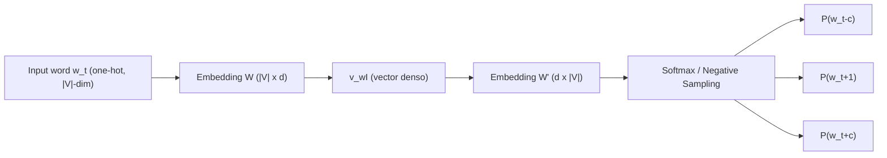
**Explicación:** la palabra objetivo $w_t$ se proyecta a un vector denso vía $W$ (esa es la matriz que terminamos usando como "los embeddings"); luego $W'$ proyecta de nuevo al espacio del vocabulario para predecir cada palabra de la ventana de contexto. El entrenamiento ajusta $W$ y $W'$ para que esa predicción sea correcta; el embedding final es lo que la red "necesitó aprender" en $W$ para lograrlo. CBOW es la misma red con el flujo invertido (contexto → centro).

## 7.2 RNN (desenrollada en el tiempo)

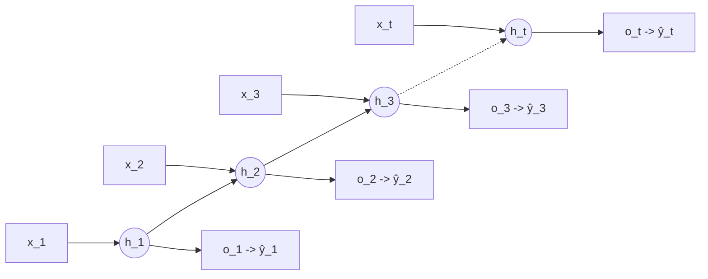
**Explicación:** $h_t=\tanh(Wh_{t-1}+Ux_t+b)$. La misma matriz $W$ se reusa en cada paso de tiempo (de ahí que el tamaño del modelo no dependa del largo de la secuencia) — pero esto también es la causa de vanishing/exploding gradients: multiplicar por $W$ una y otra vez, $T$ veces, durante BPTT. Cada $h_t$ es la "memoria" acumulada hasta el paso $t$; $o_t=Vh_t$ y $\hat y_t=\text{softmax}(o_t)$ es la predicción en ese paso (p.ej. la próxima palabra).

## 7.3 Celda LSTM (un solo paso de tiempo)

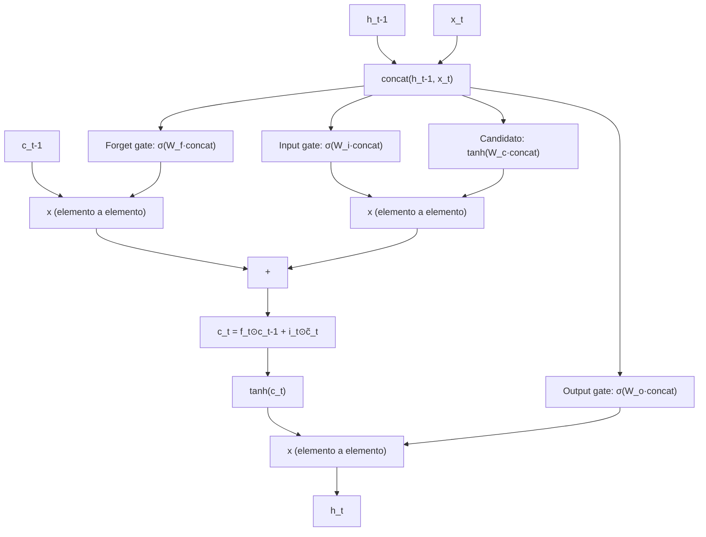
**Explicación:** el `[h_{t-1}, x_t]` concatenado alimenta **cuatro** transformaciones lineales+activación: forget gate $f_t$ (qué borrar de la memoria), input gate $i_t$ (cuánto deja pasar la nueva info), contenido candidato $\tilde c_t=\tanh(\cdot)$ (qué información nueva hay), y output gate $o_t$ (qué parte de la memoria exponer como $h_t$). La clave es que $c_t = f_t\odot c_{t-1} + i_t\odot\tilde c_t$ es una actualización con un componente **aditivo**: el gradiente puede fluir hacia atrás por la "autopista" de $c_t$ sin pasar por $T$ multiplicaciones consecutivas de una matriz de pesos, evitando el vanishing gradient.

## 7.4 Celda GRU (un solo paso de tiempo)

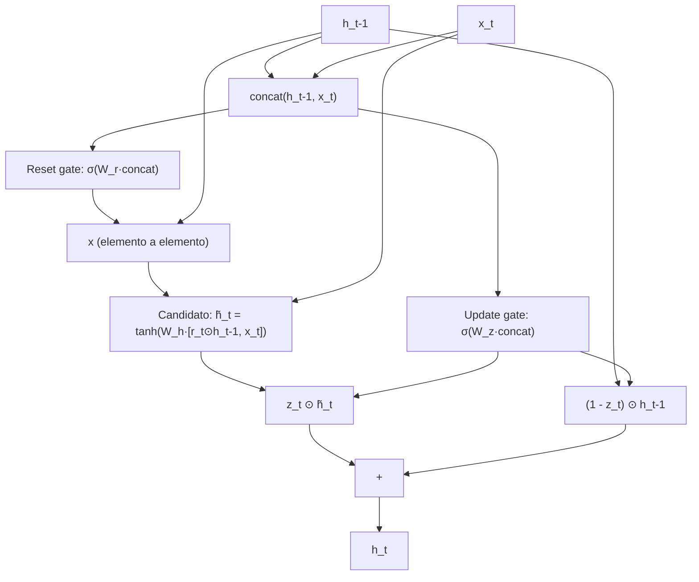
**Explicación:** GRU fusiona el forget+input gate de LSTM en un solo **update gate** $z_t$, y no tiene cell state separado — solo $h_t$. El **reset gate** $r_t$ controla cuánto del estado anterior se usa para calcular el contenido candidato $\tilde h_t$. $h_t=(1-z_t)\odot h_{t-1}+z_t\odot\tilde h_t$ es un promedio ponderado entre "quedarse con lo viejo" y "adoptar lo nuevo" — menos parámetros que LSTM (3 matrices de peso en vez de 4) pero la misma idea de fondo: permitir que el gradiente fluya sin atravesar puras multiplicaciones.

## 7.5 Seq2seq con Atención (Encoder-Decoder + RNN)

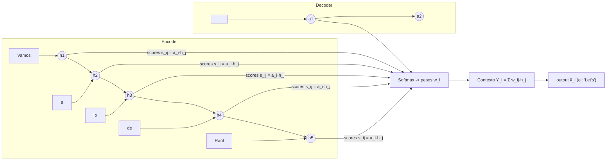
**Explicación:** el encoder corre normalmente y guarda **todos** sus hidden states $h_1,\ldots,h_T$ (no solo el último, como en seq2seq vanilla). En cada paso $i$ del decoder, su estado actual $a_i$ hace de "query": se compara contra cada $h_j$ (scores), se normaliza con softmax (pesos $w_{ij}$), y se construye un vector de contexto $Y_i$ como combinación ponderada de los $h_j$. Ese $Y_i$ —junto con $a_i$— se usa para generar la salida del paso $i$. Esto es exactamente el germen de Q/K/V de los Transformers, solo que aquí $Q=a_i$ y $K=V=h_j$ vienen de dos RNNs distintas (encoder y decoder).

## 7.6 Self-Attention (un bloque, Transformer)

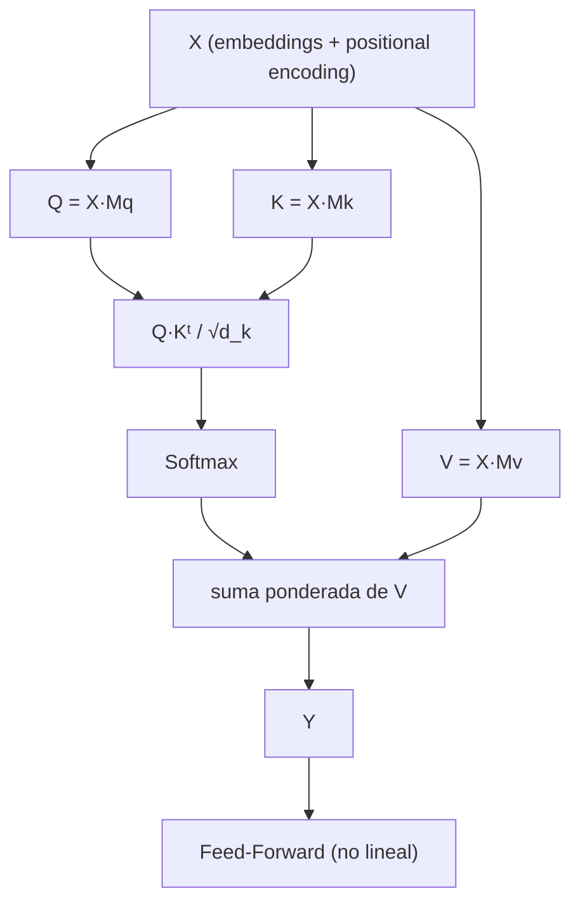
**Explicación:** cada token de la secuencia se proyecta a $Q$, $K$, $V$ mediante matrices aprendidas. El producto $QK^T$ mide cuánto "encaja" cada query con cada key (similitud); se escala por $\sqrt{d_k}$ y se normaliza con softmax → pesos de atención. La salida $Y$ es una combinación ponderada de los $V$ de **todos** los tokens, calculada en **un solo paso matricial** (paralelizable), no secuencialmente como en una RNN. La Feed-Forward posterior agrega no-linealidad token por token.

## 7.7 Bloque Encoder del Transformer (×N)

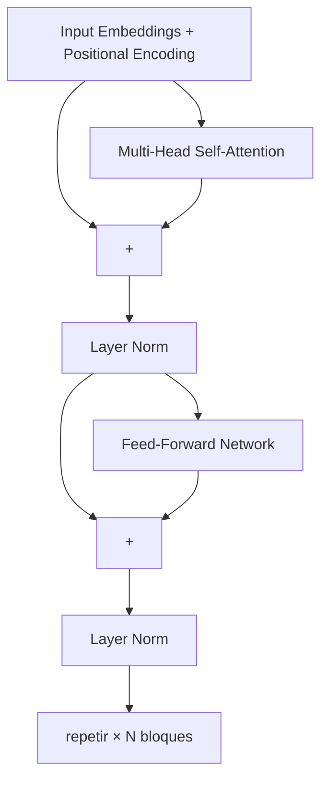
**Explicación:** cada subcapa (atención y FFN) está envuelta en `residual + LayerNorm`: la salida de la subcapa se suma a su propia entrada (camino directo para el gradiente) y luego se normaliza. Apilando $N$ de estos bloques se logra refinar progresivamente la representación de cada token usando el contexto completo de la secuencia. **BERT = solo esta pila de encoders.**

## 7.8 Bloque Decoder y Transformer Encoder-Decoder completo

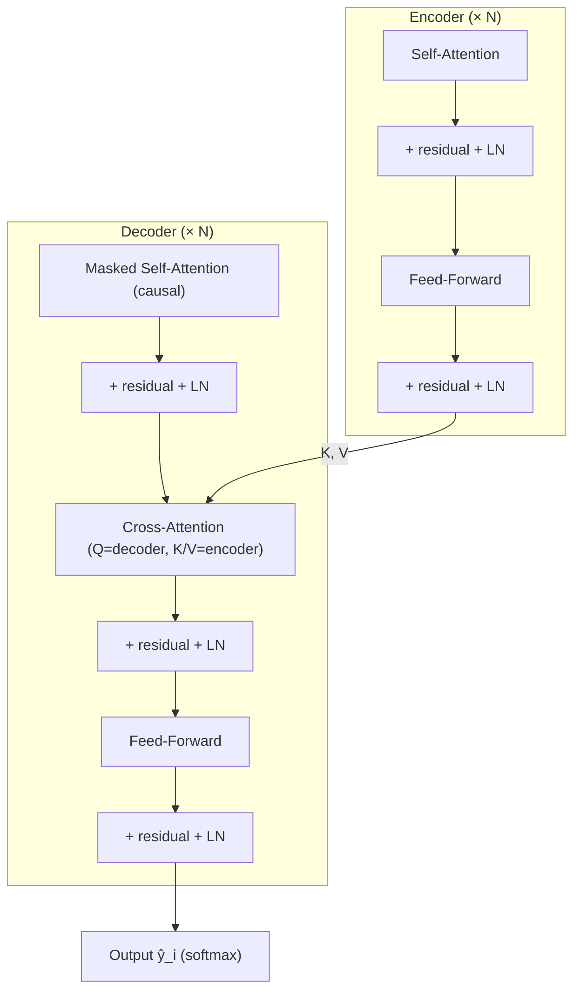
**Explicación:** el encoder produce representaciones $K,V$ de la secuencia fuente. El decoder tiene **tres** subcapas: (1) self-attention enmascarada (causal — cada posición solo ve las anteriores, necesario para generación autorregresiva), (2) cross-attention donde el **query** viene del decoder pero **keys/values** vienen del encoder (así el decoder "consulta" la fuente en cada paso de generación), y (3) feed-forward. Usado en traducción, resumen, Q&A generativo (T5, BART).

## 7.9 BERT (Encoder-only) — input/output

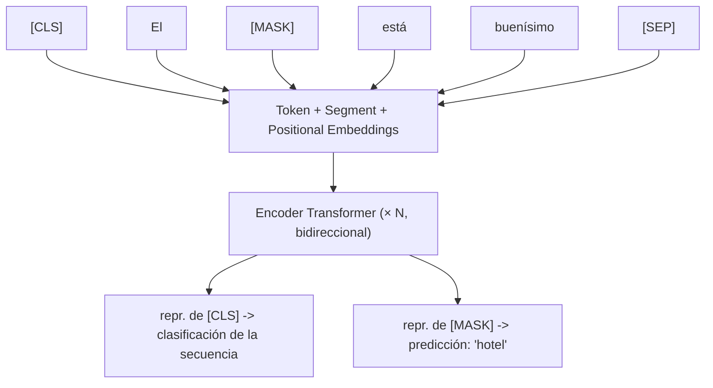
**Explicación:** todos los tokens pueden atender a todos los demás (bidireccional, sin máscara causal) — por eso BERT puede usar contexto izquierdo *y* derecho para predecir `[MASK]`, pero precisamente por esto no puede generar texto de forma autorregresiva (tendría que "ver" tokens futuros que aún no generó). `[CLS]` agrega información de toda la secuencia para tareas de clasificación; `[SEP]` separa pares de oraciones.

## 7.10 GPT (Decoder-only) — generación autorregresiva

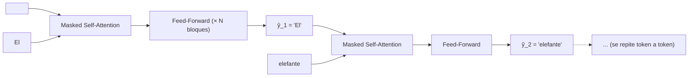
**Explicación:** no hay encoder. Cada posición predice el siguiente token usando **solo** los tokens que ya generó (máscara causal en la self-attention). Durante el entrenamiento esto se hace en paralelo sobre toda la secuencia de una vez (con la máscara forzando la causalidad); durante la generación real, es estrictamente secuencial: se genera un token, se lo agrega a la entrada, y se vuelve a pasar todo por el modelo para el siguiente token.

## 7.11 ELMo (Bi-LSTM apilado)

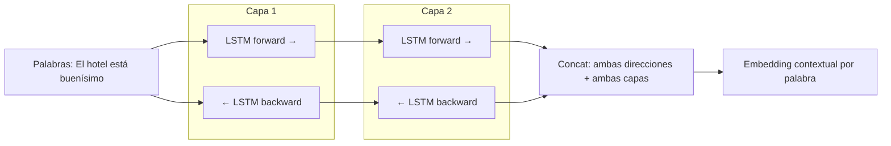
**Explicación:** dos LSTMs bidireccionales apiladas (2 capas). Para cada palabra, el embedding contextual final combina las representaciones de **ambas** direcciones y **ambas** capas (capas bajas → sintaxis, capas altas → semántica). A diferencia de Word2Vec, la representación de "hotel" cambia según el resto de la oración — esto es lo que la hace "contextual" en vez de estática.

## 7.12 LoRA (fine-tuning eficiente)

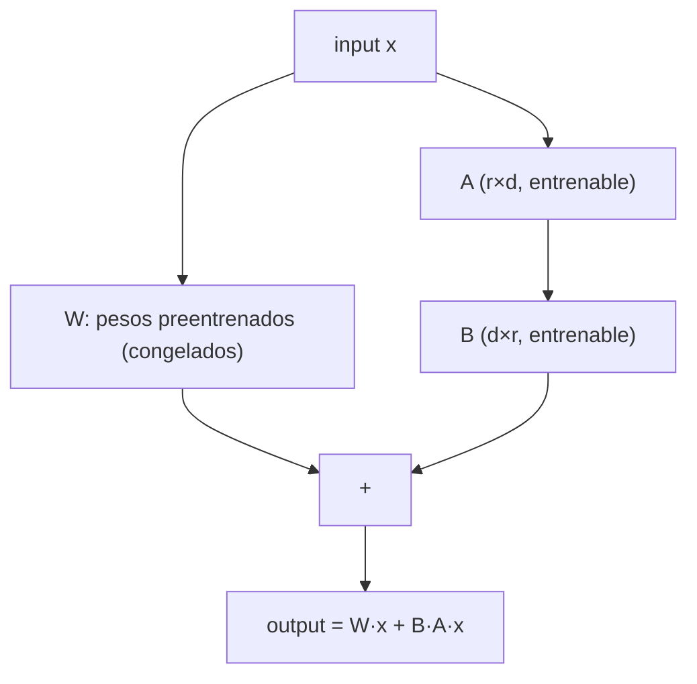
**Explicación:** en vez de actualizar la matriz completa $W$ (millones/billones de parámetros), se congela $W$ y se aprende solo una corrección de **bajo rango** $BA$ ($r \ll d$, por ejemplo $r=8$ vs $d=4096$). Esto reduce drásticamente los parámetros entrenables. En inferencia, se puede sumar $W+BA$ en una sola matriz, o mantenerlas separadas para intercambiar rápidamente entre distintos LoRAs (tareas) sobre el mismo modelo base.

---

## 8. Preguntas guía para repasar (auto-examen)

Usar estas preguntas para verificar que la solidez teórica es real y no solo reconocimiento de términos:

1. ¿Por qué un modelo de n-gramas con probabilidad 0 es catastrófico, y cómo lo resuelven distintas técnicas de smoothing (Laplace vs. Kneser-Ney)?
2. ¿Por qué BM25 es "mejor" que TF-IDF? ¿Qué dos cosas corrige explícitamente?
3. ¿Por qué Naive Bayes funciona razonablemente bien en la práctica a pesar de que su asunción de independencia es falsa?
4. ¿Qué relación hay entre LSA y Word2Vec? ¿Por qué Word2Vec normalmente generaliza mejor a pesar de no usar la matriz completa de co-ocurrencias?
5. ¿Cuál es la limitación de los embeddings estáticos que motiva a ELMo, y qué arquitectura usa ELMo para resolverla?
6. Explicar paso a paso por qué una RNN sufre vanishing/exploding gradients y por qué el cell state de LSTM lo mitiga (pensar en la diferencia entre actualización multiplicativa vs. aditiva).
7. ¿Cuál es el "cuello de botella" del seq2seq clásico, y cómo lo resuelve la atención? Dibujar el flujo de scores → softmax → contexto.
8. ¿Por qué un Transformer necesita positional embeddings y una RNN no?
9. ¿Por qué BERT (encoder-only) no puede usarse para generar texto libremente, pero GPT (decoder-only) sí?
10. ¿Qué significa "in-context learning" y por qué representa un cambio de paradigma respecto al fine-tuning clásico?
11. ¿Cómo se relacionan adapters/LoRA con el problema de costo de fine-tunear modelos grandes?
12. ¿Qué es una capacidad emergente, y por qué es un fenómeno difícil de predecir o explicar?
13. Diferencia entre fidelidad y facticidad en el contexto de alucinaciones — dar un ejemplo donde un texto sea fiel pero no factual (o viceversa).
14. ¿Cómo conecta RAG las técnicas de IR clásico (clase 2) con los LLMs generativos (clase 6)?
15. Trazar la cadena completa: ¿por qué pasamos de contar n-gramas → vectores sparse → embeddings densos estáticos → embeddings contextuales → atención → Transformers → preentrenamiento masivo? ¿Qué problema concreto resolvió cada paso?

---

## 9. Glosario rápido de fórmulas clave (cheat-sheet)

| Concepto | Fórmula |
|---|---|
| Bigrama MLE | $P(w_i\mid w_{i-1})=\frac{C(w_{i-1},w_i)}{C(w_{i-1})}$ |
| Laplace smoothing | $\frac{C+1}{C(w_{i-1})+V}$ |
| Perplexity | $2^{-\frac{1}{N}\sum\log_2 P(w_i\mid w_{<i})}$ |
| TF-IDF | $\text{TF}\cdot\log\frac{N}{\text{df}(t)}$ |
| BM25 | ver fórmula completa en clase 2 — recordar $k_1$ (saturación) y $b$ (largo) |
| Naive Bayes | $\arg\max_y P(X\mid Y)P(Y)$, con $P(X\mid Y)=\prod_i P(x_i\mid Y)$ |
| Softmax | $\frac{e^{z_i}}{\sum_j e^{z_j}}$ |
| Skip-gram | $P(w_O\mid w_I)=\frac{\exp(v'_{w_O}{}^\top v_{w_I})}{\sum_w \exp(v'_w{}^\top v_{w_I})}$ |
| RNN | $h_t=\tanh(Wh_{t-1}+Ux_t+b)$ |
| LSTM cell update | $c_t=f_t\odot c_{t-1}+i_t\odot \tilde c_t$ |
| Atención (scores) | $s_{ij}=a_i\cdot h_j \to \text{softmax} \to Y_i=\sum_j w_{ij}h_j$ |
| Self-Attention | $\text{softmax}\left(\frac{QK^T}{\sqrt{d_k}}\right)V$ |
| Positional Encoding | $\sin(pos/10000^{2i/d})$, $\cos(pos/10000^{2i/d})$ |
| LayerNorm | $\gamma\cdot\frac{x-\mu}{\sigma+\epsilon}+\beta$ |
| LoRA | $W'=W+BA$, $r\ll d$ |

---

## 10. Respuestas al autoexamen (Sección 8)

**1. ¿Por qué una probabilidad 0 en n-gramas es catastrófica, y cómo lo resuelven Laplace vs. Kneser-Ney?**
Porque la probabilidad de una oración completa es un **producto** de probabilidades condicionales: $P(w_1,\ldots,w_n)=\prod_i P(w_i\mid w_{<i})$. Si un solo n-grama nunca apareció en entrenamiento, su probabilidad MLE es 0, y como está multiplicando, **toda la cadena colapsa a 0** sin importar qué tan buena sea el resto de la oración — el modelo no puede generalizar a nada no visto literalmente. Laplace soluciona esto sumando 1 a todos los conteos (nunca hay un 0 verdadero), pero es burdo: redistribuye demasiada masa de probabilidad hacia eventos no vistos, perjudicando a los n-gramas que sí tienen buena evidencia. Kneser-Ney es más fino: en vez de "regalar" masa pareja a todo lo no visto, hace backoff a la **probabilidad de continuación** (cuántos contextos distintos preceden a la palabra), que es una mejor estimación de cuán "natural" es esa palabra en general — por eso es el método con mejor performance empírica para n-gramas.

**2. ¿Por qué BM25 es mejor que TF-IDF? ¿Qué dos cosas corrige?**
Corrige (a) la **saturación de TF**: en TF-IDF puro, una palabra que aparece 20 veces pesa el doble que si aparece 10 veces (lineal); en la práctica, después de cierto punto repetir una palabra no aporta información proporcional. El término $\frac{\text{TF}(k_1+1)}{\text{TF}+k_1(\ldots)}$ hace que el aporte de TF se sature (rendimientos decrecientes), controlado por $k_1$. (b) La **normalización por longitud del documento**: sin corrección, documentos largos acumulan más conteos de términos solo por ser largos, y "ganan" artificialmente en ranking. El factor $\left(1-b+b\frac{|d|}{\text{avgdl}}\right)$ penaliza documentos más largos que el promedio, controlado por $b$. Estas dos correcciones tienen fundamento probabilístico (derivan de un modelo de relevancia), no son ad-hoc como en TF-IDF.

**3. ¿Por qué Naive Bayes funciona bien pese a su asunción falsa de independencia?**
Porque para clasificación lo que importa no es estimar $P(X\mid Y)$ con precisión absoluta, sino que el **ranking** entre clases ($\arg\max_y$) sea correcto. Aunque la independencia condicional es violada (las palabras de un texto están correlacionadas entre sí), los errores de esa violación suelen afectar de forma similar a todas las clases, por lo que el orden relativo de los scores se mantiene razonablemente bien. Además, al ser un modelo muy simple con pocos parámetros (solo conteos), tiene **baja varianza**: con pocos datos de entrenamiento generaliza mejor que modelos discriminativos más flexibles (como logistic regression) que necesitan más datos para ajustar bien sus pesos sin sobreajustar.

**4. ¿Qué relación hay entre LSA y Word2Vec? ¿Por qué Word2Vec suele generalizar mejor?**
Ambos parten de la misma hipótesis distribucional: el significado de una palabra está determinado por sus contextos. LSA construye explícitamente una matriz término-documento (o término-término) global y la factoriza de una sola vez con SVD para obtener vectores densos — es un método de **álgebra lineal sobre estadísticas globales**. Word2Vec, en cambio, entrena iterativamente una red neuronal muy simple (skip-gram/CBOW) prediciendo palabras de contexto en ventanas locales, ajustando los vectores con gradiente descendente paso a paso sobre millones de ejemplos. Word2Vec suele generalizar mejor en la práctica porque el objetivo de entrenamiento está directamente optimizado para que la geometría del espacio capture relaciones semánticas finas (de ahí que emerjan analogías vectoriales tipo king-man+woman≈queen), algo que la factorización SVD de LSA no garantiza explícitamente — LSA prioriza reducir dimensionalidad reteniendo varianza, no necesariamente estructura semántica lineal.

**5. ¿Cuál es la limitación de los embeddings estáticos que motiva a ELMo, y cómo la resuelve?**
La limitación es que Word2Vec/GloVe/FastText asignan **un único vector fijo por palabra**, sin importar la oración en la que aparece — "banco" tiene el mismo vector en "me senté en el banco" y "saqué dinero del banco". ELMo resuelve esto generando el embedding de una palabra a partir de **todo el contexto de la oración**: usa dos capas de LSTM bidireccional (forward + backward) preentrenadas como modelo de lenguaje; el embedding final de cada palabra es la concatenación de las representaciones de ambas direcciones y ambas capas, evaluadas en esa oración específica. Por construcción, ese embedding cambia según las palabras vecinas — es **contextual**, no estático.

**6. ¿Por qué una RNN sufre vanishing/exploding gradients, y por qué el cell state de LSTM lo mitiga?**
Durante BPTT, el gradiente de la pérdida respecto a un estado lejano en el pasado se calcula propagando hacia atrás a través de $T$ pasos de tiempo, lo cual produce un **producto de $T$ matrices** $W$ (más derivadas de la no-linealidad): $\frac{\partial h_T}{\partial h_1}=\prod_t W\cdot\text{diag}(\sigma')$. Si los autovalores de $W$ son mayores a 1, el producto crece exponencialmente con $T$ (exploding); si son menores a 1, decae exponencialmente a 0 (vanishing) — en ambos casos, las dependencias de largo alcance se vuelven imposibles de aprender (el gradiente que debería "enseñarle" al modelo a usar información lejana, o explota o desaparece antes de llegar). El cell state de LSTM ataca esto introduciendo una actualización con un término **aditivo**: $c_t = f_t\odot c_{t-1} + i_t\odot\tilde c_t$. A diferencia de una RNN vanilla, donde el estado se recalcula multiplicando por $W$ en cada paso, aquí $c_{t-1}$ puede pasar (casi) sin modificar a $c_t$ si $f_t\approx 1$ — el gradiente puede fluir hacia atrás por esa "autopista" aditiva sin tener que atravesar $T$ multiplicaciones sucesivas de una matriz de pesos, evitando que se desvanezca.

**7. ¿Cuál es el cuello de botella del seq2seq clásico y cómo lo resuelve la atención?**
En seq2seq vanilla, el encoder debe comprimir **toda** la secuencia fuente (sin importar cuán larga sea) en un único vector de tamaño fijo: el último hidden state. Para secuencias largas, esto es estructuralmente imposible de hacer sin perder información — es un cuello de botella de información, no un problema de entrenamiento. La atención lo resuelve dejando que el decoder, en cada paso $i$, en vez de depender solo de ese vector único, **mire todos** los hidden states del encoder $h_1,\ldots,h_T$: calcula scores de similitud $s_{ij}=a_i\cdot h_j$ entre su estado actual $a_i$ y cada $h_j$, los normaliza con softmax para obtener pesos $w_{ij}$, y construye un vector de contexto $Y_i=\sum_j w_{ij}h_j$ específico para ese paso de generación. Así la "memoria" de la fuente no se comprime una sola vez al final del encoder, sino que está disponible completa y se consulta de nuevo en cada paso de generación.

**8. ¿Por qué un Transformer necesita positional embeddings y una RNN no?**
Una RNN procesa la secuencia **token por token, en orden**, por construcción: el hecho de que $h_t$ se calcule a partir de $h_{t-1}$ ya codifica implícitamente la posición y el orden (no se puede calcular $h_3$ sin haber calculado $h_1$ y $h_2$ antes). Un Transformer, en cambio, procesa **todos los tokens en paralelo** mediante matrices — self-attention es, por diseño, invariante a permutaciones: si se permutan las filas de $X$, la salida de la atención se permuta igual pero no cambia su contenido relativo. Esto significa que, sin ayuda adicional, el modelo no tiene ninguna forma de saber que "Juan golpeó a Pedro" es distinto de "Pedro golpeó a Juan" — ambas tendrían la misma "bolsa" de tokens procesados en paralelo. Los positional embeddings inyectan esa información de orden directamente en la representación de entrada, sumándose a los embeddings de palabra antes de la primera capa.

**9. ¿Por qué BERT no puede generar texto libremente, pero GPT sí?**
BERT (encoder-only) usa self-attention **sin máscara**: cada token puede atender a todos los demás tokens de la secuencia, incluyendo los que están a su derecha (en el futuro, si pensamos en generación token a token). Eso es justamente lo que le permite tener contexto bidireccional verdadero para tareas de comprensión — pero para *generar* texto se necesitaría predecir el token en la posición $t$ sin haber "visto" todavía los tokens en posiciones $>t$, porque esos tokens son justamente los que el modelo debería estar generando. GPT (decoder-only) usa self-attention **enmascarada/causal**: cada posición solo puede atender a posiciones anteriores o iguales a la suya, lo cual es exactamente la restricción que necesita la generación autorregresiva (predecir el próximo token usando solo lo ya generado).

**10. ¿Qué es in-context learning y por qué es un cambio de paradigma?**
Es la capacidad de un LLM grande (GPT-3+) de resolver una tarea nueva usando solo **instrucciones y/o ejemplos colocados directamente en el prompt**, sin actualizar ni un solo peso del modelo. El cambio de paradigma es que invierte la relación clásica entre modelo y tarea: en el paradigma de fine-tuning (BERT, GPT-1), se **adapta el modelo a la tarea** (se reentrenan pesos con datos etiquetados de esa tarea específica). En in-context learning, se **adapta la tarea al modelo**: se formula la tarea como texto natural dentro del prompt, y el modelo —ya preentrenado y congelado— generaliza a partir de eso. Esto elimina (en muchos casos) la necesidad de datos etiquetados específicos de tarea y de cualquier paso de entrenamiento adicional, lo cual es lo que motiva la frase "el fin del fine-tuning" para una porción grande de tareas de NLP.

**11. ¿Cómo se relacionan adapters/LoRA con el costo de fine-tunear modelos grandes?**
Fine-tunear un LLM completo implica actualizar (y guardar) todos sus parámetros — para un modelo de miles de millones de parámetros esto es costoso en cómputo, memoria, y además requiere un modelo completo separado por cada tarea (no se puede compartir un único modelo base entre tareas sin reentrenar). Adapters y LoRA resuelven esto **congelando** los pesos preentrenados y entrenando solo un número pequeño de parámetros adicionales: adapters insertan módulos chicos entre capas; LoRA aprende una actualización de bajo rango $BA$ ($r\ll d$) que se suma a los pesos congelados. El resultado práctico es que se puede tener **un solo modelo base** y múltiples adaptadores/LoRAs livianos (uno por tarea), que se cargan/descargan rápidamente, reduciendo drásticamente cómputo, memoria de almacenamiento, y riesgo de overfitting en tareas con pocos datos.

**12. ¿Qué es una capacidad emergente y por qué es difícil de explicar?**
Es una habilidad que un LLM exhibe sin haber sido entrenado explícitamente para ella (no estaba en los datos de entrenamiento como tarea etiquetada), y que **aparece de forma abrupta** al superar cierta escala de parámetros/datos, sin poder predecirse extrapolando linealmente el desempeño de modelos más chicos — un modelo de 1B parámetros puede tener desempeño cercano a 0 en una tarea, y un modelo de 100B parámetros (sin cambios arquitectónicos) puede de repente desempeñarse bien. Es difícil de explicar porque no hay todavía una teoría sólida que prediga **en qué escala exacta** aparecerá una capacidad dada, ni un mecanismo causal claro y verificado — solo hipótesis (mayor capacidad de memorización, profundidad necesaria para razonamiento multi-paso, representaciones más comprimidas) que aún no son consenso.

**13. Diferencia entre fidelidad y facticidad — ejemplo.**
**Fidelidad** mide si el texto generado es consistente con la fuente/input dado (el contenido de entrada al modelo). **Facticidad** mide si el texto es consistente con los hechos reales del mundo, independientemente de qué decía la fuente. Pueden diverger: si le pido a un modelo que resuma un artículo que **contiene un error fáctico** (dice que "la Torre Eiffel mide 500 metros"), un resumen que reproduzca fielmente ese dato sería **fiel** (a la fuente) pero **no factual** (el dato real es ~330m). Al revés: si el modelo "corrige" el dato a 330m usando su conocimiento de mundo sin que la fuente lo diga, sería **factual** pero **infiel** a la fuente que se le pidió resumir.

**14. ¿Cómo conecta RAG el IR clásico (clase 2) con los LLMs generativos (clase 6)?**
RAG usa exactamente el mismo problema que resuelve BM25/TF-IDF en clase 2 — **encontrar los documentos más relevantes para una query** dentro de una colección — como primer paso de un pipeline más grande. En vez de quedarse ahí (mostrar una lista de resultados, como un motor de búsqueda clásico), RAG toma esos documentos recuperados y los **inyecta como contexto** en el prompt de un LLM generativo (decoder-only o encoder-decoder), que los usa para generar una respuesta en lenguaje natural fundamentada en esa información. Es literalmente la unión de las dos mitades del curso: la recuperación (information retrieval clásico, estadístico, basado en términos o embeddings) con la generación (modelos neuronales modernos preentrenados) — y resuelve un problema concreto de los LLMs puros: la alucinación y el conocimiento desactualizado/cerrado del modelo.

**15. Trazar la cadena completa de la evolución del NLP — qué problema resolvió cada paso.**
- **N-gramas (conteo)** → primer modelo de lenguaje, pero sufre esparsidad: la mayoría de combinaciones de palabras nunca aparecen en el corpus, dando probabilidad 0.
- **Vectores sparse + clasificadores clásicos (BoW/TF-IDF/BM25 + Naive Bayes/SVM)** → permiten clasificar texto sin depender de probabilidades de secuencias exactas, pero los vectores son de altísima dimensión, no capturan significado semántico, y requieren features diseñadas a mano.
- **Embeddings estáticos densos (Word2Vec/GloVe/FastText)** → aprenden representaciones semánticas de baja dimensión automáticamente (sin diseño manual de features) explotando la hipótesis distribucional, resolviendo "qué significa cada palabra" — pero asignan un único vector fijo por palabra sin importar el contexto.
- **RNN/LSTM/GRU + ELMo** → procesan la secuencia manteniendo un estado/memoria, permitiendo que la representación de una palabra dependa de su contexto (embeddings contextuales) — pero son secuenciales (lentas, no paralelizables) y, en seq2seq, sufren un cuello de botella al comprimir toda la fuente en un vector fijo.
- **Atención** → deja que el decoder consulte todos los estados del encoder en cada paso, resolviendo el cuello de botella — pero todavía corre sobre una RNN secuencial por debajo.
- **Transformers (self-attention)** → eliminan la RNN por completo, dejando que cada token atienda directamente a todos los demás en un solo paso paralelizable — esto habilita entrenar con muchísimos más datos y parámetros en tiempos razonables.
- **Preentrenamiento + Transfer Learning (BERT, GPT, T5...)** → aprovechan esa escalabilidad para preentrenar en corpus de texto masivo no etiquetado, aprendiendo conocimiento general que después se adapta (fine-tuning, adapters, LoRA, o directamente in-context learning) a tareas específicas con poquísimos datos.
- **LLMs modernos (GPT-3+)** → llevan esto al extremo de escala, produciendo capacidades emergentes y in-context learning, pero heredando (y amplificando) riesgos que ya existían en germen desde clases anteriores: sesgo (ya presente en Word2Vec), alucinación (ya presente conceptualmente en la imposibilidad de un n-grama de "saber" si algo es verdad), y costo computacional (que crece con cada salto de escala de esta cadena).
